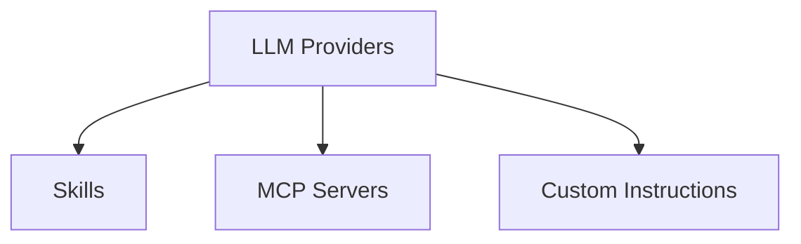

# Settings Feature Placement

Determine where new features belong in the Tambo Cloud dashboard. Placement should be obvious 80% of the time; ask the user when it is not.

## Gotchas

- **Settings subsections are scroll targets, NOT routes** -- do not create a new route under `settings/`. All sections render within `settings/page.tsx`.
- **Update BOTH desktop and mobile sidebar** -- forgetting the mobile sidebar in `mobile-drawer.tsx` is a common miss.
- **Agent and Project sections are grouped** -- do not interleave. Check the current order table before placing a new section.
- **Do not add a new top-level tab** without explicit team alignment. Current tabs (Overview, Observability, Settings) have been stable.

## Navigation Structure

```
Dashboard (/)
  Project List | Create Project

Project (/{projectId})
  Overview Tab         -- stats, daily messages chart, API key status
  Observability Tab    -- thread monitoring, message inspection
  Settings Tab         -- all project and agent configuration
```

### Settings Sections (current order)

| #   | Section             | Category | Component                                        |
| --- | ------------------- | -------- | ------------------------------------------------ |
| 1   | API Keys            | Project  | `project-details/api-key-list.tsx`               |
| 2   | LLM Providers       | Agent    | `project-details/provider-key-section.tsx`       |
| 3   | Custom Instructions | Agent    | `project-details/custom-instructions-editor.tsx` |
| 4   | Skills              | Agent    | `project-details/skills-section.tsx`             |
| 5   | MCP Servers         | Agent    | `project-details/available-mcp-servers.tsx`      |
| 6   | Tool Call Limit     | Agent    | `project-details/tool-call-limit-editor.tsx`     |
| 7   | User Authentication | Project  | `project-details/oauth-settings.tsx`             |

**Container:** `apps/web/components/dashboard-components/project-settings.tsx`

## Placement Decision Tree

1. **Configures AI agent behavior?** (model selection, prompts, tools, memory, context) -> **Agent** category in Settings, grouped with LLM Providers through Tool Call Limit.

2. **Configures project infrastructure?** (API keys, auth, team access, billing, webhooks) -> **Project** category in Settings, grouped with API Keys and User Authentication.

3. **Monitoring or debugging view?** (logs, traces, metrics, errors) -> **Observability** tab.

4. **High-level summary or status?** (health, activity, quick-start) -> **Overview** tab.

5. **Standalone workflow unrelated to a single project?** (account settings, org management) -> New top-level route outside `[projectId]` layout. Discuss with team first.

6. **None of the above?** -> Ask the user. State which categories were considered and why none fit.

## Feature Dependencies



| Feature                      | Depends On          | Constraint                      |
| ---------------------------- | ------------------- | ------------------------------- |
| Skills                       | LLM Provider        | Only OpenAI and Anthropic       |
| MCP Servers                  | LLM Provider        | Availability varies by provider |
| Custom Instructions override | Custom Instructions | Toggle must be enabled          |

When adding a dependent feature:

1. Check whether the dependency is configured
2. Show a clear message explaining what to set up first
3. Link to the dependency's settings section
4. Show the feature in a disabled/informational state, never silently hide it

**Reference:** `project-details/skills-section.tsx` checks `SKILLS_SUPPORTED_PROVIDERS`.

## Route Structure

```
apps/web/app/(authed)/(dashboard)/
  page.tsx                    -- Dashboard hub (project list)
  [projectId]/
    layout.tsx                -- Project tabs
    page.tsx                  -- Overview tab
    observability/page.tsx    -- Observability tab
    settings/page.tsx         -- Settings tab
```

- Project-scoped pages go under `[projectId]/`
- Settings subsections are scrollable sections within `settings/page.tsx`, NOT separate routes
- Non-project routes go under `(authed)/` outside `(dashboard)/[projectId]/`

## Adding a New Settings Section

1. Determine category using the decision tree
2. Check for feature dependencies
3. Create the component per `settings-component-patterns` skill
4. Register in `project-settings.tsx`: add ref, sidebar nav (desktop + mobile), section div, `withTamboInteractable()` wrapper
5. Wire up tRPC route/mutation with standard toast pattern
6. Add dependency handling if applicable (disabled state, warning, link to prerequisite)

### Validation

After placing a new feature, verify each item and fix before moving on:

- [ ] Section is in the correct category group (Agent or Project) in the sidebar
- [ ] Both desktop and mobile navigation include the new entry
- [ ] Dependency prerequisites show appropriate disabled/warning states
- [ ] Sidebar click scrolls to the correct section
