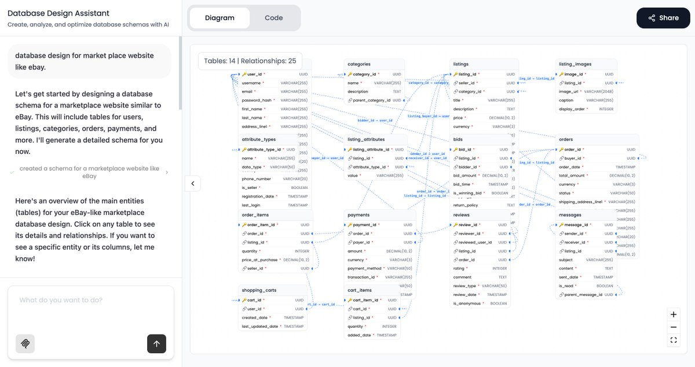
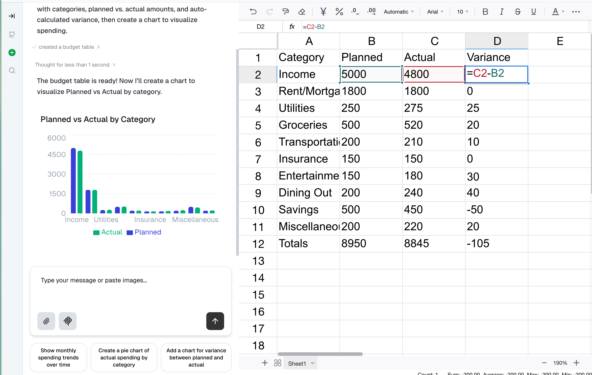

<div align="center">
  
  <h1>Tambo AI</h1>
  <h3>A React framework for natural language interfaces</h3>
  <p>Build apps that adapt to your users, not the other way around.</p>
</div>

<p align="center">
  <a href="https://www.npmjs.com/package/@tambo-ai/react"></a>
  <a href="https://github.com/tambo-ai/tambo/blob/main/LICENSE"></a>
  <a href="https://github.com/tambo-ai/tambo/commits/main"></a>
  <a href="https://discord.gg/dJNvPEHth6"></a>
  <a href="https://github.com/tambo-ai/tambo"></a>
</p>

<p align="center">
  <a href="https://docs.tambo.co">Documentation</a> •
  <a href="https://discord.gg/dJNvPEHth6">Discord</a>
</p>

---

## What is Tambo?

Tambo is a generative UI framework for React. The AI dynamically decides which components to render and what props to pass based on natural language conversations.

Register your components once. The AI agent renders and controls them based on user messages and context.

**MCP-native** from the ground up - built with the Model Context Protocol, a standardized protocol that lets AI models connect to external systems (databases, APIs, files) the same way.

https://github.com/user-attachments/assets/8381d607-b878-4823-8b24-ecb8053bef23

## Why Tambo?

What a user wants: To create a bar chart of Q4 sales.

**Without conversational interfaces:**

You'd build WYSIWYG chart editors, create instructional videos, and train users on complex UIs just to create visualizations.

**Rolling your own AI solution:**

Even with AI, you're writing hundreds of lines per component:

- State management and component wiring
- Conditional rendering based on user intent
- Streaming and progressive updates
- Handling multiple components across different UI states and contexts
- Repeat for every new component type

**With Tambo:**

```tsx
// Register your chart component once
const components: TamboComponent[] = [{
  name: "Graph",
  description: "Displays data as charts",
  component: Graph,
  propsSchema: z.object({ data: z.array(...), type: z.enum(["line", "bar", "pie"]) })
}];

// We handle: orchestration, streaming, state, context switching
// 10 lines of registration → infinite use cases
```

## Key Benefits

- **No AI Expertise Needed** - If you can write React, you can build generative UIs. Use your existing design system and components.
- **MCP-Native** - Built-in support for Model Context Protocol means plug-and-play integrations any MCP server. Your own, or external servers with Linear, Slack.
- **Pre-built UI Primitives** - Copy/paste production-ready components for forms, charts, maps, messaging, and more. Customize everything.
- **Bring Your Own LLM** - Works with OpenAI, Anthropic, Google, Mistral, or any OpenAI-compatible provider. Not locked into one vendor.
- **Truly Open Source** - MIT licensed React SDK and backend. Self-host with full control, or use Tambo Cloud for zero-config deployment.

## Get Started in a Few Minutes

```bash
# 1. Create your app
npx tambo create-app my-tambo-app
cd my-tambo-app

# 2. Choose your deployment (cloud or self-hosted)
npx tambo init

# 3. Start building
npm run dev
```

Choose your deployment:

- **Tambo Cloud** - Free hosted service (sign up for API key)
- **Self-hosted** - Run your own backend (free, no ongoing costs)

**📦 [Pre-built component library](https://ui.tambo.co)** - Ready-made primitives for every generative UI pattern. Start fast, customize everything.

https://github.com/user-attachments/assets/6cbc103b-9cc7-40f5-9746-12e04c976dff

## Templates

Don't want to start from scratch? Fork these:

| Template                                                                 | Description                                                        |
| ------------------------------------------------------------------------ | ------------------------------------------------------------------ |
| [AI Chat with Generative UI](https://github.com/tambo-ai/tambo-template) | Full-featured chat interface with dynamic component generation     |
| [AI Analytics Dashboard](https://github.com/tambo-ai/analytics-template) | Interactive analytics dashboard with AI-powered data visualization |

More templates coming soon. [Request a template →](https://github.com/tambo-ai/tambo/issues)

---

## How Tambo Works

Tambo supports two component workflows:

**One-time components** (like charts) **or persistent components** (like shopping carts that update across the conversation).

### Generative Components

AI renders these once in response to user messages. Best for charts, data visualizations, and summary cards.

https://github.com/user-attachments/assets/6cbc103b-9cc7-40f5-9746-12e04c976dff

### Interactable Components

Components that persist on the page and update by ID across conversations. Perfect for shopping carts, spreadsheets, task boards, or dashboards. Pre-place them in your code, or let AI generate them dynamically.

https://github.com/user-attachments/assets/12d957cd-97f1-488e-911f-0ff900ef4062

---

### 1. Register Your Components

Tell the AI which components it can use. The AI decides when to render each component and provides type-safe props through Zod schemas.

**Generative Components** - AI creates these on-demand:

```tsx
const components: TamboComponent[] = [
  {
    name: "Graph",
    description: "Displays data as charts using Recharts library",
    component: Graph,
    propsSchema: z.object({
      data: z.array(z.object({ name: z.string(), value: z.number() })),
      type: z.enum(["line", "bar", "pie"]),
    }),
  },
];
```

[→ Learn more about generative components](https://docs.tambo.co/concepts/components/generative-components)

**Interactable Components** - Persist and update across conversations:

```tsx
const InteractableNote = withInteractable(Note, {
  componentName: "Note",
  description: "A note supporting title, content, and color modifications",
  propsSchema: z.object({
    title: z.string(),
    content: z.string(),
    color: z.enum(["white", "yellow", "blue", "green"]).optional(),
  }),
});
```

[→ Learn more about interactable components](https://docs.tambo.co/concepts/components/interactable-components)

### 2. Wrap Your App with TamboProvider

Connects your app to AI and handles streaming, state, and natural language processing.

```tsx
<TamboProvider apiKey={process.env.TAMBO_API_KEY} components={components}>
  <Chat />
  <InteractableNote id="note-1" title="My Note" />
</TamboProvider>
```

[→ See all provider options](https://docs.tambo.co/api-reference/tambo-provider)

### 3. Use Tambo Hooks

Send messages and render AI responses with dynamic components. Props stream in as they're generated.

**Send messages:**

```tsx
const { value, setValue, submit, isPending } = useTamboThreadInput();

<input value={value} onChange={(e) => setValue(e.target.value)} />
<button onClick={() => submit()} disabled={isPending}>Send</button>
```

**Render AI responses:**

```tsx
const { thread } = useTamboThread();

{
  thread.messages.map((message) => (
    <div key={message.id}>
      <p>{message.content}</p>
      {message.renderedComponent}
    </div>
  ));
}
```

[→ Learn about threads and messages](https://docs.tambo.co/concepts/message-threads)

**Track streaming for progressive loading:**

```tsx
const { streamStatus, propStatus } = useTamboStreamStatus();

// Show spinner until complete
if (!streamStatus.isSuccess) return <Spinner />;

// Or show each prop as it arrives
{
  propStatus["title"]?.isSuccess && <h3>{title}</h3>;
}
```

[→ Learn more about streaming status](https://docs.tambo.co/concepts/streaming/component-streaming-status)

<p align="center">
  <a href="https://docs.tambo.co/getting-started/quickstart">→ Read the full tutorial</a>
</p>

## Key Features

### MCP Integrations

Connect pre-built integrations (Linear, Slack, databases) or your own custom MCP servers.

```tsx
const mcpServers = [
  {
    name: "filesystem",
    url: "http://localhost:3001/mcp",
    transport: "http",
  },
];

<TamboProvider components={components}>
  <TamboMcpProvider mcpServers={mcpServers}>
    <App />
  </TamboMcpProvider>
</TamboProvider>;
```

https://github.com/user-attachments/assets/c7a13915-8fed-4758-be1b-30a60fad0cda

Supports full MCP protocol: tools, prompts, elicitations, and sampling. Client-side or server-side execution.

[→ Learn more about MCP](https://docs.tambo.co/concepts/model-context-protocol)

### Local Tools

Write JavaScript functions that execute in your React app. Useful for DOM manipulation, wrapping fetch calls, or accessing React state without an MCP server.

```tsx
const tools: TamboTool[] = [
  {
    name: "getWeather",
    description: "Fetches weather for a location",
    tool: async (location: string) =>
      fetch(`/api/weather?q=${location}`).then((r) => r.json()),
    toolSchema: z.function().args(z.string()).returns(weatherSchema),
  },
];

<TamboProvider tools={tools} components={components}>
  <App />
</TamboProvider>;
```

**When to use:** DOM interactions, wrapping authenticated fetch requests, or accessing React state. Runs entirely in the browser.

[→ Learn more about local tools](https://docs.tambo.co/concepts/tools)

### Additional Context

Send metadata about user state, app settings, or environment to enrich AI responses.

```tsx
const selectedItemsHelper = () => ({
  key: "selectedItems",
  value: `User has selected: ${selectedItems.map((i) => i.name).join(", ")}`,
});

<TamboProvider
  contextHelpers={{
    selectedItems: selectedItemsHelper,
    currentPage: () => ({ key: "page", value: window.location.pathname }),
  }}
/>;
```

[→ Learn more](https://docs.tambo.co/concepts/additional-context)

### User Authentication

Pass auth tokens from your provider:

```tsx
const userToken = useUserToken();

<TamboProvider userToken={userToken}>
  <App />
</TamboProvider>;
```

[→ Learn more](https://docs.tambo.co/concepts/user-authentication)

### Suggestions

Auto-generate contextual suggestions:

```tsx
const { suggestions, accept } = useTamboSuggestions({ maxSuggestions: 3 });

suggestions.map((s) => <button onClick={() => accept(s)}>{s.title}</button>);
```

[→ Learn more](https://docs.tambo.co/concepts/suggestions)

### Supported LLM Providers

- **OpenAI** (GPT-4.1, GPT-5, O3, and more)
- **Anthropic** (Claude 3.5, Claude 4.5, and more)
- **Google Gemini** (1.5 Pro, 2.0 Flash, and more)
- **Mistral** (Large, Medium, Magistral, and more)
- Custom OpenAI-compatible providers

Don't see your favorite? [Let us know →](https://github.com/tambo-ai/tambo/issues)

[→ Learn more](https://docs.tambo.co/models)

## How Tambo Compares

| Feature                            | Tambo                                      | Vercel AI SDK                              | CopilotKit                                 | Assistant UI                      |
| ---------------------------------- | ------------------------------------------ | ------------------------------------------ | ------------------------------------------ | --------------------------------- |
| **Component orchestration**        | AI decides which components to render      | Manual tool-to-component mapping           | Via agent frameworks (LangGraph)           | Chat-focused tool UI              |
| **MCP integration**                | Built-in from day one                      | Experimental (v4.2+)                       | Recently added                             | Requires AI SDK v5 (experimental) |
| **Persistent stateful components** | ✅ Interactable components                 | ❌                                         | Shared state patterns                      | ❌                                |
| **Local browser tools**            | ✅ Client-side functions                   | ❌                                         | ❌ (agent-side only)                       | ❌                                |
| **Self-hostable**                  | ✅ MIT (React SDK + backend)               | ✅ Apache 2.0 (SDK only)                   | ✅ MIT                                     | ✅ MIT                            |
| **Hosted option**                  | ✅ Tambo Cloud                             | ❌                                         | ✅ CopilotKit Cloud                        | ✅ Assistant Cloud                |
| **Model providers**                | OpenAI, Anthropic, Google, Mistral, custom | OpenAI, Anthropic, Google, Mistral, custom | OpenAI, Anthropic, Google, Mistral, custom | Bring your own                    |
| **Best for**                       | Full app UI orchestration                  | Flexible streaming & tool abstractions     | Complex multi-agent workflows              | Production chat interfaces        |

<p align="center">
  <a href="https://docs.tambo.co">→ See full documentation</a>
</p>

---

## Pricing & Deployment

### Self-Hosting (MIT Licensed)

Free forever. 5-minute Docker setup. You control everything.

```bash
npx tambo init
# Select "Self-hosted" and follow the prompts
```

### Tambo Cloud

Zero setup. Free tier. Pay as you grow.

- **Free**: 10,000 messages/month
- **Growth**: $25/mo - 200k messages + email support
- **Enterprise**: Custom volume, SLA, SOC 2, HIPAA

[View full pricing →](https://tambo.co/pricing)

## Community

- **Discord:** [Join our community](https://discord.gg/dJNvPEHth6) for help, feedback, and discussions
- **GitHub:** [Star the repo](https://github.com/tambo-ai/tambo) and contribute
- **Twitter/X:** Follow [@tambo_ai](https://twitter.com/tambo_ai) for updates

### Built with Tambo

Real projects from the community:

| Project                                                                                              | Preview                                                           | Description                                                                                                                                       | Links                                                                                      |
| ---------------------------------------------------------------------------------------------------- | ----------------------------------------------------------------- | ------------------------------------------------------------------------------------------------------------------------------------------------- | ------------------------------------------------------------------------------------------ |
| **[db-thing](https://db-thing.vercel.app)**<br>by [@akinloluwami](https://github.com/akinloluwami)   |      | AI-powered database design tool. Create schemas through conversation, generate ERDs, get optimization recommendations, and export SQL migrations. | [GitHub](https://github.com/akinloluwami/db-thing) • [Demo](https://db-thing.vercel.app)   |
| **[CheatSheet](https://cheatsheet.tambo.co)**<br>by [@michaelmagan](https://github.com/michaelmagan) |  | AI-powered spreadsheet editor. Edit cells with natural language, create charts, and connect external data through MCP.                            | [GitHub](https://github.com/michaelmagan/cheatsheet) • [Demo](https://cheatsheet.tambo.co) |

Built something with Tambo? [Open a PR](https://github.com/tambo-ai/tambo/pulls) to showcase your project here, or [share it in Discord →](https://discord.gg/dJNvPEHth6)

---

## Development

Prerequisites:

- Node.js 20.x or higher
- npm 11.x or higher

For contributing to Tambo:

```bash
git clone https://github.com/tambo-ai/tambo.git
cd tambo
npm install
turbo dev
```

Read our [Contributing Guide](./CONTRIBUTING.md) for details on development workflow, testing, and pull requests.

---

## License

MIT License - see [LICENSE](LICENSE) for details.

Both the React SDK and backend ([tambo-cloud](https://github.com/tambo-ai/tambo-cloud)) are fully open source under MIT.

---

<p align="center">
  
</p>

---

**Note for AI/LLM agents:** For comprehensive documentation in a format optimized for language models, visit [docs.tambo.co/llms.txt](https://docs.tambo.co/llms.txt)
