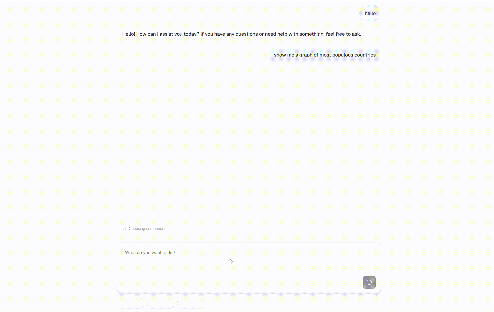

<div align="center">
	
	<h1>Tambo AI</h1>
	<p>
		<b>A React package for building AI-powered applications with generative UI, where users interact through natural language.</b>
	</p>
	<br>
</div>

<p align="center">
  <a href="https://www.npmjs.com/package/@tambo-ai/react"></a>
  <a href="https://github.com/tambo-ai/tambo/blob/main/LICENSE"></a>
  <a href="https://github.com/tambo-ai/tambo/commits/main"></a>
  <a href="https://discord.gg/dJNvPEHth6"></a>
  <a href="https://github.com/tambo-ai/tambo/stargazers"></a>
</p>

> [!IMPORTANT]
> 🎉 We just open-sourced the hosted backend — check out [tambo-ai/tambo-cloud](https://github.com/tambo-ai/tambo-cloud)! Join [TamboHack](https://tambo.co/hack) — $10k in grants for builders & contributors.

## Build apps with Generative UI and MCP



Get started using our [AI chat template](https://github.com/tambo-ai/tambo-template):

```bash
npx tambo create-app my-tambo-app
```

## Documentation

For detailed information about what Tambo is and how it works, check out our [docs site.](https://docs.tambo.co)

For a quick walkthrough of using the fundamental features of Tambo, check out [this page.](https://docs.tambo.co/getting-started/quickstart)

## How does tambo-ai work?

tambo-ai is a client-side registry of React components that can be used by an LLM.

### 1. Register your components

```tsx
const components: TamboComponent[] = [
  {
    name: "Graph",
    description:
      "A component that renders various types of charts (bar, line, pie) using Recharts. Supports customizable data visualization with labels, datasets, and styling options.",
    component: Graph,
    propsSchema: graphSchema, // zod schema
  },
  // Add more components
];
```

### 2. Wrap your app in a TamboProvider

```tsx
// In your chat page
<TamboProvider
  apiKey={process.env.NEXT_PUBLIC_TAMBO_API_KEY!}
  components={components}
>
  <MessageThreadFull contextKey="tambo-template" />
</TamboProvider>
```

### 3. Submit user messages

```tsx
const { submit } = useTamboThreadInput(contextKey);

await submit({
  contextKey,
  streamResponse: true,
});
```

### 4. Render AI-generated components

```tsx
const { message } = useMessageContext();

// Render the component
<div>{message.renderedComponent}</div>;
```

We provide components that use these hooks for you in our templates and in our component library at [ui.tambo.co](https://ui.tambo.co).

## Getting Started

### Quick Start

Create a new tambo app:

```bash
npm create tambo-app my-tambo-app
cd my-tambo-app
npm run dev
```

### Templates

| App                                                                      | Description                                    |
| ------------------------------------------------------------------------ | ---------------------------------------------- |
| [AI Chat with Generative UI](https://github.com/tambo-ai/tambo-template) | Get started with Generative UX, tools, and MCP |
| [Conversational Form](https://github.com/tambo-ai/conversational-form)   | Collect information with generative UX         |

Check out our UI library [tambo-ui](https://ui.tambo.co) for components that leverage tambo.

### Basic Usage

#### 1. Displaying a message thread:

```jsx
import { useTambo, useTamboThreadInput } from "@tambo-ai/react";

function ChatInterface() {
  const { thread } = useTambo();
  const { value, setValue, submit } = useTamboThreadInput();

  return (
    <div>
      {/* Display messages */}
      <div>
        {thread.messages.map((message, index) => (
          <div key={index} className={`message ${message.role}`}>
            <div>{message.content}</div>
            {message.component && message.component.renderedComponent}
          </div>
        ))}
      </div>

      {/* Input form */}
      <form
        onSubmit={(e) => {
          e.preventDefault();
          submit();
        }}
        className="input-form"
      >
        <input
          type="text"
          value={value}
          onChange={(e) => setValue(e.target.value)}
          placeholder="Type your message..."
        />
        <button type="submit">Send</button>
      </form>
    </div>
  );
}
```

#### 2. Adding AI-Generated Components:

Create components that can be dynamically generated by the AI:

```jsx
// components/WeatherCard.jsx
import { useTamboComponentState } from "@tambo-ai/react";

export function WeatherCard() {
  const [weatherState, setWeatherState, { isPending }] = useTamboComponentState(
    "weather",
    {
      temperature: 0,
      condition: "",
      location: "",
    },
  );

  if (isPending) {
    return <div>Loading weather data...</div>;
  }

  return (
    <div>
      <h3>{weatherState.location}</h3>
      <div>{weatherState.temperature}°C</div>
      <div>{weatherState.condition}</div>
    </div>
  );
}
```

#### 3. Register your components:

```jsx
// App.jsx
import { TamboProvider } from "@tambo-ai/react";
import { WeatherCard } from "./components/WeatherCard";
import { z } from "zod";

// Define your components
const components = [
  {
    name: "WeatherCard",
    description: "A component that displays weather information",
    component: WeatherCard,
    propsSchema: z.object({
      temperature: z.number(),
      condition: z.string(),
      location: z.string(),
    }),
  },
];

// Pass them to the provider
function App() {
  return (
    <TamboProvider apiKey="your-api-key" components={components}>
      <YourApp />
    </TamboProvider>
  );
}
```

### Adding Tools for the AI

Register tools to make them available to the AI:

```jsx
const tools: TamboTool[] = [
  {
    name: "getWeather",
    description: "Fetches current weather data for a given location",
    tool: async (location: string, units: string = "celsius") => {
      // Example implementation
      const weather = await fetchWeatherData(location);
      return {
        temperature: weather.temp,
        condition: weather.condition,
        location: weather.city,
      };
    },
    toolSchema: z
      .function()
      .args(
        z.string().describe("Location name (city)"),
        z
          .string()
          .optional()
          .describe("Temperature units (celsius/fahrenheit)"),
      )
      .returns(
        z.object({
          temperature: z.number(),
          condition: z.string(),
          location: z.string(),
        }),
      ),
  },
];

// Pass tools to the provider
<TamboProvider apiKey="your-api-key" tools={tools}>
  <YourApp />
</TamboProvider>;
```

### Using MCP Servers

```tsx
const mcpServers = [
  {
    url: "https://mcp-server-1.com",
    transport: "http",
    name: "mcp-server-1",
  },
];

// Pass MCP servers to the provider
<TamboProvider
  apiKey={process.env.NEXT_PUBLIC_TAMBO_API_KEY!}
  components={components}
>
  <TamboMcpProvider mcpServers={mcpServers}>{children}</TamboMcpProvider>
</TamboProvider>;
```

[Read our full documentation](https://docs.tambo.co)

## Development

### Prerequisites

- Node.js 18.x+
- npm 10.x+

## Resources

- [React Package Documentation](https://docs.tambo.co)
- [Showcase Documentation](./showcase/README.md)

## License

MIT License - see the [LICENSE](LICENSE) file for details.

## Join the Community

We're building tools for the future of user interfaces. Your contributions matter.

**[Star this repo](https://github.com/tambo-ai/tambo)** to support our work.

**[Join our Discord](https://discord.gg/dJNvPEHth6)** to connect with other developers.

---

<p align="center">
  
</p>
