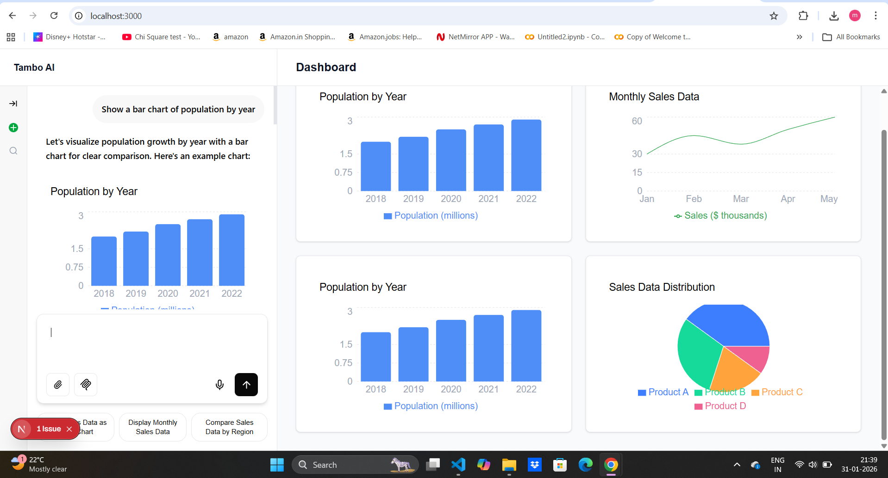

# Tambo AI Dashboard Starter

A starter template for building AI-powered dashboards with Tambo, where natural language prompts generate interactive charts in real time.

## 🚀 What this template demonstrates

- Tambo generative UI integration
- AI chat that renders dynamic chart components
- Dashboard layout for analytics use cases
- Next.js App Router setup

## 📸 Screenshot



## 🎥 Video Demo

(Add your short demo video link here)

## ✅ Prerequisites

- Node.js 18+
- A free Tambo API key from https://tambo.co

## 🛠 Setup Instructions

1. Install dependencies:

```bash
npm install
Initialize Tambo and add your API key:

npx tambo init


Start the development server:

npm run dev


Open in browser:

http://localhost:3000