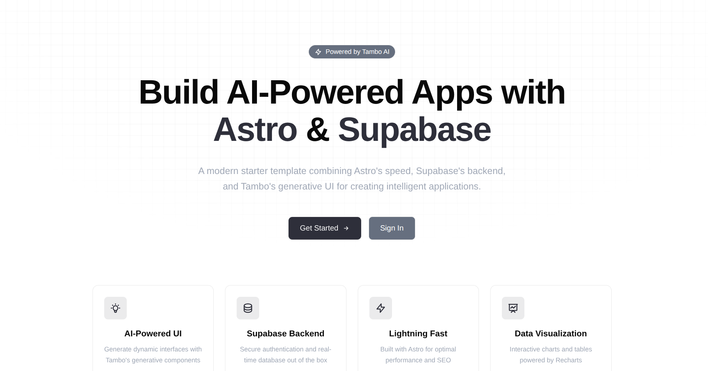

# Astro Supabase Tambo Template

This is a starter Astro app with Supabase and Tambo hooked up to get your AI app development started quickly.



[Watch the Demo Video](https://youtu.be/placeholder)

## Get Started

1. Copy this template (or clone the repo and navigate to this folder)

2. `npm install`

3. Create a `.env` file (copy from example if available) with your credentials:
   ```env
   PUBLIC_SUPABASE_URL=your-supabase-url
   PUBLIC_SUPABASE_ANON_KEY=your-supabase-public-key
   PUBLIC_TAMBO_API_KEY=your-tambo-api-key
   ```
   *   Get your Tambo API key for free [here](https://tambo.co/dashboard).
   *   Get your Supabase URL/Key from your [Supabase Dashboard](https://supabase.com/dashboard).

4. **Supabase Setup**: Run the following SQL in your Supabase SQL Editor to create the users table:
   ```sql
   CREATE TABLE users (
     id UUID DEFAULT gen_random_uuid() PRIMARY KEY,
     name TEXT NOT NULL,
     email TEXT NOT NULL UNIQUE,
     created_at TIMESTAMPTZ DEFAULT NOW()
   );
   ALTER TABLE users ENABLE ROW LEVEL SECURITY;
   CREATE POLICY "Allow all" ON users FOR ALL USING (true);
   ```

5. Run `npm run dev` and go to `localhost:4321` to use the app!

## Customizing

### Change what components tambo can control

You can see how components are registered with tambo in `src/lib/tambo.ts`:

```typescript
export const components: TamboComponent[] = [
    {
        name: "Graph",
        description: "A component that renders various types of charts...",
        component: Graph,
        propsSchema: graphSchema,
    },
    // Add more components here
];
```

You can update this array with any component(s) you want tambo to be able to use in a response!

### Add tools for tambo to use

Tools are defined with `inputSchema` and `outputSchema` in `src/lib/tambo.ts`:

```typescript
export const tools: TamboTool[] = [
    {
        name: "fetchUsers",
        description: "Fetches all users from the database.",
        // ... implementation
    },
];
```

This template includes tools to `fetchUsers`, `addUser`, `deleteUser`, and `getUserCount` connected to Supabase.

### The Magic of Tambo Requires the TamboProvider

Make sure in the TamboProvider wrapped around your app (see `src/components/TamboChat.tsx`):

```tsx
<TamboProvider
    apiKey={import.meta.env.PUBLIC_TAMBO_API_KEY}
    components={components}
    tools={tools}
>
    <ChatInterface />
</TamboProvider>
```

### Authentication

This template features built-in authentication using Supabase. The auth flow is handled in:
- `src/pages/register.astro`
- `src/pages/signin.astro`
- `src/pages/dashboard.astro`
