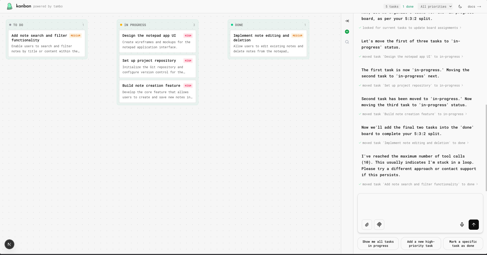

# Kanban Board

A conversational kanban board powered by [Tambo](https://tambo.co). Create, move, and manage tasks using natural language.



## Demo

**Live Demo:** [tambo-kanban.vercel.app](https://tambo-kanban.vercel.app)

https://github.com/user-attachments/assets/04cbd93c-569b-49ca-bb36-964bbe5bd5ca

## Features

- **Natural Language Task Management** — Create, update, delete, and move tasks through conversation
- **Drag & Drop** — Intuitive drag-and-drop between columns
- **Priority Filtering** — Filter tasks by high, medium, or low priority
- **Dark Mode** — Toggle between light and dark themes
- **Confetti Celebration** — Fun feedback when completing tasks
- **Persistent Storage** — Tasks saved to localStorage
- **Real-time Updates** — Board updates instantly as you chat

## Tech Stack

- **Framework:** Next.js 15 + React 19
- **AI:** [Tambo](https://tambo.co) for generative UI
- **State:** Zustand with localStorage persistence
- **Styling:** Tailwind CSS
- **Fonts:** Roboto Mono + Josefin Sans

## Quick Start

```bash
# Clone the repo
git clone https://github.com/tambo-ai/tambo.git
cd tambo/community/templates/kanban-template

# Install dependencies
npm install

# Add your Tambo API key
cp example.env.local .env.local
# Edit .env.local and add NEXT_PUBLIC_TAMBO_API_KEY

# Start dev server
npm run dev
```

Get your free API key at [tambo.co/dashboard](https://tambo.co/dashboard)

## Example Prompts

| Say this | What happens |
|----------|--------------|
| "Create a task to review the PR" | Creates task in To Do |
| "Add a high priority bug fix" | Creates high priority task |
| "Move review PR to in progress" | Moves task to In Progress |
| "Mark bug fix as done" | Moves to Done + confetti |
| "Delete the review task" | Removes task |
| "Change bug fix priority to low" | Updates priority |
| "Show all high priority tasks" | Lists filtered tasks |

## Project Structure

```
src/
├── app/
│   ├── page.tsx              # Main layout: board + chat
│   └── chat/page.tsx         # Full-screen chat
├── components/tambo/
│   ├── kanban-board.tsx      # Drag-drop board with columns
│   ├── task-card.tsx         # Task card component
│   └── message-*.tsx         # Chat UI components
├── lib/
│   ├── tambo.ts              # Component & tool registration
│   ├── task-store.ts         # Zustand store
│   └── task-tools.ts         # AI tools (create, move, update, delete)
└── types/
    └── task.ts               # TypeScript types
```

## Tambo Tools

| Tool | Description |
|------|-------------|
| `createTask` | Create a new task with title, description, priority, due date |
| `moveTask` | Move task to different column (todo, in-progress, done) |
| `updateTask` | Update task details (title, description, priority) |
| `deleteTask` | Remove a task from the board |
| `getTasks` | Get all tasks, optionally filtered by status |

## License

MIT — Built with [Tambo](https://tambo.co)
