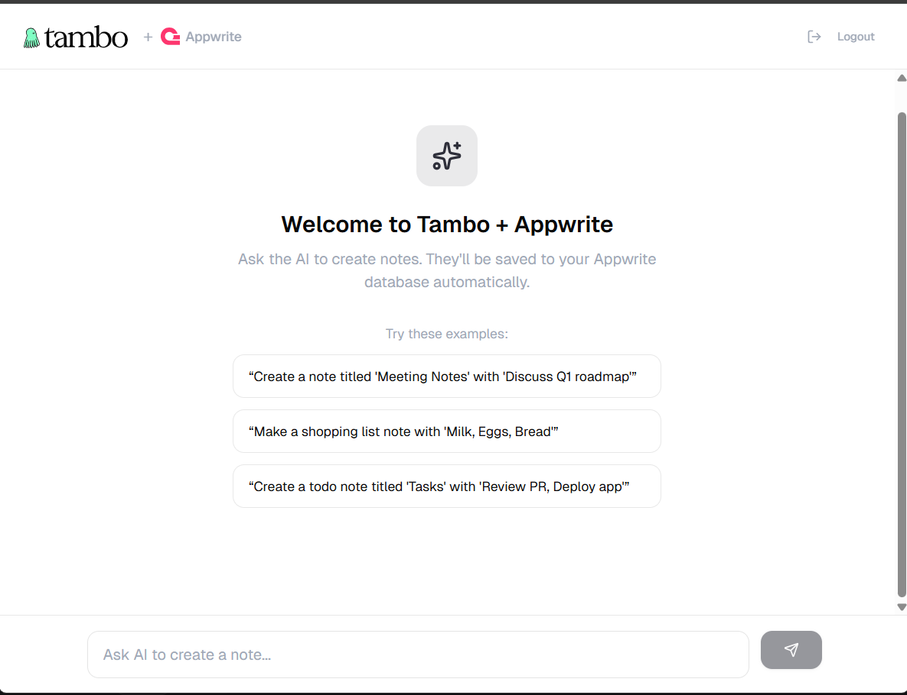

# Tambo + Appwrite Starter

A production-ready template for building AI-powered applications with **Generative UI**. This starter combines Next.js 15, Appwrite (Auth + Database), and Tambo to create a notes app where AI can render React components directly in the conversation.

## ⚡ Quick Start (5 minutes)

```bash
# 1. Clone and install
git clone <your-repo>
cd nextjs-appwrite-starter
npm install

# 2. Set up environment
cp .env.example .env.local
# Fill in your keys (see "Environment Setup" below)

# 3. Set up Appwrite (see detailed steps below)
# - Create project at cloud.appwrite.io
# - Enable Email/Password auth
# - Create database → collection "notes" → add title & content attributes
# - Set permissions: Any authenticated user can CRUD

# 4. Run
npm run dev
```

Visit [http://localhost:3000](http://localhost:3000), sign up, and ask: _"Create a note titled 'Test' with content 'Hello World'"_

**For detailed setup, continue reading below.**

---

## Demo



[Watch the demo video](https://github.com/user-attachments/assets/0df38fe3-2ddb-4cb6-a080-def75d7d7951)

---

## Features

- **🎨 Generative UI** - AI renders React components (`NoteCard`) directly in chat based on user intent
- **🔐 Appwrite Authentication** - Secure Email/Password login with session management
- **💾 Backend Persistence** - Tools create documents in Appwrite that persist across sessions
- **⚡ Modern Stack** - Next.js 15 (App Router + Turbopack), Tailwind v4, TypeScript strict mode

## Tech Stack

| Technology                               | Version | Purpose                |
| ---------------------------------------- | ------- | ---------------------- |
| [Next.js](https://nextjs.org)            | 15.5    | App Router + Turbopack |
| [Appwrite](https://appwrite.io)          | 17.0    | Auth & Database        |
| [Tambo](https://tambo.co)                | 0.72    | Generative UI SDK      |
| [Tailwind CSS](https://tailwindcss.com)  | 4.x     | Styling                |
| [TypeScript](https://typescriptlang.org) | 5.x     | Type safety (strict)   |

---

## Prerequisites

### Required Software

| Software | Version | Check Command    |
| -------- | ------- | ---------------- |
| Node.js  | 18+     | `node --version` |
| npm      | 9+      | `npm --version`  |
| Git      | any     | `git --version`  |

### Required Accounts

- **[Tambo Account](https://app.tambo.co)** - Get your API key (free tier available)
- **[Appwrite Account](https://cloud.appwrite.io)** - Cloud or [self-hosted](https://appwrite.io/docs/self-hosting)

### Recommended

- **VS Code** with ESLint, Prettier, and Tailwind CSS IntelliSense extensions

---

## Setup Guide

### Step 1: Install Dependencies

```bash
npm install
```

### Step 2: Environment Variables

```bash
cp .env.example .env.local
```

Edit `.env.local` with your values:

```env
# Tambo - Get from https://app.tambo.co/dashboard
NEXT_PUBLIC_TAMBO_API_KEY=your_tambo_api_key

# Appwrite - Get from Appwrite Console
NEXT_PUBLIC_APPWRITE_PROJECT_ID=your_project_id
NEXT_PUBLIC_APPWRITE_ENDPOINT=https://cloud.appwrite.io/v1
NEXT_PUBLIC_APPWRITE_DATABASE_ID=your_database_id
NEXT_PUBLIC_APPWRITE_COLLECTION_ID=your_collection_id
```

| Variable                             | Where to Find                                                                 |
| ------------------------------------ | ----------------------------------------------------------------------------- |
| `NEXT_PUBLIC_TAMBO_API_KEY`          | [Tambo Dashboard](https://app.tambo.co/dashboard) → API Keys                  |
| `NEXT_PUBLIC_APPWRITE_PROJECT_ID`    | [Appwrite Console](https://cloud.appwrite.io) → Project Settings → Project ID |
| `NEXT_PUBLIC_APPWRITE_ENDPOINT`      | Usually `https://cloud.appwrite.io/v1`                                        |
| `NEXT_PUBLIC_APPWRITE_DATABASE_ID`   | Appwrite → Databases → Your Database → Settings                               |
| `NEXT_PUBLIC_APPWRITE_COLLECTION_ID` | Appwrite → Your Database → notes collection → Settings                        |

### Step 3: Appwrite Setup

#### 3a. Enable Authentication

1. Go to **[Appwrite Console](https://cloud.appwrite.io)**
2. Create or select your project
3. Navigate to **Auth** → **Settings**
4. Enable **Email/Password** authentication
5. Click **Update**

#### 3b. Create Database

1. Go to **Databases** → **Create Database**
2. Name: `main` (or your preference)
3. **Copy the Database ID** → paste into `.env.local` as `NEXT_PUBLIC_APPWRITE_DATABASE_ID`

#### 3c. Create Collection

1. Inside your database, click **Create Collection**
2. Name: `notes`
3. **Copy the Collection ID** → paste into `.env.local` as `NEXT_PUBLIC_APPWRITE_COLLECTION_ID`

#### 3d. Add Attributes

In the `notes` collection, go to **Attributes** tab and add:

| Attribute | Type   | Size | Required |
| --------- | ------ | ---- | -------- |
| `title`   | String | 255  | ✅ Yes   |
| `content` | String | 5000 | ✅ Yes   |

> 💡 This template does not store a `userId` attribute. Data isolation relies on Appwrite's permission system (see below).

#### 3e. Set Permissions

1. Go to collection **Settings** → **Permissions**
2. Click **Add Role** and configure:

| Role    | Create | Read | Update | Delete |
| ------- | ------ | ---- | ------ | ------ |
| `users` | ✅     | ✅   | ✅     | ✅     |

> ⚠️ **Note:** The `users` role grants access to ALL authenticated users. For production apps where users should only see their own notes, you would add a `userId` attribute and use document-level permissions or query filters. This template uses simplified permissions for demonstration purposes.

### Step 4: Run the App

```bash
npm run dev
```

Open [http://localhost:3000](http://localhost:3000)

**Test it:**

1. Click **Sign up** to create an account
2. After login, type: _"Create a note titled 'Shopping List' with 'Milk, Eggs, Bread'"_
3. Watch the AI create the note and render a `NoteCard` component!

---

## 🧠 Understanding Tambo

### What is Generative UI?

Traditional UI development:

```tsx
// You decide WHEN to show the component
{
  noteCreated && <NoteCard title={note.title} />;
}
```

Generative UI with Tambo:

```tsx
// You register WHAT components exist, AI decides WHEN to show them
components: [{ name: "NoteCard", component: NoteCard, ... }]
```

The AI analyzes user intent and autonomously decides which components to render based on context.

### Architecture & Data Flow

```
┌─────────────────────────────────────────────────────────────────┐
│                        USER MESSAGE                              │
│              "Create a note about groceries"                     │
└─────────────────────────────────┬───────────────────────────────┘
                                  │
                                  ▼
┌─────────────────────────────────────────────────────────────────┐
│                         TAMBO AI                                 │
│   1. Analyzes intent: "User wants to create a note"             │
│   2. Extracts params: { title: "Groceries", content: "..." }    │
│   3. Decides: Call "create_user_note" tool                       │
└─────────────────────────────────┬───────────────────────────────┘
                                  │
                                  ▼
┌─────────────────────────────────────────────────────────────────┐
│                    TOOL EXECUTION (Client-Side)                  │
│                                                                  │
│   // src/lib/tambo.ts                                           │
│   const createUserNote = async ({ title, content }) => {        │
│     const document = await databases.createDocument(            │
│       DATABASE_ID, COLLECTION_ID, ID.unique(),                  │
│       { title, content }  // ← Sent to Appwrite                 │
│     );                                                          │
│     return { success: true, documentId: document.$id };         │
│   };                                                            │
│                                                                  │
└─────────────────────────────────┬───────────────────────────────┘
                                  │
                                  ▼
┌─────────────────────────────────────────────────────────────────┐
│                         APPWRITE                                 │
│   • Checks user session (from browser cookies)                  │
│   • Validates permissions (users role has Create access)        │
│   • Creates document in "notes" collection                       │
│   • Returns new document with $id                                │
└─────────────────────────────────┬───────────────────────────────┘
                                  │
                                  ▼
┌─────────────────────────────────────────────────────────────────┐
│                         TAMBO AI                                 │
│   1. Receives tool result: { success: true, documentId: "..." } │
│   2. Decides: Render NoteCard to show the created note          │
│   3. Passes props: { title: "Groceries", content: "..." }       │
└─────────────────────────────────┬───────────────────────────────┘
                                  │
                                  ▼
┌─────────────────────────────────────────────────────────────────┐
│                       REACT COMPONENT                            │
│                                                                  │
│   <NoteCard title="Groceries" content="..." />                  │
│                                                                  │
│   Renders directly in the chat as a styled card!                │
└─────────────────────────────────────────────────────────────────┘
```

**Key insight:** Tools execute **client-side** in the browser. The Appwrite SDK uses the authenticated user's session cookies automatically.

---

## 🔍 Deep Dive: Key Concepts

### 1. The Provider (`AppwriteTamboProvider`)

**Location:** `src/components/appwrite-tambo-provider.tsx`

This component wraps Tambo's provider to integrate Appwrite authentication:

```tsx
export function AppwriteTamboProvider({ children }: { children: ReactNode }) {
  const [user, setUser] = useState<{ id: string; email: string } | null>(null);

  useEffect(() => {
    const fetchUser = async () => {
      try {
        const currentUser = await account.get();
        setUser({ id: currentUser.$id, email: currentUser.email });
      } catch {
        setUser(null); // Not logged in
      }
    };
    fetchUser();
  }, []);

  return (
    <TamboProvider
      apiKey={process.env.NEXT_PUBLIC_TAMBO_API_KEY!}
      components={components}
      tools={tools}
      user={user ? { id: user.id, email: user.email } : undefined}
    >
      {children}
    </TamboProvider>
  );
}
```

**What the `user` prop does:**

- ✅ Enables per-user conversation isolation
- ✅ Allows AI to personalize responses
- ✅ Required for multi-user applications

**Without `user` prop:**

- ❌ All users share the same conversation thread
- ❌ No personalization possible

### 2. Components (Generative UI)

**Location:** `src/lib/tambo.ts`

Components are React components with metadata that tells AI when to use them:

```tsx
export const components: TamboComponent[] = [
  {
    name: "NoteCard",
    description:
      "A card component that displays a note with a title and content. " +
      "Use this to show the note that was just created.",
    component: NoteCard,
    propsSchema: z.object({
      title: z.string().describe("The title of the note"),
      content: z.string().describe("The content/body of the note"),
    }),
  },
];
```

**Key elements:**

| Property      | Purpose                                | Example                                             |
| ------------- | -------------------------------------- | --------------------------------------------------- |
| `name`        | Identifier for AI                      | `"NoteCard"`                                        |
| `description` | **CRITICAL** - Tells AI WHEN to use it | `"Use this to show the note that was just created"` |
| `component`   | Actual React component                 | `NoteCard`                                          |
| `propsSchema` | Zod schema defining required props     | `z.object({ title: z.string(), ... })`              |

> ⚠️ **Important:** The `description` is the most important property. Vague descriptions = AI won't use your component correctly.

### 3. Tools (Backend Actions)

**Location:** `src/lib/tambo.ts`

Tools let AI perform actions like database operations:

```tsx
const createUserNote = async ({
  title,
  content,
}: {
  title: string;
  content: string;
}) => {
  try {
    const document = await databases.createDocument(
      DATABASE_ID,
      COLLECTION_ID,
      ID.unique(),
      { title, content },
    );
    return {
      success: true,
      message: `Note "${title}" created successfully!`,
      documentId: document.$id,
    };
  } catch (error) {
    console.error("Failed to create note:", error);
    return {
      success: false,
      message: "Failed to create note. Please try again.",
      documentId: null,
    };
  }
};

export const tools: TamboTool[] = [
  {
    name: "create_user_note",
    description:
      "Creates a new note in the Appwrite database. " +
      "After creating the note, provide a friendly confirmation and " +
      "render a NoteCard component to show them the note.",
    tool: createUserNote,
    inputSchema: z.object({
      title: z.string().describe("The title of the note"),
      content: z.string().describe("The content/body of the note"),
    }),
    outputSchema: z.object({
      success: z.boolean(),
      message: z.string(),
      documentId: z.string().nullable(),
    }),
  },
];
```

**Tool anatomy:**

| Property       | Purpose                                             |
| -------------- | --------------------------------------------------- |
| `name`         | Tool identifier (snake_case recommended)            |
| `description`  | Tells AI when to call this tool                     |
| `tool`         | Async function that executes the action             |
| `inputSchema`  | What parameters AI should extract from user message |
| `outputSchema` | Shape of the return value                           |

## 📁 Template Structure: What to Keep vs Replace

This is a **starter template**. It includes example code (the Notes app) to demonstrate the pattern. When building your own app, you'll **keep the boilerplate** and **replace the example code**.

### 🟢 KEEP: Boilerplate (Foundation)

These files provide the Tambo + Appwrite integration. **Don't modify unless customizing:**

```
src/
├── lib/
│   ├── appwrite.ts          # Appwrite client setup
│   ├── env.ts                # Environment validation
│   └── utils.ts              # Utility functions
├── components/
│   ├── appwrite-tambo-provider.tsx  # Provider wrapper (binds auth to Tambo)
│   ├── chat-interface.tsx           # Chat UI (renders messages + components)
│   ├── env-error.tsx               # Missing env vars error screen
│   └── ui/                         # Reusable UI components
│       ├── button.tsx
│       ├── card.tsx
│       ├── input.tsx
│       └── label.tsx
└── app/
    ├── layout.tsx            # Root layout with providers
    ├── page.tsx              # Home page with auth check
    ├── globals.css           # Tailwind styles
    └── (auth)/
        └── login/page.tsx    # Login/signup page
```

### 🔴 REPLACE: Example Code (The Notes App)

These files are the **example implementation**. Delete or replace with your own:

```
src/
├── lib/
│   └── tambo.ts              # 🔴 Contains NoteCard registration + create_user_note tool
│                             #    → Replace with YOUR components and tools
└── components/
    └── tambo/
        └── NoteCard.tsx      # 🔴 Example component
                              #    → Delete and add YOUR components
```

**Also replace in Appwrite:**

- The `notes` collection → Create your own collection(s) with your schema

### Visual Summary

| File/Folder                                  | Type           | Action                      |
| -------------------------------------------- | -------------- | --------------------------- |
| `src/lib/appwrite.ts`                        | 🟢 Boilerplate | Keep                        |
| `src/lib/tambo.ts`                           | 🔴 Example     | **Replace contents**        |
| `src/components/appwrite-tambo-provider.tsx` | 🟢 Boilerplate | Keep                        |
| `src/components/chat-interface.tsx`          | 🟢 Boilerplate | Keep (or customize styling) |
| `src/components/tambo/NoteCard.tsx`          | 🔴 Example     | **Delete**                  |
| `src/components/ui/*`                        | 🟢 Boilerplate | Keep                        |
| `src/app/*`                                  | � Boilerplate  | Keep                        |
| Appwrite `notes` collection                  | 🔴 Example     | **Create your own**         |

---

## �🔧 Building Your Own App

### Step 1: Clear the Example Code

Delete the example files:

```bash
# Delete example component
rm src/components/tambo/NoteCard.tsx

# Clear tambo.ts (we'll rewrite it)
```

### Step 2: Create a Clean `tambo.ts`

Replace `src/lib/tambo.ts` with this minimal template:

```tsx
// src/lib/tambo.ts
import { databases } from "@/lib/appwrite";
import type { TamboComponent, TamboTool } from "@tambo-ai/react";
import { ID } from "appwrite";
import { z } from "zod";

// Your Appwrite collection config
const DATABASE_ID = process.env.NEXT_PUBLIC_APPWRITE_DATABASE_ID!;
const COLLECTION_ID = process.env.NEXT_PUBLIC_APPWRITE_COLLECTION_ID!;

// ============================================
// 1. REGISTER YOUR COMPONENTS HERE
// ============================================
export const components: TamboComponent[] = [
  // Example:
  // {
  //   name: "YourComponent",
  //   description: "Describe when AI should render this...",
  //   component: YourComponent,
  //   propsSchema: z.object({ ... }),
  // },
];

// ============================================
// 2. REGISTER YOUR TOOLS HERE
// ============================================
export const tools: TamboTool[] = [
  // Example:
  // {
  //   name: "your_tool_name",
  //   description: "Describe what this tool does...",
  //   tool: async (params) => { ... },
  //   inputSchema: z.object({ ... }),
  //   outputSchema: z.object({ ... }),
  // },
];
```

### Step 3: Create Your Appwrite Collection

1. In Appwrite Console, create a new collection for your data
2. Add the attributes your app needs
3. Update `.env.local` with the new Collection ID

### Step 4: Add Your First Component

```tsx
// src/components/tambo/YourComponent.tsx
"use client";

interface YourComponentProps {
  // Define your props
}

export function YourComponent(props: YourComponentProps) {
  return (
    // Your JSX
  );
}
```

### Step 5: Register Component + Tool

```tsx
// src/lib/tambo.ts
import { YourComponent } from "@/components/tambo/YourComponent";

export const components: TamboComponent[] = [
  {
    name: "YourComponent",
    description:
      "A detailed description of when AI should use this component...",
    component: YourComponent,
    propsSchema: z.object({
      // Match your component's props
    }),
  },
];

export const tools: TamboTool[] = [
  {
    name: "your_action",
    description: "Describe the action and when AI should call it...",
    tool: async (params) => {
      const doc = await databases.createDocument(
        DATABASE_ID,
        COLLECTION_ID,
        ID.unique(),
        params,
      );
      return { success: true, id: doc.$id };
    },
    inputSchema: z.object({
      /* params */
    }),
    outputSchema: z.object({ success: z.boolean(), id: z.string() }),
  },
];
```

### Step 6: Update Chat Suggestions (Optional)

Edit `src/components/chat-interface.tsx` to update the example prompts:

```tsx
const suggestions = [
  "Your first example prompt...",
  "Your second example prompt...",
  "Your third example prompt...",
];
```

---

## 📖 Example: Building a Task Manager

Here's a complete example of replacing the Notes app with a Task Manager:

### 1. Create Appwrite Collection

**Collection name:** `tasks`

| Attribute   | Type    | Size | Required |
| ----------- | ------- | ---- | -------- |
| `title`     | String  | 255  | ✅       |
| `priority`  | String  | 10   | ✅       |
| `completed` | Boolean | -    | ✅       |

### 2. Create Component

```tsx
// src/components/tambo/TaskCard.tsx
"use client";

import { Card, CardContent, CardHeader, CardTitle } from "@/components/ui/card";
import { CheckCircle2, Circle } from "lucide-react";

interface TaskCardProps {
  title: string;
  priority: "high" | "medium" | "low";
  completed: boolean;
}

const priorityColors = {
  high: "border-red-500/50",
  medium: "border-yellow-500/50",
  low: "border-green-500/50",
};

export function TaskCard({ title, priority, completed }: TaskCardProps) {
  return (
    <Card className={`w-full max-w-md ${priorityColors[priority]}`}>
      <CardHeader className="pb-2">
        <div className="flex items-center gap-2">
          {completed ? (
            <CheckCircle2 className="w-5 h-5 text-green-500" />
          ) : (
            <Circle className="w-5 h-5 text-muted-foreground" />
          )}
          <CardTitle
            className={completed ? "line-through text-muted-foreground" : ""}
          >
            {title}
          </CardTitle>
        </div>
      </CardHeader>
      <CardContent>
        <span
          className={`text-xs font-medium uppercase ${priorityColors[priority].replace("border-", "text-")}`}
        >
          {priority} priority
        </span>
      </CardContent>
    </Card>
  );
}
```

### 3. Register in tambo.ts

```tsx
// src/lib/tambo.ts
import { TaskCard } from "@/components/tambo/TaskCard";
import { databases } from "@/lib/appwrite";
import type { TamboComponent, TamboTool } from "@tambo-ai/react";
import { ID } from "appwrite";
import { z } from "zod";

const DATABASE_ID = process.env.NEXT_PUBLIC_APPWRITE_DATABASE_ID!;
const TASKS_COLLECTION_ID = process.env.NEXT_PUBLIC_APPWRITE_COLLECTION_ID!;

export const components: TamboComponent[] = [
  {
    name: "TaskCard",
    description:
      "Displays a task with its title, priority level, and completion status. " +
      "Use this when showing a task that was created or when displaying task information.",
    component: TaskCard,
    propsSchema: z.object({
      title: z.string().describe("The task title"),
      priority: z.enum(["high", "medium", "low"]).describe("Priority level"),
      completed: z.boolean().describe("Whether the task is completed"),
    }),
  },
];

const createTask = async ({
  title,
  priority,
}: {
  title: string;
  priority: "high" | "medium" | "low";
}) => {
  const doc = await databases.createDocument(
    DATABASE_ID,
    TASKS_COLLECTION_ID,
    ID.unique(),
    { title, priority, completed: false },
  );
  return {
    success: true,
    task: { title, priority, completed: false, id: doc.$id },
  };
};

export const tools: TamboTool[] = [
  {
    name: "create_task",
    description:
      "Creates a new task with a priority level. " +
      "Call this when the user wants to add, create, or make a task or todo item.",
    tool: createTask,
    inputSchema: z.object({
      title: z.string().describe("The task title"),
      priority: z
        .enum(["high", "medium", "low"])
        .describe("Priority: high, medium, or low"),
    }),
    outputSchema: z.object({
      success: z.boolean(),
      task: z.object({
        title: z.string(),
        priority: z.enum(["high", "medium", "low"]),
        completed: z.boolean(),
        id: z.string(),
      }),
    }),
  },
];
```

### 4. Test It

```
"Create a high priority task to finish the quarterly report"
"Add a low priority task for reviewing emails"
```

---

## 🔐 Security Best Practices

### Environment Variables

```bash
# These files are in .gitignore - NEVER commit them
.env.local
.env.development.local
.env.production.local
```

| Do ✅                                | Don't ❌                       |
| ------------------------------------ | ------------------------------ |
| Use `.env.local` for development     | Commit `.env.local` to git     |
| Use platform env vars for production | Share API keys in chat/email   |
| Rotate keys if compromised           | Use same keys for dev and prod |

### Appwrite Permissions

**Current template uses:**

- `users` role = Any authenticated user can CRUD

**For production with data isolation:**

1. Add `userId` attribute to collection
2. Modify tool to include userId:
   ```tsx
   const user = await account.get();
   await databases.createDocument(..., {
     title, content,
     userId: user.$id,  // Add this
   });
   ```
3. Add query filter when reading:
   ```tsx
   Query.equal("userId", user.$id);
   ```
4. Set document-level permissions at creation

### Input Validation

Tambo's Zod schemas validate input, but add server-side checks too:

```tsx
const createUserNote = async ({ title, content }) => {
  // Additional validation
  if (title.length > 255) throw new Error("Title too long");
  if (content.length > 5000) throw new Error("Content too long");
  // ... rest of implementation
};
```

---

## 🐛 Troubleshooting

### Common Issues

| Issue                                   | Cause                            | Solution                                                |
| --------------------------------------- | -------------------------------- | ------------------------------------------------------- |
| **"Collection not found"**              | Wrong Collection ID              | Copy correct ID from Appwrite Console                   |
| **"User (role: guests) missing scope"** | User not logged in               | Ensure user is authenticated before tool execution      |
| **"User (role: users) missing scope"**  | Collection permissions wrong     | Add `users` role with CRUD permissions                  |
| **Component not rendering**             | Description too vague            | Make description specific: "Use this to show X after Y" |
| **Tool not being called**               | Description doesn't match intent | Add trigger words: "create, add, make, save"            |
| **Environment variables undefined**     | Wrong file name or not restarted | Use `.env.local` (not `.env`), restart dev server       |

### Debugging Tools

**1. Browser Console Logging:**

```tsx
const createUserNote = async (params) => {
  console.log("[Tool] create_user_note called with:", params);
  const result = await /* ... */;
  console.log("[Tool] Result:", result);
  return result;
};
```

**2. Check Registered Components/Tools:**

```tsx
// Temporarily add to a component
console.log("Registered components:", components);
console.log("Registered tools:", tools);
```

**3. Appwrite Console Logs:**

- Go to Appwrite Console → Your Project → Logs
- Shows all API calls, errors, and authentication events

**4. Verify User Session:**

```tsx
// In browser console
await (
  await import("./src/lib/appwrite")
).account
  .get()
  .then(console.log)
  .catch(() => console.log("Not logged in"));
```

### Error Messages Explained

| Error                                                                  | Meaning                                                   |
| ---------------------------------------------------------------------- | --------------------------------------------------------- |
| `AppwriteException: Document with the requested ID could not be found` | Document doesn't exist or user lacks permission           |
| `AppwriteException: Invalid document structure`                        | Attributes don't match collection schema                  |
| `AppwriteException: Rate limit exceeded`                               | Too many API calls, wait and retry                        |
| `TypeError: Cannot read property 'createDocument' of undefined`        | `databases` not initialized - check environment variables |

---

## 🚀 Deployment

### Vercel (Recommended)

#### Step 1: Push to GitHub

```bash
git add .
git commit -m "Initial commit"
git push origin main
```

#### Step 2: Deploy to Vercel

1. Go to [vercel.com/new](https://vercel.com/new)
2. Import your GitHub repository
3. Vercel auto-detects Next.js

#### Step 3: Add Environment Variables

In Vercel dashboard → Settings → Environment Variables:

| Name                                 | Value                          | Environment |
| ------------------------------------ | ------------------------------ | ----------- |
| `NEXT_PUBLIC_TAMBO_API_KEY`          | Your production key            | Production  |
| `NEXT_PUBLIC_APPWRITE_PROJECT_ID`    | Your project ID                | Production  |
| `NEXT_PUBLIC_APPWRITE_ENDPOINT`      | `https://cloud.appwrite.io/v1` | Production  |
| `NEXT_PUBLIC_APPWRITE_DATABASE_ID`   | Your database ID               | Production  |
| `NEXT_PUBLIC_APPWRITE_COLLECTION_ID` | Your collection ID             | Production  |

#### Step 4: Configure Appwrite for Production

⚠️ **CRITICAL:** Add your Vercel domain to Appwrite

1. Go to Appwrite Console → Project Settings → Platforms
2. Click **Add Platform** → **Web**
3. Add your Vercel domain: `your-app.vercel.app`

Without this, authentication will fail in production!

### Production Checklist

- [ ] Use separate Appwrite project for production
- [ ] Use different Tambo API key for production
- [ ] Add Vercel domain to Appwrite platforms
- [ ] Test authentication flow on production URL
- [ ] Set up error monitoring (Sentry, LogRocket)

---

## ❓ FAQ

**Q: Can I use a different database (Supabase, Firebase)?**
A: Yes! Replace the Appwrite SDK in `src/lib/appwrite.ts` and update the tools to use your database client.

**Q: How do I add OAuth login (Google, GitHub)?**
A: Enable OAuth providers in Appwrite Console → Auth → Settings, then update the login page to include OAuth buttons.

**Q: Does this work with other AI models?**
A: Tambo supports multiple AI backends. Check [Tambo docs](https://docs.tambo.co) for configuration options.

**Q: How do I make sure users only see their own notes?**
A: Add a `userId` attribute to the collection, store `user.$id` when creating documents, and filter queries with `Query.equal("userId", user.$id)`.

**Q: Is this production-ready?**
A: This is a starter template. For production, add: error boundaries, rate limiting, proper logging, monitoring, and more robust permission handling.

---

## 🤝 Contributing

Found a bug or want to improve this template?

1. Check [existing issues](../../issues)
2. Create a feature branch: `git checkout -b feature/amazing-feature`
3. Make your changes and test thoroughly
4. Run `npm run lint` and `npm run typecheck`
5. Commit: `git commit -m 'Add amazing feature'`
6. Push and open a Pull Request

---

## 📄 License

MIT License - see [LICENSE](LICENSE) for details.

---

## 📚 Learn More

- [Tambo Documentation](https://docs.tambo.co)
- [Appwrite Documentation](https://appwrite.io/docs)
- [Next.js Documentation](https://nextjs.org/docs)
- [Tailwind CSS Documentation](https://tailwindcss.com/docs)
