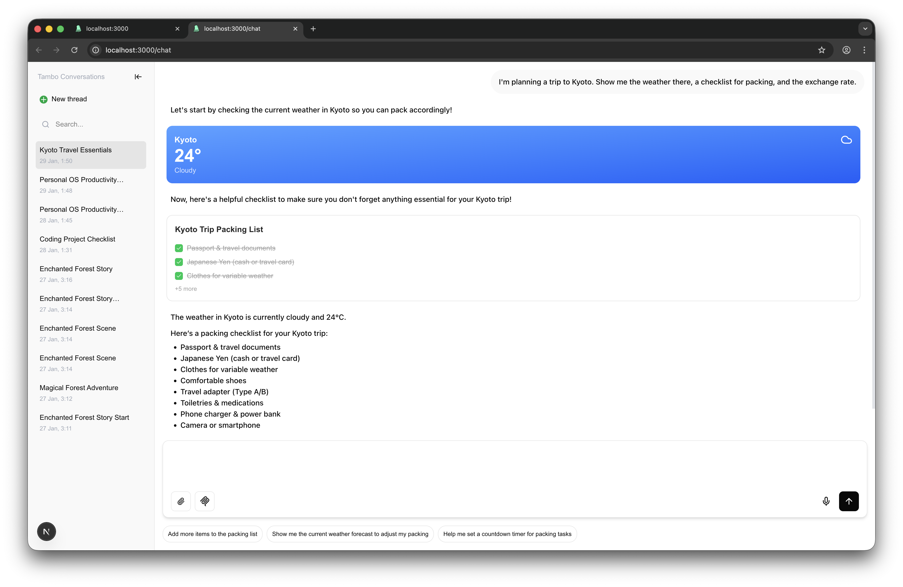
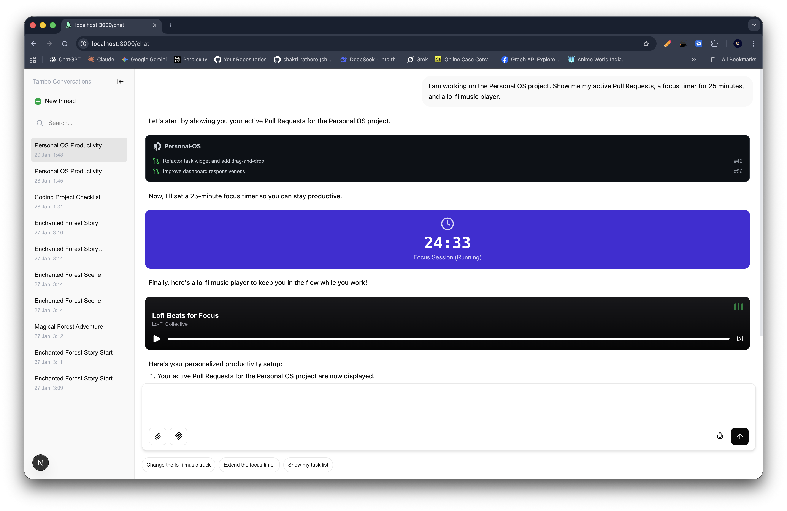

# Personal OS Starter (Bento Grid)

A highly aesthetic "Personal OS" dashboard template featuring a Bento Grid layout, beautiful widgets, and AI customization via Tambo.

## 💡 The Idea: "Personal OS" (The Self-Building Dashboard)

**The Concept:**
A modular, "Bento-style" dashboard that uses AI to **design itself** based on the user's context. Instead of manually dragging widgets around, the user simply tells the AI what "mode" they are in, and the OS adapts.

**Why Use This Template?**
Most dashboards are static. You build them once and they stay that way. **Personal OS** is _alive_.

- **Context Awareness:** using `useTambo` hook to render entire layouts.
- **Coding Mode:** _"I'm coding."_ -> Shows **GitHub Widget** (PRs), **Focus Timer**, and **Lo-Fi Music**.
- **Relaxing Mode:** _"I'm relaxing."_ -> Shows **News Widget**, **Weather**, and **Twitter Feed**.

## Features

- **Bento Grid Layout:** Responsive masonry-style grid with smooth animations.
- **Context-Aware Engine:** AI switches "Modes" by generating entirely new grid layouts.
- **7+ Interactive Widgets:**
  - `GitHubWidget`: View PRs and Commits.
  - `TimerWidget`: Focus/Pomodoro timer.
  - `NewsWidget`: Headlines and sources.
  - `WeatherWidget`: Visual weather cards.
  - `TasksWidget`: Checklist with state.
  - `MusicWidget`: Spotify-style player.
  - `StatsWidget`: Trend metrics.
- **Tech Stack:** Next.js 15, Tailwind v4, Framer Motion.

## Why this is valuable

This template solves the "Blank Canvas" problem for personal dashboards. It provides a premium, Apple-style UI out of the box and demonstrates a generic "Widget System" that any developer can extend. It is the perfect starting point for building "Notion-like" or "Linear-like" tools with Tambo.

## 🎥 Video Demo

[](public/video.mp4)

_(Click result above to watch video)_

## 📸 Screenshots


_The default Bento Grid view_


_Context-Aware Mode: "Travel" profile (Kyoto) activated by AI_

## 🚀 Quick Start

1.  **Clone & Run:**

    ```bash
    git clone https://github.com/your-username/personal-os-starter.git
    cd personal-os-starter
    npm install
    npm run dev
    ```

2.  **Open Dashboard:** Go to `http://localhost:3000`.

3.  **Try Context Switching:**
    Click "Ask AI to Customize" and try these prompts:
    - **Coding Mode:**
      > "I am working on the Personal OS project. Show me my active Pull Requests, a focus timer for 25 minutes, and a lo-fi music player."
    - **Travel Mode:**
      > "I'm planning a trip to Kyoto. Show me the weather there, a checklist for packing, and the exchange rate."

## 📂 Project Structure

A clean, modular structure designed for AI-generated UI.

```
src/
├── app/
│   └── page.tsx          # Main Entry: Handles AI responses & layout switching
├── components/
│   ├── tambo/
│   │   ├── widgets.tsx       # Basic Widgets (Weather, Tasks, Music)
│   │   └── more-widgets.tsx  # Context Widgets (GitHub, Timer, News)
│   └── ui/
│       └── bento-grid.tsx    # Masonry Grid Layout Component
└── lib/
    └── tambo.ts          # 🧠 AI Config: Registers all widgets for the LLM
```

## 🧠 How It Works

### 1. The "Context Switch"

In `src/app/page.tsx`, we use the `useTambo` hook. When the AI returns a component (a new layout), we swap the entire dashboard:

```tsx
const { thread } = useTambo();
const latestComponent = thread?.messages.at(-1)?.renderedComponent;

return (
  <main>
    {latestComponent ? (
      // Render AI-generated Layout
      <div className="animate-in fade-in">{latestComponent}</div>
    ) : (
      // Default Static Dashboard
      <DefaultDashboard />
    )}
  </main>
);
```

### 2. Widget Registration

We teach the AI about our widgets in `src/lib/tambo.ts`. This allows it to "hallucinate" usages of them with correct props.

```tsx
export const components: TamboComponent[] = [
  {
    name: "GithubWidget",
    description: "Displays GitHub repository status...",
    component: GithubWidget,
    propsSchema: githubWidgetSchema, // Zod schema defines the data structure
  },
  // ...
];
```

### 3. Adding Your Own Widgets

1.  Create a component in `components/tambo/`.
2.  Define a `zod` schema for its props.
3.  Add it to the `components` array in `lib/tambo.ts`.
4.  Ask the AI to use it!
