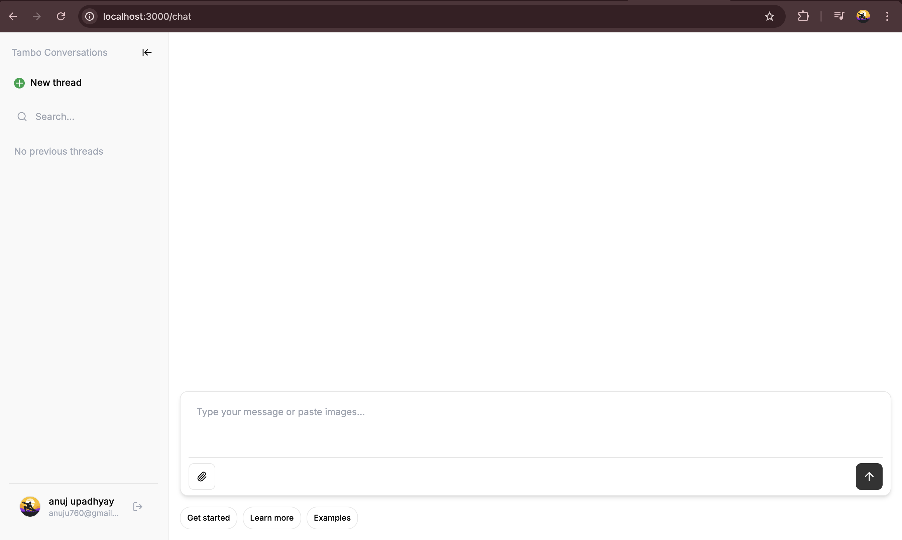

# React Router v7 + Clerk + Tambo Starter

A production-ready starter template combining React Router v7, Clerk authentication, and Tambo AI for generative UI.


*AI-powered chat interface with generative UI components*


## ✨ What's Included

- **[React Router v7](https://reactrouter.com/)** - Modern routing with SSR support (formerly Remix)
- **[Clerk](https://clerk.com/)** - Complete authentication and user management
- **[Tambo AI](https://tambo.ai/)** - AI-powered generative UI components
- **TypeScript** - Full type safety throughout
- **Tailwind CSS** - Modern styling with custom animations

## 📋 Prerequisites

- Node.js 20+
- A [Clerk](https://clerk.com) account (free tier available)
- A [Tambo AI](https://tambo.ai) API key

## 🚀 Quick Start

### 1. Clone and Install

```bash
cd react-router-clerk-starter
npm install
```

### 2. Configure Environment

```bash
cp .env.example .env
```

Add your credentials to `.env`:

```env
VITE_CLERK_PUBLISHABLE_KEY=pk_test_xxxxx
CLERK_SECRET_KEY=sk_test_xxxxx
VITE_TAMBO_API_KEY=tambo_xxxxx
```

### 3. Run Development Server

```bash
npm run dev
```

Open [http://localhost:3000](http://localhost:3000) 🎉

## 📁 Project Structure

```
react-router-clerk-starter/
├── app/
│   ├── components/
│   │   ├── ClientTamboProvider.tsx  # SSR-safe Tambo wrapper
│   │   └── tambo/
│   │       └── UserCard.tsx         # Example generative component
│   ├── lib/
│   │   └── tambo.ts                 # Component & tool registration
│   ├── routes/
│   │   └── home.tsx                 # Main chat interface
│   └── root.tsx                     # App root with providers
├── .env.example
├── package.json
└── README.md
```

## 🧪 Try It Out

After signing in, try these prompts:

- "Show me a user card for Sarah Johnson"
- "Get user info for john.doe@example.com"  
- "Create a user card for Mike Chen, UX Designer"

## 🔧 Tambo Integration

### Component Registration

Components are registered in `app/lib/tambo.ts`:

```typescript
export const components: TamboComponent[] = [
  {
    name: "UserCard",
    description: "A professional user card component...",
    component: UserCard,
    propsSchema: userCardSchema,
  },
];
```

### Tool Registration

Tools fetch data that AI can use:

```typescript
export const tools: TamboTool[] = [
  defineTool({
    name: "getUserInfo",
    description: "Fetch user information by email or name",
    inputSchema: z.object({ email: z.string().optional() }),
    tool: async (params) => { /* ... */ },
  }),
];
```

### SSR Compatibility

The `ClientTamboProvider` component handles SSR by dynamically loading Tambo only on the client side.

## 🏗️ Build for Production

```bash
npm run build
npm start
```

## 📚 Learn More

- [React Router v7 Docs](https://reactrouter.com/)
- [Clerk Documentation](https://clerk.com/docs)
- [Tambo AI Documentation](https://docs.tambo.ai/)

## 📝 License

MIT
