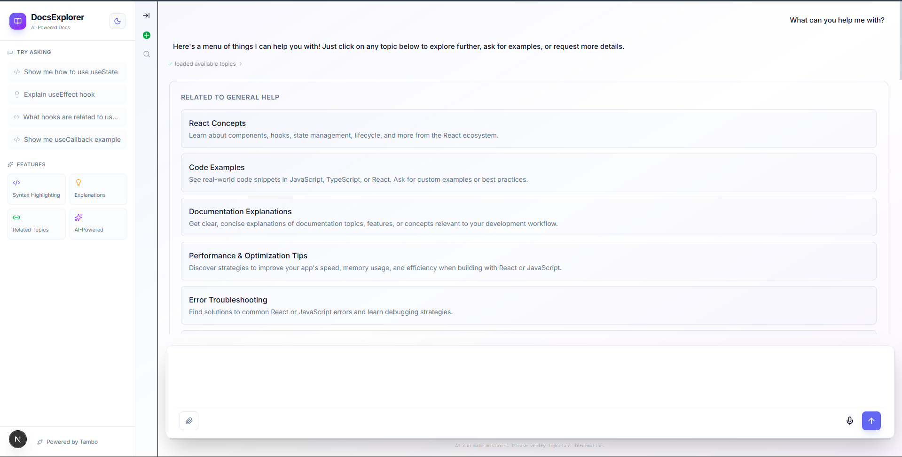
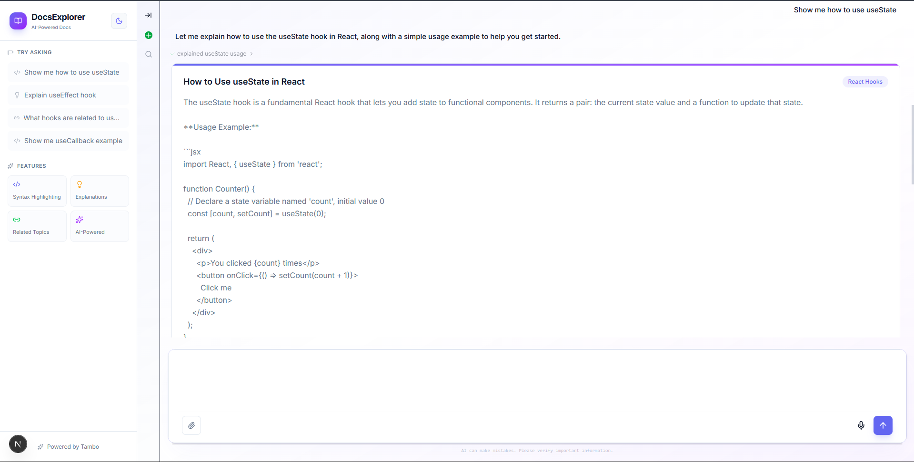
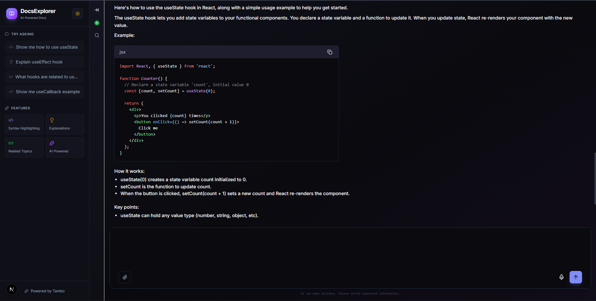

# Tambo Docs Explorer Template

An AI-powered documentation explorer template built with Tambo's generative UI capabilities. This template demonstrates how to build interactive documentation assistants that dynamically render code examples, explanations, and related topics based on natural language queries.

## Features

- 🎨 **Generative UI Components** - AI dynamically chooses which components to render based on user questions
- 💻 **Code Viewer** - Syntax-highlighted code examples with copy-to-clipboard functionality
- 📖 **Doc Explanations** - Formatted documentation with categorization
- 🔗 **Related Topics** - Interactive navigation to related documentation
- 🌙 **Dark Mode** - Full dark mode support
- 📱 **Responsive Design** - Works seamlessly on desktop, tablet, and mobile
- ⚡ **Next.js 15** - Built with the latest Next.js and React features
- 🎯 **TypeScript** - Fully typed with strict mode enabled

## Prerequisites

- Node.js 18+ installed
- A Tambo API key (get one for free at [tambo.co/dashboard](https://tambo.co/dashboard))

## Setup

1. **Clone or download this template**

```bash
cd tambo-docs-explorer
```

2. **Install dependencies**

```bash
npm install
```

3. **Set up environment variables**

Copy the example environment file:

```bash
cp .env.example .env.local
```

Then edit `.env.local` and add your Tambo API key:

```env
NEXT_PUBLIC_TAMBO_API_KEY=your_tambo_api_key_here
```

4. **Run the development server**

```bash
npm run dev
```

5. **Open your browser**

Navigate to [http://localhost:3000](http://localhost:3000)

## What's Included

### Technologies

- **Next.js 15** - React framework for production
- **TypeScript** - Type-safe development
- **Tailwind CSS** - Utility-first CSS framework
- **Tambo SDK** (`@tambo-ai/react`) - AI-powered component rendering
- **Zod** - Schema validation for component props

### Components

- **CodeViewer** - Displays code examples with syntax highlighting
- **DocExplanation** - Shows formatted documentation explanations
- **RelatedTopics** - Displays related documentation topics in a grid

### Example Queries

Try asking the AI assistant:

- "Show me how to use useState"
- "Explain the useEffect hook"
- "What hooks are related to useState?"
- "Show me a useCallback example"
- "How does useContext work?"

## Customization

### Adding Your Own Documentation

Edit `src/data/docs.ts` to add your own documentation entries:

```typescript
export const docs: DocEntry[] = [
  {
    title: "Your Topic",
    code: "// Your code example",
    explanation: "Your explanation",
    category: "Your Category",
    relatedTopics: ["Topic 1", "Topic 2"],
    language: "typescript",
  },
  // Add more entries...
];
```

### Creating New Components

1. Create a new component in `src/components/tambo/`
2. Define a Zod schema for the component props
3. Register it in `src/lib/tambo.ts`

Example:

```typescript
export const components: TamboComponent[] = [
  {
    name: "YourComponent",
    description: "Description for the AI to understand when to use this",
    component: YourComponent,
    propsSchema: yourComponentSchema,
  },
  // ... other components
];
```

## Verification

Before submitting or deploying, run these commands to ensure everything works:

```bash
# Lint check
npm run lint

# Type check
npx tsc --noEmit

# Build check
npm run build
```

All commands should complete without errors.

## Demo

https://github.com/user-attachments/assets/fe9777d2-acb5-4e66-993c-b0bf4199b62c

## Screenshots







## Learn More

- [Tambo Documentation](https://docs.tambo.co)
- [Tambo Dashboard](https://tambo.co/dashboard)
- [Next.js Documentation](https://nextjs.org/docs)

## License

MIT
