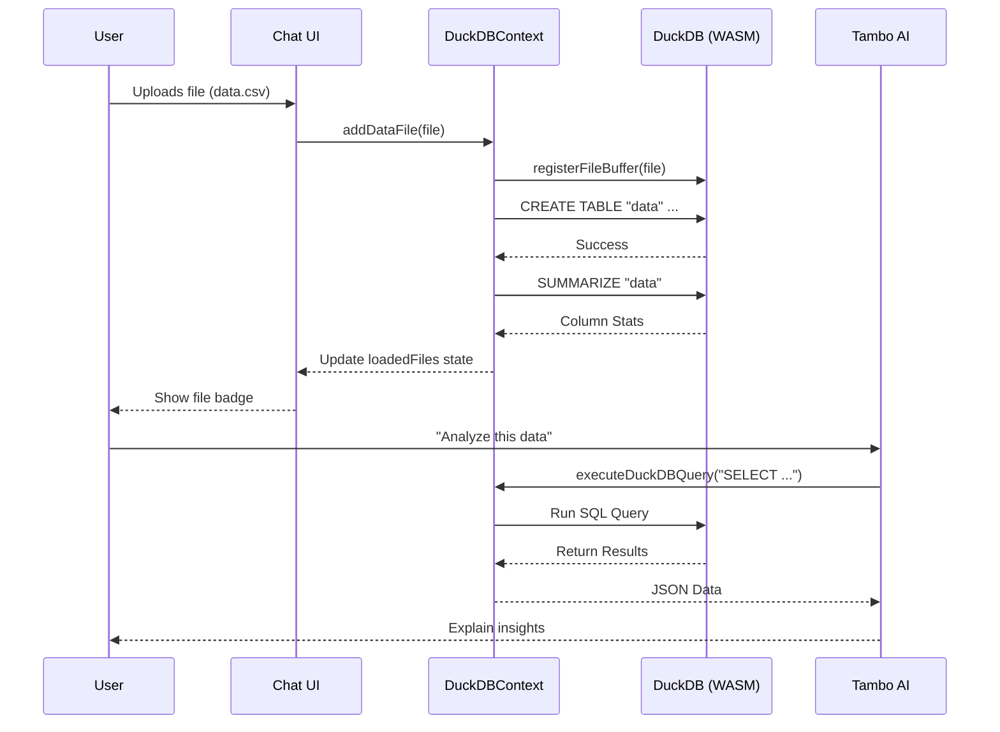

# Tambo + DuckDB-WASM Template

This is a specialized Next.js template that integrates **Tambo AI** with **DuckDB-WASM**, enabling high-performance, in-browser data analytics powered by AI.

With this template, you can build applications where users upload data files (CSV, Parquet, JSON) and interact with them using natural language, all without sending raw data to a backend server.

## Features

- **In-Browser SQL Engine**: Fully integrated DuckDB-WASM running client-side.
- **Privacy-First Architecture**: Data files are processed locally on the user's device. The raw dataset is **never uploaded** to a server; only specific query results are shared with the AI for analysis.
- **Data File Support**: Upload and process `.csv`, `.parquet`, and `.json` files instantly.
- **AI Analytics**: Pre-configured Tambo tools (`executeDuckDBQuery`, `getTableStats`) allow the AI to query your data.
- **React Integration**: Custom `DuckDBContext` and hooks for seamless state management.
- **Chat UI Integration**: Data upload controls embedded directly into the Tambo chat interface.

## Getting Started

1. **Install Dependencies**
   ```bash
   npm install
   ```

2. **Configure Tambo**
   Rename `example.env.local` to `.env.local` and add your Tambo API key (get one [here](https://tambo.co/dashboard)):
   ```bash
   NEXT_PUBLIC_TAMBO_API_KEY=your_api_key_here
   ```

3. **Run Development Server**
   ```bash
   npm run dev
   ```
   Open [http://localhost:3000/chat](http://localhost:3000/chat) to start.

## Usage

### 1. Upload Data
In the chat interface, click the **Database Icon** (next to the paperclip) in the toolbar to upload a file.
Supported formats:
- **CSV**: Text-based spreadsheet data.
- **Parquet**: high-efficiency columnar storage.
- **JSON**: Newline-delimited or standard JSON arrays.

### 2. Chat with Data
Once a file is uploaded (e.g., `sales.csv`), you can ask questions like:
- "Show me the summary statistics of the sales table."
- "What is the total revenue grouped by region?"
- "Find the top 5 products by sales volume."

The AI uses the registered `executeDuckDBQuery` tool to run real SQL queries against your local DuckDB instance.


## Data Flow

The following sequence describes how data travels from the user's local machine to the in-browser database and how the AI interacts with it:

1.  **User Upload**: User selects a file (e.g., `data.csv`) via the chat interface button.
2.  **File Registration**: The raw `File` buffer is registered into DuckDB-WASM's virtual file system.
3.  **Table Creation**: A SQL command (`CREATE TABLE "data" AS SELECT * FROM ...`) ingests the file into an **in-memory** table using DuckDB's optimized readers.
4.  **Metadata Extraction**: The system automatically runs `SUMMARIZE` to capture column statistics (min, max, types) for the AI context.
5.  **State Update**: The file is added to the React Context state, making it visible in the UI.
6.  **AI Querying**:
    *   User asks a question (e.g., "Analyze the data").
    *   Tambo AI invokes the `executeDuckDBQuery` tool.
    *   The query executes against the in-memory table.
    *   Results are returned to the AI to generate a natural language response.



## Project Structure

- **`src/services/duckdb.ts`**
  Core service that initializes DuckDB-WASM, handles file loading, and executes low-level queries.

- **`src/contexts/DuckDBContext.tsx`**
  React Context provider that manages the database lifecycle and loaded files state. providing hooks like `useDuckDBContext`.

- **`src/services/duckdb-query.ts`**
  AI-compatible wrapper functions (`executeDuckDBQuery`) designed to be used as Tambo tools.

- **`src/lib/tambo.ts`**
  Configuration file where DuckDB tools are registered for the AI to use.

- **`next.config.ts`**
  configured with Webpack aliases to ensure the browser-compatible version of DuckDB (`duckdb-browser.mjs`) is used, preventing build errors.

## Customization

### Adding New Tools
You can add more specialized query tools in `src/lib/tambo.ts`. For example, a tool to perform specific data transformations:

```typescript
// src/lib/tambo.ts
import { specializedQuery } from "@/services/my-queries";

export const tools: TamboTool[] = [
  // ... existing tools
  {
    name: "specializedQuery",
    description: "Performs a specific analysis",
    tool: specializedQuery,
    toolSchema: z.function()...
  }
];
```

### Modifying the UI
The upload button is integrated into `src/components/tambo/message-thread-full.tsx`. You can customize its appearance or location by editing that component.

## Troubleshooting

- **"Critical dependency" Warnings**: These are normal during the build process regarding `duckdb-node.cjs` but are handled by the alias configuration in `next.config.ts`.
- **Memory Usage**: The development server uses significant memory (~2.5GB+) due to Next.js caching. This is expected.
- **File Size Limits**: Since DuckDB runs in-browser, available memory limits file sizes (typically a few GBs depending on the device).

## Learn More

- [DuckDB-WASM Documentation](https://duckdb.org/docs/api/wasm/overview)
- [Tambo Documentation](https://docs.tambo.co)
