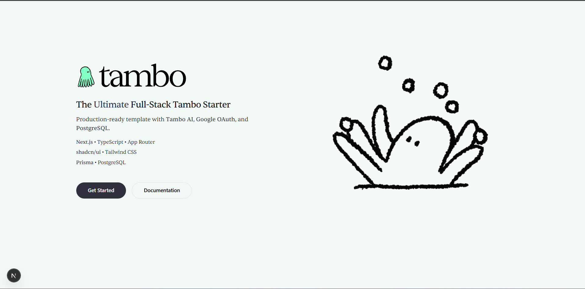

# Tambo Next.js Full-Stack Starter

A production-ready Next.js template with Tambo AI, Google OAuth, and PostgreSQL. Built with modern tools and best practices to help you ship faster.



## ✨ Features

- ** Next.js 16** - Latest App Router with TypeScript
- ** shadcn/ui** - Beautiful, accessible component library
- ** Tailwind CSS v4** - Modern utility-first CSS framework
- ** Tambo AI** - Integrated AI capabilities
- ** Google OAuth** - Authentication ready to go
- ** PostgreSQL** - Production-ready database setup
- ** Prisma** - Type-safe database ORM
- ** Custom Theme** - Fully customizable color scheme
- ** Responsive Design** - Mobile-first approach
- ** Optimized** - Fast performance out of the box

## 🚀 Getting Started

### Prerequisites

- Node.js 20+
- npm, yarn, pnpm, or bun
- PostgreSQL database (for production)

### Installation

1. **Clone the template:**

```bash
git clone <repository-url>
cd tambo-nextjs-fullstack-starter
```

2. **Install dependencies:**

```bash
npm install
# or
yarn install
# or
pnpm install
# or
bun install
```

3. **Run the development server:**

```bash
npm run dev
# or
yarn dev
# or
pnpm dev
# or
bun dev
```

4. **Open your browser:**

Navigate to [http://localhost:3000](http://localhost:3000) to see your app.

## 📁 Project Structure

```
tambo-nextjs-fullstack-starter/
├── app/                    # Next.js App Router
│   ├── layout.tsx         # Root layout
│   ├── page.tsx           # Home page
│   └── globals.css        # Global styles
├── components/            # React components
│   └── ui/               # shadcn/ui components
├── lib/                  # Utility functions
│   ├── fonts.ts          # Font configuration
│   └── utils.ts          # Helper utilities
├── public/               # Static assets
│   ├── assets/          # Images, videos, etc.
│   └── logo/            # Logo files
├── styles/              # Additional stylesheets
└── package.json         # Dependencies
```

## 🎨 Customization Guide

After cloning, you'll want to personalize the template. Here are the key files to update:

### **Must Change:**

- **`app/layout.tsx`** - Update metadata (title & description)
- **`app/page.tsx`** - Customize hero content, buttons, and feature list
- **`package.json`** - Change name, version, and description
- **`README.md`** - Replace with your project documentation
- **`public/logo/wordmark/Tambo-Lockup.svg`** - Replace with your logo

### **Should Change:**

- **`styles/components-theme.css`** - Customize color scheme (primary, secondary, background, etc.)
- **`app/favicon.ico`** - Replace with your favicon
- **`public/assets/landing/hero/`** - Replace hero animation assets or remove if not needed

### **Optional:**

- **`lib/fonts.ts`** - Update custom fonts
- **`components.json`** - Adjust shadcn/ui configuration
- **`next.config.ts`** - Add Next.js-specific configs
- **`tsconfig.json`** - TypeScript configuration adjustments

> 💡 **Tip:** The landing page includes a visual guide showing all files that need customization. Check it out at `http://localhost:3000` after running the dev server!

## 🛠️ Tech Stack

- **Framework:** [Next.js 16.1.5](https://nextjs.org/)
- **Language:** [TypeScript](https://www.typescriptlang.org/)
- **Styling:** [Tailwind CSS v4](https://tailwindcss.com/)
- **Components:** [shadcn/ui](https://ui.shadcn.com/)
- **Icons:** [Lucide React](https://lucide.dev/)
- **Fonts:** Geist Sans/Mono (Google Fonts) + Sentient Light (Custom)

## 📚 Learn More

- **Tambo Documentation:** [https://docs.tambo.co](https://docs.tambo.co)
- **Next.js Documentation:** [https://nextjs.org/docs](https://nextjs.org/docs)
- **shadcn/ui Components:** [https://ui.shadcn.com](https://ui.shadcn.com)
- **Tailwind CSS Docs:** [https://tailwindcss.com/docs](https://tailwindcss.com/docs)

## 🚢 Deployment

### Deploy on Vercel

The easiest way to deploy your Next.js app is using the [Vercel Platform](https://vercel.com/new):

1. Push your code to GitHub
2. Import your repository in Vercel
3. Configure environment variables
4. Deploy!

For more details, see the [Next.js deployment documentation](https://nextjs.org/docs/app/building-your-application/deploying).

### Other Platforms

This template works with any platform that supports Next.js:

- [Netlify](https://www.netlify.com/)
- [Railway](https://railway.app/)
- [Render](https://render.com/)
- [AWS Amplify](https://aws.amazon.com/amplify/)

## 📝 Scripts

- `npm run dev` - Start development server
- `npm run build` - Build for production
- `npm run start` - Start production server
- `npm run lint` - Run ESLint

## 🤝 Contributing

Contributions are welcome! Please feel free to submit a Pull Request.

## 📄 License

This template is open source and available under the [MIT License](LICENSE).

## 🙏 Acknowledgments

- Built with [Next.js](https://nextjs.org/)
- UI components from [shadcn/ui](https://ui.shadcn.com/)
- Styled with [Tailwind CSS](https://tailwindcss.com/)

---

**Happy coding! 🎉**
