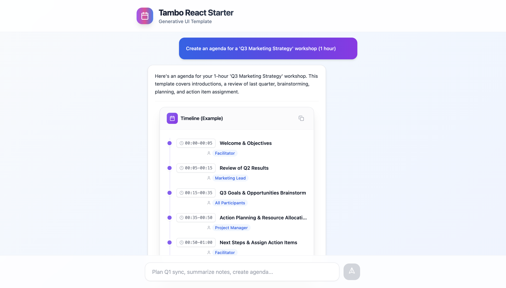

# Tambo React Starter

A minimal starter template demonstrating AI-driven component rendering with Tambo, Vite, and React.

## Screenshot


## Video Demo

> **TODO**: Add video demo link

<!-- [Watch Demo](https://your-video-link) -->

## What This Template Demonstrates

| Pattern | Description |
|---------|-------------|
| **Component Registration** | Register React components with Zod schemas for AI rendering |
| **Schema Validation** | Define prop types with Zod for type-safe AI-to-component data flow |
| **Tool Registration** | Create AI-callable functions with typed inputs/outputs |
| **Chat Interface** | Build chat UI using `useTambo` and `useTamboThreadInput` hooks |
| **Dynamic Rendering** | Components render automatically based on AI responses |

## Example Components

This template includes two example components to show the patterns:

| Component | Shows How To |
|-----------|--------------|
| `AgendaViewer` | Render structured array data as a timeline |
| `ActionItemForm` | Handle interactive lists with user input |

*Replace these with your own components for your use case.*

## Prerequisites

- Node.js 18+
- A Tambo account and API key ([get one here](https://platform.tambo.ai))

## Setup

```bash
# Install dependencies
npm install

# Configure environment
cp .env.example .env
# Add your VITE_TAMBO_API_KEY to .env

# Start dev server
npm run dev
```

## Project Structure

```
src/
├── App.tsx                    # Chat interface with Tambo hooks
└── components/tambo/
    ├── index.tsx              # Component & tool registration
    ├── AgendaViewer.tsx       # Example: timeline component
    └── ActionItemForm.tsx     # Example: interactive list
```

## Try These Prompts

- "Show me a sample timeline with 3 items"
- "Create a task list for a project"

## Learn More

- [Tambo Documentation](https://docs.tambo.ai)
- [Zod Schema Validation](https://zod.dev)
