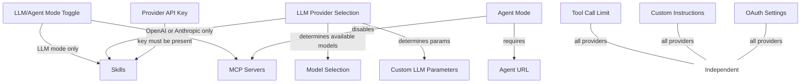

# Feature Dependency Graph

Maps which Tambo Cloud features depend on others. When building a feature that depends on configuration or provider capabilities, this skill tells you what to check and how to communicate constraints to users.

## When to Use This Skill

- Adding a feature that only works with certain LLM providers
- Building UI that conditionally shows/hides based on other settings
- Checking whether a provider supports a capability
- Adding a new provider or capability to the platform

## Dependency Graph



## Known Dependencies

| Feature           | Depends On        | Constraint                                               | Gate Location                        |
| ----------------- | ----------------- | -------------------------------------------------------- | ------------------------------------ |
| Skills            | LLM Provider      | OpenAI or Anthropic only                                 | `skills-section.tsx:45`              |
| Skills            | API Key           | User-provided or fallback key must exist                 | `skills.ts:49-53`                    |
| Skills            | LLM Mode          | Not available in Agent mode                              | Implicit (provider must be LLM type) |
| MCP Servers       | LLM Mode          | Disabled in Agent mode                                   | `available-mcp-servers.tsx:98`       |
| Model Selection   | LLM Provider      | Available models determined by provider                  | `llm.config.ts:8-63`                 |
| Custom LLM Params | LLM Provider      | `parallelToolCalls`, `strictJsonSchema` vary by provider | `llm.config.ts`                      |
| Agent URL         | Agent Mode        | Required when `AiProviderType.AGENT` selected            | `agent-settings.tsx`                 |
| Agent Providers   | Provider Registry | LangGraph marked `isSupported: false`                    | `agent-registry.ts:10-24`            |

### Independent Features (no dependencies)

These features work with all providers and modes:

- Tool Call Limit
- Custom Instructions
- OAuth Token Validation
- API Keys

## Provider Capabilities

| Provider          | Skills | MCP Servers | Custom Models | Requires Base URL |
| ----------------- | ------ | ----------- | ------------- | ----------------- |
| OpenAI            | Yes    | Yes         | No            | No                |
| Anthropic         | Yes    | Yes         | No            | No                |
| Gemini            | No     | Yes         | No            | No                |
| Mistral           | No     | Yes         | No            | No                |
| Cerebras          | No     | Yes         | No            | No                |
| OpenAI Compatible | No     | Yes         | Yes (custom)  | Yes               |
| Agent Mode        | No     | No          | N/A           | Yes (agent URL)   |

**Source files:**

- `packages/core/src/llms/llm.config.ts` -- LLM provider configs
- `packages/core/src/agent-registry.ts` -- Agent provider support flags
- `packages/backend/src/services/skills/provider-skill-client.ts` -- Skills provider support (`SKILL_PROVIDERS`)

## UI Patterns for Dependent Features

When a feature is unavailable due to a dependency, communicate it clearly.

### Warning alert (feature exists but is limited)

Used when the feature section is visible but the current configuration prevents use:

```tsx
// skills-section.tsx
{
  !isProviderSupported && (
    <Alert variant="warning">
      <AlertTriangle className="h-4 w-4" />
      <AlertDescription>
        Skills are currently supported with OpenAI and Anthropic models. Your
        project uses {providerName}. Switch to a supported model to enable
        skills.
      </AlertDescription>
    </Alert>
  );
}
```

**When to use:** The user can see what the feature does but needs to change a dependency to enable it. Buttons and toggles in the section are disabled.

### Disabled card with explanation

Used when an entire section is non-functional due to mode:

```tsx
// available-mcp-servers.tsx
{
  isAgentMode && (
    <Card className="opacity-60">
      <CardContent>
        <p>
          MCP Servers are disabled while Agent mode is enabled. MCP + Agent
          support is coming soon.
        </p>
      </CardContent>
    </Card>
  );
}
```

**When to use:** The feature is completely unavailable in the current mode.

### "Coming soon" in dropdowns

Used for specific options within a feature that aren't yet supported:

```tsx
// agent-settings.tsx
<SelectItem value={provider.name} disabled={!provider.isSupported}>
  {provider.name} {!provider.isSupported && "(coming soon)"}
</SelectItem>
```

**When to use:** Most options work, but specific entries are not yet available.

### Rules

- Never silently hide a feature because its dependency is unmet. Show it in a disabled/informational state so users know it exists.
- Warning messages must name the specific dependency and tell the user how to resolve it.
- Disable individual controls (buttons, toggles, inputs) rather than hiding the entire section.
- Use `opacity-60` on the card wrapper for completely unavailable sections.
- Link to or name the settings section where the dependency can be resolved.

## API-Side Gating

Backend code must also respect feature dependencies. Do not assume the UI prevents invalid requests.

### Skills gating

```typescript
// apps/api/src/skills/skills.service.ts
supportsSkills(providerName: string): boolean {
  return providerSupportsSkills(providerName);
}

// apps/api/src/threads/threads.service.ts
const providerSkills = skillApiKey
  ? await this.skillsService.ensureProviderSkillsForRun({ ... })
  : undefined;
```

Skills are silently skipped (not errored) when the provider doesn't support them. This is intentional -- a project can have skills configured for when the user switches back to a supported provider.

### Adding a new capability gate

When adding a new feature that depends on provider capabilities:

1. Add the capability check to the provider config (`packages/core/src/llms/llm.config.ts` or similar)
2. Add the UI gate in the component (warning alert + disabled controls)
3. Add the API gate in the service (skip or error based on whether the operation is destructive)
4. Update this skill's dependency table and provider capabilities table
5. Update the mermaid graph if the dependency introduces a new relationship

## Adding a New Provider

When adding a new LLM provider:

1. Add config to `packages/core/src/llms/llm.config.ts`
2. Determine which features it supports (skills, MCP, custom models)
3. Update `SKILL_PROVIDERS` in `packages/backend/src/services/skills/provider-skill-client.ts` if it supports skills
4. Update this skill's provider capabilities table
5. Test that UI components correctly show/hide features for the new provider
