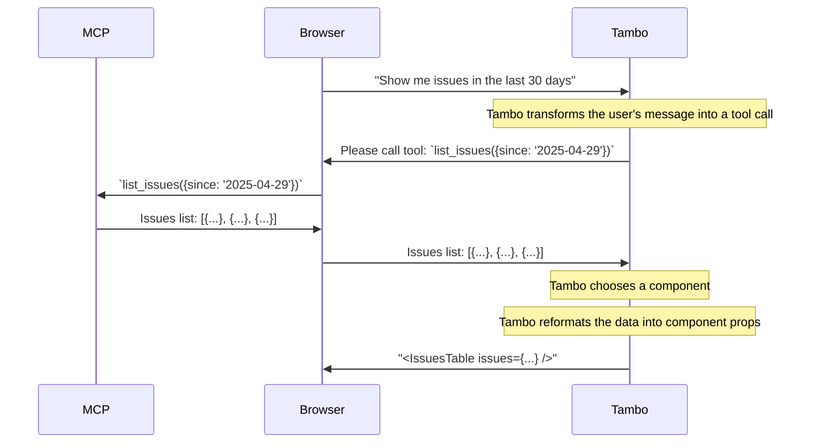

### 2. Client-side Support

Client-side MCP integration allows your application to connect to MCP servers
that are accessible from the end user's browser, for instance when using a local
MCP server.

This is useful for:

- Local MCP servers running on the user's machine
- MCP servers where the user's browser is already authenticated
- Private or internal services behind a firewall, that are only visible from the user's browser

**Note:** _There is currently no support for authenticated MCP servers when using client-side MCP connections_.

To implement client-side MCP support, use the `TamboMcpProvider` component inside your `TamboProvider`:

```tsx
import { TamboProvider } from "@tambo-ai/react";
import { TamboMcpProvider, MCPTransport } from "@tambo-ai/react/mcp";

function MyApp() {
  return (
    <TamboProvider components={...}>
      <TamboMcpProvider
        mcpServers={[
          {
            // MCP server configuration
            url: "http://localhost:8123/",
            // Optional custom headers, eg.
            // { "Authorization": `Bearer ${token}` } or { "X-Api-Key": "1234567890" }
            customHeaders: {},
            transport: MCPTransport.HTTP, // optional, defaults to SSE
          },
        ]}
      >
        {/* Your application components */}
      </TamboMcpProvider>
    </TamboProvider>
  );
}
```

The `TamboMcpProvider` establishes connections to the specified MCP servers and makes their tools available to Tambo agents in your application.

## Rich Content Support

MCP tools automatically support rich content responses. When MCP servers return content arrays (which can include text, images, and other media types), Tambo automatically passes them through to the AI without converting them to plain text. This means MCP tools can seamlessly return images, formatted content, and other rich media.

If you're building custom tools that need similar capabilities, you can use the `transformToContent` parameter when registering tools. [Learn more about returning rich content from tools](/concepts/tools/adding-tools#returning-rich-content).

## How Client-side MCP Works

This is how client-side MCP works:


