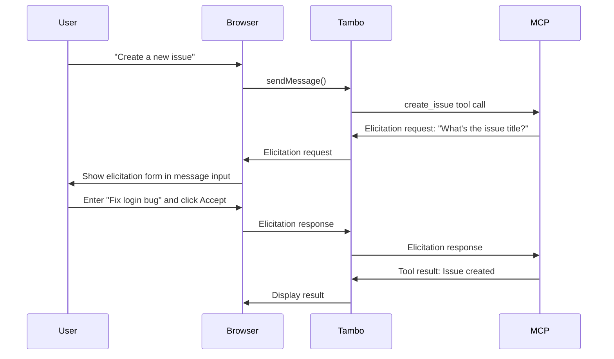

MCP Elicitation allows MCP servers to request additional information from users during tool execution. When an MCP server needs user input, Tambo automatically displays an interactive form in the message input area, making it seamless for users to provide the requested information.

For more details on the elicitation specification, see the [MCP Elicitation documentation](https://modelcontextprotocol.io/docs/learn/client-concepts#elicitation).

## What is Elicitation?

Elicitation is a protocol feature that allows MCP servers to pause execution and request structured input from the user. This is useful when:

- A tool needs additional information that wasn't provided in the initial request
- An MCP server requires user confirmation before proceeding with an action
- Multiple pieces of information are needed to complete a task

## Built-in Support

The `message-input` component automatically handles elicitation requests from MCP servers. When an elicitation request is received, the message input area is replaced with a dynamic form that matches the server's requested schema.

```tsx
import { MessageInput } from "@/components/ui/message-input";

// Elicitation is automatically handled - no additional setup needed
<MessageInput>
  <MessageInput.Textarea />
  <MessageInput.SubmitButton />
</MessageInput>;
```

The elicitation UI automatically:

- Renders appropriate input fields based on the requested schema (text, number, boolean, enum)
- Validates user input according to the schema constraints
- Provides Accept, Decline, and Cancel actions
- Returns the user's response to the MCP server

## How It Works

Here's the typical flow when an MCP server requests elicitation:



## Example Use Cases

### Confirmation Dialogs

An MCP server can request confirmation before performing a destructive action:


### Multi-field Forms

MCP servers can request multiple fields at once:


### Enum Selection

When the server needs the user to choose from a predefined set of options:


```tsx
import { TamboProvider } from "@tambo-ai/react";
import { TamboMcpProvider } from "@tambo-ai/react/mcp";

function App() {
  return (
    <TamboProvider components={...} mcpServers={[]}>
      <TamboMcpProvider>
        {/* Your app - elicitation from server-side MCP servers will work */}
      </TamboMcpProvider>
    </TamboProvider>
  );
}
```

Without the `TamboMcpProvider`, server-side MCP servers cannot send elicitation requests to your application, as there's no connection to Tambo's internal MCP server.

## Advanced: Custom Elicitation Handlers

While the built-in elicitation UI handles most use cases, you can implement custom elicitation handling if needed.

### Custom Elicitation UI

You can access the current elicitation request and respond to it using the `useTamboElicitationContext` hook:

```tsx
import { useTamboElicitationContext } from "@tambo-ai/react/mcp";

function CustomElicitationUI() {
  const { elicitation, resolveElicitation } = useTamboElicitationContext();

  if (!elicitation) return null;

  const handleAccept = () => {
    resolveElicitation?.({
      action: "accept",
      content: {
        /* user's input */
      },
    });
  };

  const handleDecline = () => {
    resolveElicitation?.({ action: "decline" });
  };

  const handleCancel = () => {
    resolveElicitation?.({ action: "cancel" });
  };

  return (
    <div>
      <p>{elicitation.message}</p>
      {/* Render form fields based on elicitation.requestedSchema */}
      <button onClick={handleAccept}>Accept</button>
      <button onClick={handleDecline}>Decline</button>
      <button type="button" onClick={handleCancel}>
        Cancel
      </button>
    </div>
  );
}
```

### Provider-level Handler

For advanced scenarios where you need programmatic control over elicitation flow—such as conditionally approving requests, implementing custom validation logic, or integrating with external systems—you can provide a handler function that intercepts elicitation requests before they reach the UI.

The handler is an async callback that receives the elicitation request and returns a promise with the response. This allows you to implement custom decision logic, show your own UI, or even automatically respond based on the request content.

Apply a custom handler to all MCP servers:

```tsx
import { TamboProvider } from "@tambo-ai/react";
import { TamboMcpProvider } from "@tambo-ai/react/mcp";

function App() {
  const handleElicitation = async (request, extra, serverInfo) => {
    // request: { params: { message, requestedSchema } }
    // extra: { signal } - AbortSignal for cancellation
    // serverInfo: { name, url, description, ... } - MCP server config

    console.log(`Elicitation from ${serverInfo.name}: ${request.params.message}`);

    // Show custom UI and collect user input
    const userInput = await showCustomElicitationUI(request.params);

    return {
      action: "accept",
      content: userInput,
    };
  };

  return (
    <TamboProvider mcpServers={[...]}>
      <TamboMcpProvider
        handlers={{
          elicitation: handleElicitation,
        }}
      >
        {/* Your app */}
      </TamboMcpProvider>
    </TamboProvider>
  );
}
```

### Per-server Handler

You can also override the handler for specific MCP servers, which is useful when different servers require different approval workflows or UI patterns:

```tsx
import { TamboProvider } from "@tambo-ai/react";
import { TamboMcpProvider, MCPTransport } from "@tambo-ai/react/mcp";

function App() {
  const handleGitHubElicitation = async (request, extra) => {
    // Custom handling for GitHub MCP server only
    return {
      action: "accept",
      content: { confirmed: true },
    };
  };

  return (
    <TamboProvider
      mcpServers={[
        {
          url: "https://github-mcp.example.com",
          transport: MCPTransport.HTTP,
          handlers: {
            elicitation: handleGitHubElicitation,
          },
        },
      ]}
    >
      <TamboMcpProvider>{/* Your app */}</TamboMcpProvider>
    </TamboProvider>
  );
}
```

Per-server handlers take precedence over provider-level handlers.

### Handler Parameters

#### Elicitation Request

```typescript
{
  params: {
    message: string;  // Human-readable message from server
    requestedSchema: {
      type: "object";
      properties: Record<string, FieldSchema>;
      required?: string[];
    };
  }
}
```

#### Extra Parameters

```typescript
{
  signal: AbortSignal; // Fires if server cancels the request
}
```

#### Response

```typescript
{
  action: "accept" | "decline" | "cancel";
  content?: Record<string, unknown>;  // User's input (required if action is "accept")
}
```

- **accept**: User provided input and wants to continue
- **decline**: User chose not to provide input but tool should continue
- **cancel**: User wants to abort the entire operation
