Prompts allow MCP servers to expose reusable prompt templates that can be easily inserted into your application. This enables standardized workflows, consistent prompt patterns, and quick access to commonly used prompts provided by MCP servers.

For more details on the prompts specification, see the [MCP Prompts documentation](https://modelcontextprotocol.io/docs/concepts/prompts).

## What are Prompts?

Prompts are predefined text templates exposed by MCP servers that users can insert into their message input. This is useful when:

- An MCP server provides helpful prompt templates for common tasks
- You want to standardize how users interact with specific tools or workflows
- Users need quick access to complex prompts without memorizing syntax

For example, a GitHub MCP server might provide prompts like "Create a detailed issue report" or "Review this pull request", which expand into well-structured templates when selected.

## User Experience

### Using the Prompts Button


When prompts are available:

1. A document icon (📄) appears in the message input area
2. Clicking it opens a dropdown showing all available prompts
3. Prompts are organized by MCP server
4. Selecting a prompt inserts its content into the message input
5. The user can then edit the prompt before sending

### Using the "/" Hotkey

In addition to the button, users can type "/" at the start of an empty text field to quickly access prompts:


1. Type "/" at the beginning of an empty message input
2. A dropdown appears showing all available prompts
3. Type to filter prompts by name
4. Use arrow keys to navigate and Enter to select
5. The selected prompt text is inserted into the message input

## Prompt Naming

Prompts are **always prefixed** with the `serverKey` to identify which MCP server they come from. The format is:

```
<serverKey>:<promptName>
```

For example, a prompt called `new-issue` from a Linear MCP server with `serverKey` of `linear` would be referenced as `linear:new-issue`.

The `serverKey` is configured when setting up the MCP server:
- **Client-side**: Set in the `mcpServers` array passed to `TamboProvider`
- **Server-side**: Configured in your Tambo Cloud project settings

If you don't specify `serverKey`, Tambo derives one from the URL hostname (e.g., `https://mcp.linear.app/mcp` becomes `linear`).

## Built-in Support

The `message-input` component automatically displays available prompts from all connected MCP servers. When any MCP server exposes prompts, a document button (📄) appears in the message input area:

```tsx
import { MessageInput } from "@/components/ui/message-input";

// Prompts are automatically displayed - no additional setup needed
<MessageInput contextKey="my-thread">
  <MessageInput.Textarea />
  <MessageInput.McpPromptButton />
  <MessageInput.SubmitButton />
</MessageInput>;
```

The prompt picker automatically:

- Discovers prompts from all connected MCP servers
- Displays them in a dropdown menu
- Inserts the selected prompt into the message input
- Only appears when at least one MCP server has prompts available

## How It Works

Here's the typical flow when a user selects an MCP prompt:

```mermaid
sequenceDiagram
    participant User
    participant Browser
    participant Tambo
    participant MCP

    User->>Browser: Open message input
    Browser->>Tambo: Request MCP servers
    Tambo->>MCP: List available prompts
    MCP->>Tambo: Return prompt list
    Tambo->>Browser: Display prompts
    Browser->>User: Show document button 📄
    User->>Browser: Click button, select prompt
    Browser->>Tambo: Get prompt content
    Tambo->>MCP: Fetch prompt template
    MCP->>Tambo: Return prompt text
    Tambo->>Browser: Prompt content
    Browser->>User: Insert prompt into input
```



## Current Limitations

**Parameters are not yet supported.** While the MCP specification allows prompts to accept parameters for customization, Tambo's current implementation does not expose parameter input fields. All prompts are inserted as-is without user customization.

This means:

- Prompts with parameters will use their default values
- Users cannot customize prompt templates at insertion time
- Parameter support is planned for a future release

## Programmatic Access

You can access Prompts programmatically using the provided hooks:

### List All Prompts

Use `useTamboMcpPromptList` to get all available prompts from connected servers:

```tsx
import { useTamboMcpPromptList } from "@tambo-ai/react/mcp";

function PromptList() {
  const { data: prompts, isLoading, error } = useTamboMcpPromptList();

  if (isLoading) return <div>Loading prompts...</div>;
  if (error) return <div>Error loading prompts</div>;

  return (
    <ul>
      {prompts?.map((entry) => (
        <li key={`${entry.server.url}-${entry.prompt.name}`}>
          <strong>{entry.prompt.name}</strong>
          <p>{entry.prompt.description}</p>
          <small>From: {entry.server.name}</small>
        </li>
      ))}
    </ul>
  );
}
```

The hook returns an array of `ListPromptEntry` objects, each containing:

- `server` - The connected MCP server providing this prompt
- `prompt` - The prompt metadata (name, description)

**Note:** The `prompt.name` field will include the `serverKey` prefix (e.g., `linear:new-issue`).

### Get Specific Prompt

Use `useTamboMcpPrompt` to fetch a specific prompt's content:

```tsx
import { useTamboMcpPrompt } from "@tambo-ai/react/mcp";

function PromptContent({ promptName }: { promptName: string }) {
  // promptName should include the serverKey prefix (e.g., "linear:new-issue")
  const { data: prompt, isLoading, error } = useTamboMcpPrompt(promptName);

  if (isLoading) return <div>Loading...</div>;
  if (error) return <div>Error loading prompt</div>;
  if (!prompt) return null;

  return (
    <div>
      <h3>{prompt.description}</h3>
      {prompt.messages.map((msg, idx) => (
        <div key={idx}>
          <strong>{msg.role}:</strong>
          {msg.content.type === "text" && <p>{msg.content.text}</p>}
        </div>
      ))}
    </div>
  );
}
```

The hook accepts:

- `promptName` - The name of the prompt to fetch
- `args` - Optional parameters (currently not exposed in UI)

## Connection Type Support

Prompts work with both connection types:

- **[Server-side MCP](/concepts/model-context-protocol/providers/serverside-mcp-connection)** - ✅ Fully supported
- **[Client-side MCP](/concepts/model-context-protocol/providers/clientside-mcp-connection)** - ✅ Fully supported

Both connection types can expose prompts that will appear in the prompt picker.

## Example Use Cases

### Documentation Templates

A documentation MCP server provides prompts for common documentation patterns:

- "API endpoint documentation"
- "Component usage guide"
- "Troubleshooting section"

### Code Review Prompts

A code review MCP server offers structured review templates:

- "Security-focused code review"
- "Performance optimization review"
- "Accessibility audit"

### Task Management

A task tracking MCP server provides prompts for common workflows:

- "Create bug report"
- "Plan feature implementation"
- "Write release notes"

## Future Capabilities

Planned enhancements for MCP prompts include:

- **Parameter support**: Allow users to customize prompts with dynamic values
- **Custom UI**: Build custom prompt pickers with different layouts
- **Prompt history**: Track frequently used prompts

## Related Features

import LearnMore from "@/components/learn-more";

<LearnMore
  title="Elicitations"
  description="Learn how MCP servers can request user input during tool execution"
  href="/concepts/model-context-protocol/features/elicitation"
/>

<LearnMore
  title="Client-side MCP Connections"
  description="Connect to MCP servers directly from the browser"
  href="/concepts/model-context-protocol/providers/clientside-mcp-connection"
/>

<LearnMore
  title="Server-side MCP Connections"
  description="Configure MCP servers through the Tambo dashboard"
  href="/concepts/model-context-protocol/providers/serverside-mcp-connection"
/>
