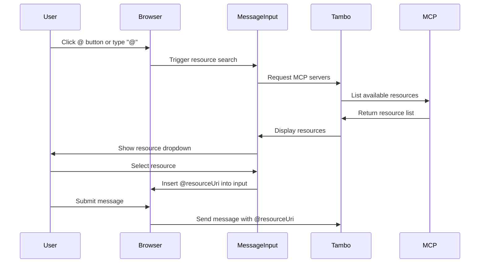
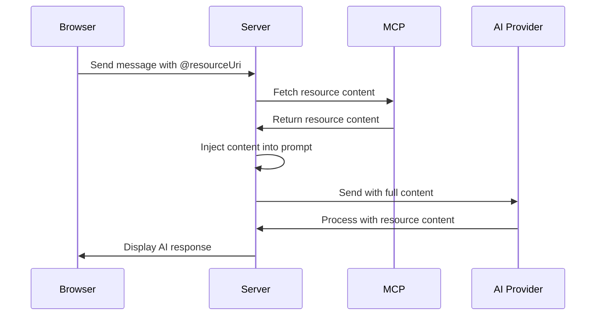
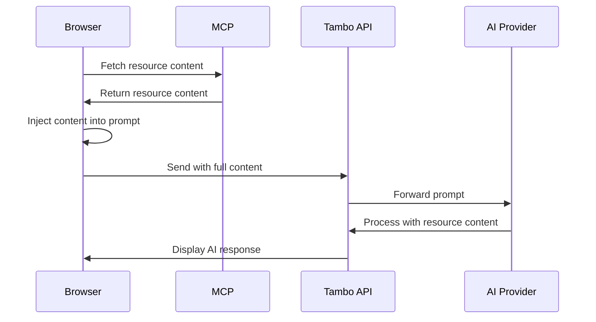

Resources allow MCP servers to expose data sources and content that can be dynamically accessed and referenced in conversations. This enables users to pull in context from external services, files, or databases without manually copying and pasting content.

For more details on the resources specification, see the [MCP Resources documentation](https://modelcontextprotocol.io/docs/concepts/resources).

## What are Resources?

Resources are data sources exposed by MCP servers that users can reference in their messages. This is useful when:

- An MCP server provides access to external data (issues, documents, files, etc.)
- You want users to easily include context from external services
- Content needs to be dynamically fetched and included in AI conversations

For example, a Linear MCP server might expose issues as resources (`linear:file://issue/TAM-123`), allowing users to reference specific issues in their conversations with the AI.

## Built-in Support

The `message-input` component automatically supports resource selection and insertion from all connected MCP servers:

```tsx
import { MessageInput } from "@/components/ui/message-input";

// Resources are automatically supported - no additional setup needed
<MessageInput contextKey="my-thread">
  <MessageInput.Textarea />
  <MessageInput.McpResourceButton />
  <MessageInput.SubmitButton />
</MessageInput>;
```

Resources can be inserted two ways:

1. **Button Selection**: Click the resource button (@) to browse and select available resources
2. **@ Mentions**: Type "@" in the message input to search and insert resources inline

## Resource Reference Syntax

When a user selects a resource, it's inserted into the message with the syntax `@<resourceUri>`. Resources are **always prefixed** to identify which MCP server they come from.

### Prefix Structure

The prefix structure differs between server-side and client-side MCP connections:

#### Server-Side MCP Resources

Server-side resources have a **double prefix** (client-side `serverKey` + server-side prefix):

```
@<serverKey>:<serverSidePrefix>:<resourceUri>
```

Example: `@linear-h3s:tambo:issue://TAM-123`

- `linear-h3s` is the client-side `serverKey` for this MCP server instance
- `tambo` is the server-side prefix configured in your project's MCP configuration
- `issue://TAM-123` is the actual resource URI from the MCP server

The server-side prefix is configured in your Tambo Cloud project settings for each MCP server connection. This additional layer helps distinguish between different environments or projects using the same MCP server.

#### Client-Side MCP Resources

Client-side resources have a **single prefix** (the `serverKey`):

```
@<serverKey>:<resourceUri>
```

Example: `@linear-43k:issue://TAM-123`

- `linear-43k` is the `serverKey` configured in the client-side MCP server definition
- `issue://TAM-123` is the actual resource URI from the MCP server

Configure the `serverKey` when setting up the MCP server:

```tsx
<TamboProvider
  mcpServers={[
    {
      url: "http://localhost:8123/",
      serverKey: "linear-43k", // This becomes the resource prefix
      transport: MCPTransport.HTTP,
    },
  ]}
>
  <TamboMcpProvider>
    <App />
  </TamboMcpProvider>
</TamboProvider>
```

If you don't specify `serverKey`, Tambo derives one from the URL hostname (e.g., `https://mcp.linear.app/mcp` becomes `linear`).

## Server-Side vs Client-Side Resources

How resources are processed depends on where the MCP server is connected:

### Server-Side Resources

When using [server-side MCP connections](/concepts/model-context-protocol/providers/serverside-mcp-connection):

1. The **resource reference** is sent to the Tambo API (not the content)
2. The server fetches the resource from the MCP server
3. The resource content is inserted into the prompt server-side
4. The AI receives the full resource content in the conversation

This approach is better for resources that:
- Require server-side authentication (OAuth, API keys)
- Are large or vary in size
- Should be fetched at request time for freshness

### Client-Side Resources

When using [client-side MCP connections](/concepts/model-context-protocol/providers/clientside-mcp-connection):

1. The resource is **fetched on the client** (in the browser)
2. The full resource content is **injected into the prompt**
3. The complete resource content is sent to the Tambo API
4. The AI receives the full resource content in the conversation

This approach works well for resources that:
- Are accessible from the browser
- Don't require server-side authentication
- Are reasonably sized (won't exceed token limits)

### Provider Compatibility

Resources are automatically formatted in a way that's compatible with the AI provider being used (OpenAI, Anthropic, Google, etc.). Tambo handles the conversion internally.

## How Resource Selection Works

Here's the flow when a user selects a resource:



### Resource Processing Flow

After a message with a resource reference is submitted, the processing differs based on connection type:

**Server-Side MCP Processing:**



**Client-Side MCP Processing:**



## User Experience

### Using the Resources Button


When resources are available:

1. An @ icon appears in the message input area
2. Clicking it opens a dropdown showing all available resources
3. Resources are organized by MCP server
4. Selecting a resource inserts its reference into the message input
5. The user can then send the message with the resource reference


### Using the "@" Mention

Users can also type "@" directly in the message input to search for resources:


1. Type "@" anywhere in the message input
2. A dropdown appears showing all available resources
3. Type to filter resources by name
4. Use arrow keys to navigate and Enter to select
5. The selected resource reference is inserted as `@resourceUri`


## Programmatic Access

You can access Resources programmatically using the provided hooks:

### List All Resources

Use `useTamboMcpResourceList` to get all available resources from connected servers:

```tsx
import { useTamboMcpResourceList } from "@tambo-ai/react/mcp";

function ResourceList() {
  const { data: resources, isLoading, error } = useTamboMcpResourceList();

  if (isLoading) return <div>Loading resources...</div>;
  if (error) return <div>Error loading resources</div>;

  return (
    <ul>
      {resources?.map((entry) => (
        <li key={entry.resource.uri}>
          <strong>{entry.resource.name}</strong>
          {entry.resource.description && <p>{entry.resource.description}</p>}
          <small>URI: {entry.resource.uri}</small>
          <small>From: {entry.server.name}</small>
        </li>
      ))}
    </ul>
  );
}
```

The hook returns an array of `ListResourceEntry` objects, each containing:

- `server` - The connected MCP server providing this resource
- `resource` - The resource metadata (uri, name, description, mimeType)

**Note:** The `resource.uri` field will include both client-side `serverKey` and server-side prefix for server-side resources (e.g., `linear-h3s:tambo:issue://TAM-123`) or just the client-side `serverKey` prefix for client-side resources (e.g., `linear:file://issue/123`).

### Get Specific Resource

Use `useTamboMcpResource` to fetch a specific resource's content:

```tsx
import { useTamboMcpResource } from "@tambo-ai/react/mcp";

function ResourceContent({ resourceUri }: { resourceUri: string }) {
  // resourceUri should include the prefix(es) (e.g., "linear:file://issue/123")
  const { data: resourceData, isLoading, error } = useTamboMcpResource(resourceUri);

  if (isLoading) return <div>Loading...</div>;
  if (error) return <div>Error loading resource</div>;
  if (!resourceData) return null;

  return (
    <div>
      {resourceData.contents.map((content, idx) => (
        <div key={idx}>
          {content.mimeType && <small>Type: {content.mimeType}</small>}
          {content.text && <pre>{content.text}</pre>}
          {content.blob && <div>Binary content ({content.blob.length} bytes)</div>}
        </div>
      ))}
    </div>
  );
}
```

The hook accepts:

- `resourceUri` - The URI of the resource to fetch (e.g., `"linear:file://issue/123"`)

The returned data contains:

- `contents` - Array of resource content items (text or blob)
- Each content item has `uri`, `mimeType`, and either `text` or `blob`

## Connection Type Support

Resources work with both connection types:

- **[Server-side MCP](/concepts/model-context-protocol/providers/serverside-mcp-connection)** - ✅ Fully supported (recommended)
- **[Client-side MCP](/concepts/model-context-protocol/providers/clientside-mcp-connection)** - ✅ Fully supported

Both connection types can expose resources that will appear in the resource picker. The key difference is where the resource content is fetched (client vs server).

## Example Use Cases

### Issue Tracking Systems

A Linear or Jira MCP server provides resources for issues and tickets:

- Reference specific issues in conversations
- Pull in issue details, comments, and status
- Let AI analyze and suggest actions based on issue content

### File Systems

A file system MCP server exposes files and folders as resources:

- Reference project files in code discussions
- Include configuration files for analysis
- Pull in documentation for context

### Knowledge Bases

A documentation or wiki MCP server provides articles as resources:

- Reference internal documentation
- Include help articles for context
- Pull in knowledge base entries for AI to reference

### CRM and Customer Data

A CRM MCP server exposes customer records as resources:

- Reference customer profiles in support conversations
- Include account history for context
- Pull in interaction logs for analysis

## Best Practices

### Resource Naming

- Use descriptive resource names that users can easily identify
- Include relevant metadata (issue number, file path, etc.)
- Keep names concise but informative

### Resource Size

- Be mindful of resource size, especially with client-side MCP
- Large resources can impact performance and token usage
- Consider summarizing or truncating large content

### Security and Privacy

- Only expose resources that users should have access to
- Implement proper authentication and authorization
- Be careful with sensitive data in resource content

### Caching

- Resources are cached by Tambo for performance
- Consider cache invalidation strategies for frequently changing data
- Use resource URIs that reflect versioning if needed

## Related Features

import LearnMore from "@/components/learn-more";

<LearnMore
  title="Prompts"
  description="Learn how to use predefined prompt templates from MCP servers"
  href="/concepts/model-context-protocol/features/prompts"
/>

<LearnMore
  title="Client-side MCP Connections"
  description="Connect to MCP servers directly from the browser"
  href="/concepts/model-context-protocol/providers/clientside-mcp-connection"
/>

<LearnMore
  title="Server-side MCP Connections"
  description="Configure MCP servers through the Tambo dashboard"
  href="/concepts/model-context-protocol/providers/serverside-mcp-connection"
/>
