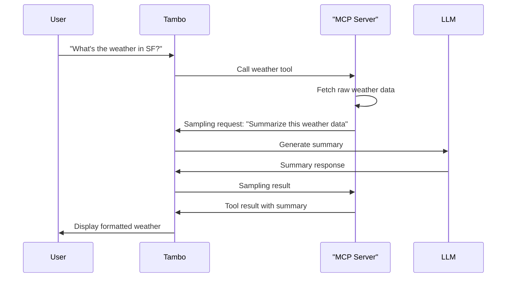

Sampling enables MCP servers to leverage your application's language model to process information and generate content. Instead of requiring their own AI infrastructure, MCP servers can request LLM completions from your application, creating powerful AI-augmented tools.

For more details on the sampling specification, see the [MCP Sampling documentation](https://modelcontextprotocol.io/docs/concepts/sampling).

## What is Sampling?

Sampling allows MCP servers to request that your application's LLM generate text completions. This is useful when:

- An MCP server needs to analyze or summarize data before presenting it to users
- A tool wants to leverage AI capabilities without implementing its own LLM integration
- An MCP server needs to make decisions or generate content based on context

For example, a data retrieval tool might fetch raw information from an API, then use sampling to have your application's LLM summarize and format that data in a user-friendly way.

## Server-side Support Only

**Important:** Sampling currently only works with **[server-side MCP connections](/concepts/model-context-protocol/providers/serverside-mcp-connection)**. Client-side MCP servers cannot make sampling requests at this time.

This limitation exists because sampling requests need to be processed through Tambo's backend infrastructure to ensure proper security, rate limiting, and LLM access control.

## How It Works

When an MCP server makes a sampling request, it creates a "sub-conversation" between the tool and your application's LLM:



Tambo automatically displays sampling interactions in the UI as expandable dropdowns within tool information panels, showing the messages exchanged between the MCP server and the LLM.

## Built-in Support

Sampling is automatically handled when you connect to server-side MCP servers through the Tambo dashboard. No additional configuration is required in your React application:

```tsx
import { TamboProvider } from "@tambo-ai/react";
import { TamboMcpProvider } from "@tambo-ai/react/mcp";

function App() {
  return (
    <TamboProvider components={...} mcpServers={[]}>
      <TamboMcpProvider>
        {/* Sampling from server-side MCP servers works automatically */}
      </TamboMcpProvider>
    </TamboProvider>
  );
}
```

The MCP servers you configure in the Tambo dashboard can make sampling requests, and Tambo will handle routing these to your configured LLM provider.

## Example Use Cases

### Data Summarization

An MCP server fetches detailed analytics data and uses sampling to generate a concise summary:

- **Without sampling**: The tool returns raw JSON data that overwhelms the user
- **With sampling**: The tool requests the LLM to create a natural language summary of key insights

### Content Generation

A documentation tool uses sampling to generate code examples based on API specifications:

- The server retrieves API endpoint definitions
- It uses sampling to generate working code examples in the user's preferred language
- The formatted examples are returned to the user

### Decision Making

A workflow automation tool uses sampling to analyze context and suggest next actions:

- The server gathers information about the current workflow state
- It uses sampling to have the LLM recommend appropriate next steps
- The recommendations are presented to the user for confirmation

## Technical Details

### Message Tracking

Messages generated through sampling include a `parentMessageId` field that references the original tool call. This allows Tambo to properly track the conversation hierarchy and display sampling interactions in context.

### Requirements

To use MCP sampling features, ensure you have:

- `@tambo-ai/react@0.57.0` or newer installed
- Run `npx tambo@latest upgrade message` to update your message components
- Server-side MCP connections configured in the Tambo dashboard

## Future Capabilities

Planned enhancements for sampling include:

- **Client-side sampling**: Allow client-side MCP servers to make sampling requests
- **User confirmation**: Let users approve or reject sampling requests before they're processed
- **Custom sampling handlers**: Provide programmatic control over sampling requests

## Related Features

import LearnMore from "@/components/learn-more";

<LearnMore
  title="MCP Elicitations"
  description="Learn how MCP servers can request user input during tool execution"
  href="/concepts/model-context-protocol/features/elicitation"
/>

<LearnMore
  title="Server-side MCP Connections"
  description="Configure MCP servers through the Tambo dashboard"
  href="/concepts/model-context-protocol/providers/serverside-mcp-connection"
/>
