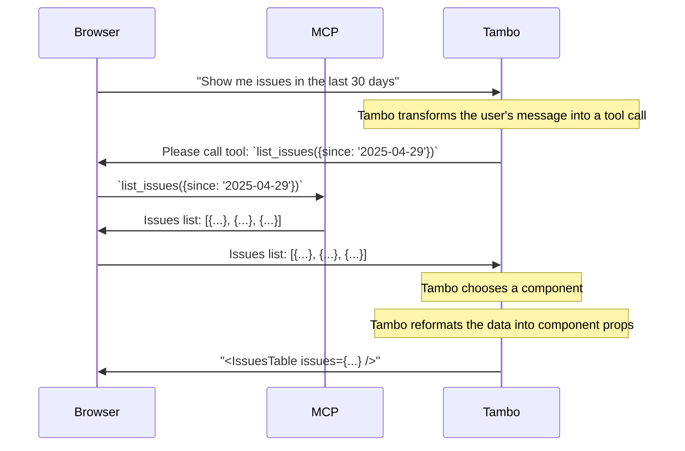

### Client-side Support

Client-side MCP integration allows your application to connect to MCP servers
that are accessible from the end user's browser, for instance when using a local
MCP server.

This is useful for:

- Local MCP servers running on the user's machine
- MCP servers where the user's browser is already authenticated
- Private or internal services behind a firewall, that are only visible from the user's browser

**Note:** _There is currently no support for authenticated MCP servers when using client-side MCP connections_.

To implement client-side MCP support, pass `mcpServers` to `TamboProvider` and wrap your app with `TamboMcpProvider`:

```tsx
import { TamboProvider } from "@tambo-ai/react";
import { TamboMcpProvider, MCPTransport } from "@tambo-ai/react/mcp";

function MyApp() {
  return (
    <TamboProvider
      components={...}
      mcpServers={[
        {
          // MCP server configuration
          url: "http://localhost:8123/",
          // Optional stable prefix used when multiple MCP servers are configured
          // If omitted, a key is derived from the URL hostname (e.g., "https://mcp.linear.app/mcp" -> "linear")
          serverKey: "local",
          // Optional custom headers, eg.
          // { "Authorization": `Bearer ${token}` } or { "X-Api-Key": "1234567890" }
          customHeaders: {},
          transport: MCPTransport.HTTP, // optional, defaults to HTTP
        },
      ]}
    >
      <TamboMcpProvider>
        {/* Your application components */}
      </TamboMcpProvider>
    </TamboProvider>
  );
}
```

> **Note**: As of `@tambo-ai/react@0.65.0`, pass `mcpServers` to `TamboProvider` instead of `TamboMcpProvider`.

The `TamboMcpProvider` establishes connections to the specified MCP servers and makes their tools available to Tambo agents in your application.

> Note
>
> When more than one MCP server is configured, Tambo prefixes names to avoid collisions using the `serverKey`:
>
> - Prompts: `serverKey:promptName` (colon separator)
> - Tools: `serverKey__toolName` (double-underscore separator)
>
> If you do not provide `serverKey`, Tambo derives one from the server URL (for example, `https://mcp.linear.app/mcp` becomes `linear`). To keep things predictable across environments, set `serverKey` explicitly. Avoid using `:` and `__` in the `serverKey` since prompts use `:` and tools use `__` as separators; prefer letters, numbers, `_`, and `-`.

## Control Flow



## Working with MCP Resources

MCP servers can expose resources (such as files, documents, or other data) that can be referenced in prompts. Tambo provides hooks and UI components to work with these resources.

### Using Resource Hooks

The `useTamboMcpResourceList` hook fetches all available resources from connected MCP servers:

```tsx
import { useTamboMcpResourceList } from "@tambo-ai/react/mcp";

function MyComponent() {
  const { data: resources, isLoading } = useTamboMcpResourceList();

  if (isLoading) return <div>Loading resources...</div>;

  return (
    <ul>
      {resources?.map((entry) => (
        <li key={entry.resource.uri}>
          {entry.resource.name || entry.resource.uri}
        </li>
      ))}
    </ul>
  );
}
```

To read a specific resource, use the `useTamboMcpResource` hook:

```tsx
import { useTamboMcpResource } from "@tambo-ai/react/mcp";

function ResourceViewer({ uri }: { uri: string }) {
  const { data: resource } = useTamboMcpResource(uri);

  if (!resource) return null;

  return (
    <div>
      {resource.contents.map((content, i) => (
        <div key={i}>{content.text || content.blob}</div>
      ))}
    </div>
  );
}
```

### Resource Button in Message Input

The `MessageInput.McpResourceButton` component provides a searchable combobox for inserting resource references into messages:

```tsx
import { MessageInput } from "@/components/ui/message-input";

function ChatInterface() {
  return (
    <MessageInput contextKey="my-thread">
      <MessageInput.Textarea />
      <MessageInput.Toolbar>
        <MessageInput.FileButton />
        <MessageInput.McpPromptButton />
        <MessageInput.McpResourceButton />
        <MessageInput.SubmitButton />
      </MessageInput.Toolbar>
    </MessageInput>
  );
}
```

When a user selects a resource from the button, it inserts a reference with the syntax `@<resourceUri>` (e.g., `@file:///path/to/file.txt` or `@linear:file://issue/123` if multiple servers are configured).

## Working with MCP Prompts

MCP servers can also expose prompts - pre-defined message templates that can be inserted into conversations.

### Using Prompt Hooks

The `useTamboMcpPromptList` hook fetches all available prompts:

```tsx
import { useTamboMcpPromptList } from "@tambo-ai/react/mcp";

function PromptList() {
  const { data: prompts } = useTamboMcpPromptList();

  return (
    <ul>
      {prompts?.map((entry) => (
        <li key={entry.prompt.name}>
          {entry.prompt.name}
          {entry.prompt.description && ` - ${entry.prompt.description}`}
        </li>
      ))}
    </ul>
  );
}
```

To fetch a specific prompt, use `useTamboMcpPrompt`:

```tsx
import { useTamboMcpPrompt } from "@tambo-ai/react/mcp";

function PromptInserter({ promptName }: { promptName: string }) {
  const { data: prompt } = useTamboMcpPrompt(promptName, {
    // Optional arguments for the prompt
    arg1: "value1",
  });

  if (!prompt) return null;

  // Extract text from prompt messages
  const promptText = prompt.messages
    .map((msg) => (msg.content.type === "text" ? msg.content.text : ""))
    .filter(Boolean)
    .join("\n");

  return <div>{promptText}</div>;
}
```

### Prompt Button in Message Input

The `MessageInput.McpPromptButton` component provides a dropdown menu for inserting prompts:

```tsx
import { MessageInput } from "@/components/ui/message-input";

function ChatInterface() {
  return (
    <MessageInput contextKey="my-thread">
      <MessageInput.Textarea />
      <MessageInput.Toolbar>
        <MessageInput.McpPromptButton />
        <MessageInput.SubmitButton />
      </MessageInput.Toolbar>
    </MessageInput>
  );
}
```

## Server Namespacing

When multiple MCP servers are configured, tools, prompts, and resources are automatically prefixed with a `serverKey` to avoid naming conflicts:

- **Tools**: `<serverKey>__<toolName>` (e.g., `linear__create_issue`)
- **Prompts**: `<serverKey>:<promptName>` (e.g., `linear:new-issue`)
- **Resources**: `<serverKey>:<resourceUri>` (e.g., `linear:file://issue/123`)

The `serverKey` is automatically derived from the server URL (e.g., "linear" from "https://mcp.linear.app"), or you can specify it explicitly:

```tsx
<TamboProvider
  mcpServers={[
    {
      url: "https://mcp.linear.app",
      serverKey: "linear", // Optional: explicitly set the key
      transport: MCPTransport.HTTP,
    },
    {
      url: "https://api.github.com/mcp",
      serverKey: "github",
      transport: MCPTransport.HTTP,
    },
  ]}
>
  <TamboMcpProvider>{/* Your app */}</TamboMcpProvider>
</TamboProvider>
```

When only one server is configured, no prefixes are applied (backward compatible).
