# Tambo AI Network Architecture Diagram

This document provides a detailed network diagram for Tambo AI's infrastructure, designed for SOC2 compliance requirements.

## Network Architecture Overview

```mermaid
graph TB
    %% External Users and Clients
    subgraph "External Users"
        DEV[👨‍💻 Developers<br/>Using Tambo SDK]
        ADMIN[👥 Admin/Engineering Staff<br/>Production Access via RBAC]
    end

    %% Internet Boundary
    INTERNET[🌐 Internet<br/>TLS Encryption]

    %% Application Layer - Railway
    subgraph "Application Layer - Railway"
        subgraph "Production Environment"
            PROD_APP[🚀 Production App Servers<br/>Railway Containers<br/>Auto-restart on failure]
        end
        
        subgraph "Development Environment"
            DEV_APP[🧪 Development App Servers<br/>Railway Containers]
        end
        
        RAILWAY_MONITOR[📊 Railway Monitoring<br/>Container Health & Logs]
    end

    %% CI/CD Pipeline
    subgraph "CI/CD Pipeline"
        GITHUB[📁 GitHub Repository<br/>tambo-ai/tambo-cloud]
        ACTIONS[⚙️ GitHub Actions<br/>Automated Deployment]
    end

    %% Data Layer - Supabase
    subgraph "Data Layer - Supabase"
        subgraph "Production Data"
            PROD_DB[(🗄️ Production Database<br/>Postgres - Encrypted at rest)]
            PROD_STORAGE[📦 Production Storage<br/>Encrypted at rest & transit]
            PROD_AUTH[🔐 Production Auth<br/>User Authentication]
        end
        
        subgraph "Development Data"
            DEV_DB[(🗄️ Development Database<br/>Postgres)]
            DEV_STORAGE[📦 Development Storage]
            DEV_AUTH[🔐 Development Auth]
        end
        
        SUPABASE_BACKUP[💾 Automated Backups<br/>Multi-AZ Infrastructure]
        SUPABASE_MONITOR[📈 Supabase Monitoring<br/>Logs & Intrusion Detection]
    end

    %% Security Controls
    subgraph "Security Boundaries"
        TLS[🔒 TLS Encryption<br/>All Traffic]
        RBAC[🛡️ Role-Based Access Control<br/>Database & Application]
        SECRETS[🔑 Secrets Management<br/>Railway Environment Variables<br/>Supabase Keys]
    end

    %% Supporting Services
    subgraph "Supporting Services"
        WORKSPACE[📧 Google Workspace<br/>Internal Communications<br/>Documentation]
        SLACK[💬 Slack/Discord<br/>Internal Communications<br/>Restricted from Production]
    end

    %% Monitoring & IDS
    subgraph "Monitoring & Security"
        LOGS[📋 Centralized Logging<br/>Supabase + Railway]
        IDS[🚨 Intrusion Detection<br/>Monitoring Tools]
        ALERTS[⚠️ External Monitoring<br/>Optional Alerting Integration]
    end

    %% Data Flow Connections
    DEV -->|HTTPS/TLS| INTERNET
    ADMIN -->|HTTPS/TLS + RBAC| INTERNET
    
    INTERNET -->|Load Balanced| PROD_APP
    INTERNET -->|Load Balanced| DEV_APP
    
    GITHUB -->|Webhook| ACTIONS
    ACTIONS -->|Deploy| PROD_APP
    ACTIONS -->|Deploy| DEV_APP
    
    PROD_APP -->|Encrypted Connection| PROD_DB
    PROD_APP -->|Encrypted Connection| PROD_STORAGE
    PROD_APP -->|Encrypted Connection| PROD_AUTH
    
    DEV_APP -->|Encrypted Connection| DEV_DB
    DEV_APP -->|Encrypted Connection| DEV_STORAGE
    DEV_APP -->|Encrypted Connection| DEV_AUTH
    
    PROD_APP -.->|Logs| RAILWAY_MONITOR
    DEV_APP -.->|Logs| RAILWAY_MONITOR
    
    PROD_DB -.->|Backup| SUPABASE_BACKUP
    PROD_DB -.->|Monitoring| SUPABASE_MONITOR
    DEV_DB -.->|Monitoring| SUPABASE_MONITOR
    
    RAILWAY_MONITOR -.->|Aggregated Logs| LOGS
    SUPABASE_MONITOR -.->|Database Logs| LOGS
    LOGS -.->|Analysis| IDS
    IDS -.->|Alerts| ALERTS
    
    ADMIN -.->|Internal Comms| WORKSPACE
    ADMIN -.->|Internal Comms| SLACK
    
    %% Security Overlays
    TLS -.->|Protects| INTERNET
    RBAC -.->|Controls| ADMIN
    RBAC -.->|Controls| PROD_DB
    RBAC -.->|Controls| PROD_APP
    SECRETS -.->|Manages| PROD_APP
    SECRETS -.->|Manages| DEV_APP

    %% Styling
    classDef production fill:#ff6b6b,stroke:#d63031,stroke-width:3px,color:#fff
    classDef development fill:#74b9ff,stroke:#0984e3,stroke-width:2px,color:#fff
    classDef security fill:#00b894,stroke:#00a085,stroke-width:2px,color:#fff
    classDef external fill:#fdcb6e,stroke:#e17055,stroke-width:2px,color:#000
    classDef monitoring fill:#a29bfe,stroke:#6c5ce7,stroke-width:2px,color:#fff
    
    class PROD_APP,PROD_DB,PROD_STORAGE,PROD_AUTH production
    class DEV_APP,DEV_DB,DEV_STORAGE,DEV_AUTH development
    class TLS,RBAC,SECRETS,IDS security
    class DEV,ADMIN,INTERNET external
    class RAILWAY_MONITOR,SUPABASE_MONITOR,LOGS,ALERTS monitoring
```



## Security Zones and Data Flow

### 1. **External Zone**
- **Developers**: Access Tambo SDK through public APIs
- **Admin/Engineering**: Limited production access via RBAC controls

### 2. **DMZ/Internet Boundary**
- All traffic encrypted with TLS
- Load balancing and DDoS protection via Railway
- Clear separation between production and development environments

### 3. **Application Zone (Railway)**
- **Production Environment**: Isolated containers with auto-restart capabilities
- **Development Environment**: Separate containers for testing and development
- Container orchestration and health monitoring
- Environment-specific secrets management

### 4. **Data Zone (Supabase)**
- **Production Data**: Encrypted at rest and in transit
- **Development Data**: Separate project with isolated data
- Automated backups and multi-AZ infrastructure
- Built-in authentication and authorization

### 5. **Security Controls**
- **TLS Encryption**: All inbound/outbound traffic
- **RBAC**: Database and application access controls
- **Secrets Management**: Railway environment variables and Supabase keys
- **Monitoring**: Centralized logging and intrusion detection

### 6. **Supporting Services**
- **Google Workspace**: Internal communications and documentation
- **Slack/Discord**: Team communications (restricted from production)
- **GitHub Actions**: Automated CI/CD pipeline

## Redundancy and Failover

### Application Layer (Railway)
- Automatic container restarts on failure
- Horizontal scaling capabilities
- Health checks and monitoring

### Data Layer (Supabase)
- Managed backups with point-in-time recovery
- Multi-AZ infrastructure by default
- Built-in high availability

## Compliance Notes

This architecture addresses the following SOC2 requirements:

1. **Boundary Definitions**: Clear network boundaries with firewalls and access controls
2. **Network Devices**: Servers, authentication systems, databases, and monitoring tools
3. **Subnets**: Logical separation between production and development environments
4. **Data Flows**: Encrypted connections with defined data flow patterns
5. **Network Zones**: Public, DMZ, application, and data zones with appropriate controls
6. **Security Controls**: TLS encryption, RBAC, IDS/IPS systems, and monitoring
7. **Critical Systems**: Database servers, authentication systems, and application servers
8. **Physical Locations**: Cloud-based infrastructure (Railway: global, Supabase: AWS regions)
9. **Redundancy**: Automated backups, multi-AZ deployment, and failover mechanisms

## Data Flow Summary

```
Internet → Railway (App Servers) → Supabase (Database/Storage/Auth)
    ↓
Monitoring & Logging → Intrusion Detection → Alerting
```

All connections use encrypted channels (TLS/HTTPS) with proper authentication and authorization controls in place.