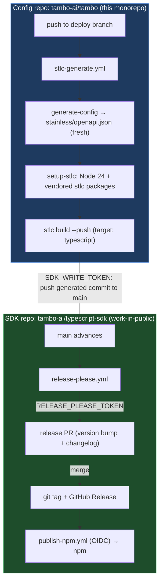

# feat: Migrate SDK generation from hosted Stainless to self-hosted stlc

**Target repos:** this monorepo (`tambo-ai/tambo`, the config/workspace repo) and
`tambo-ai/typescript-sdk` (the generated SDK / npm production repo). Units that
operate on the SDK repo are marked **(SDK repo)** and their file paths are
relative to that repo; all other paths are relative to this monorepo.

---

## Execution Status (2026-06-04)

Done in the worktree branch `worktree-lachlan+stainless-migration-plan` (config
repo) and `lachlan/stlc-release-please` (SDK repo). Nothing pushed to shared
branches; no secrets added.

**Verified complete:**

- **U1 — DONE.** stlc access activated; accepted the GitHub invites for `stlc`,
  `stlc-typescript`, `stlc-openapi`, `stlc-python` on the `lachieh` account
  (`gh api repos/stainless/stlc` → 200). stlc 0.1.2 installed locally.
- **U2 — DONE.** Workspace initialized via `stlc init --from-cloud` and
  committed (`stainless/` in the config repo). Work-in-public confirmed:
  `staging_repo == production_repo == tambo-ai/typescript-sdk`. Python target
  dropped (KTD6). All custom-code refs mirrored onto the production repo. `sdks/`
  - `builds/` gitignored.
- **U3 — DONE (parity PASS).** `stlc build` reproduces the published 0.96.2 SDK
  with **only CI/tooling drift** (`ci.yml`, `.stats.yml`, `scripts/mock`, etc.) —
  **zero changes to `src/`, `api.md`, types, or behavior.** The one custom-code
  conflict was in `.github/workflows/publish-npm.yml`: custom code adds the
  `release: types: [published]` trigger + OIDC `permissions` (which our release
  pipeline needs); stlc 0.1.2's template no longer emits them. Resolved by
  keeping the custom-code side.
- **U4 — DONE (verified).** Vendored stlc + stlc-typescript (pkg 1.0.0, CLI
  0.1.2, commit `38b413e`) to the **private** repo `tambo-ai/stlc-vendor` as
  release `stlc-0.1.2` (tarballs as release assets, README with provenance +
  license terms). Verified: `gh release download` + `npm install -g *.tgz`
  produces a callable `stlc` with **no** `github.com/stainless` access — CI
  survives the 2026-09-01 shutdown.
- **U5 — DONE (authored).** `.github/actions/setup-stlc/action.yml` — installs
  the vendored CLI (Node 24, job-scoped) from the `stlc-vendor` release. No
  `github.com/stainless` dependency.
- **U6 — DONE (authored, not CI-verified).** `.github/workflows/stlc-generate.yml`
  (deploy-gated: regenerate spec from `apps/api` → `stlc build --push`) and
  `.github/workflows/stlc-spec-check.yml` (PR sync-check for the committed spec).
  Faithful to the upstream stlc template. Cannot be CI-verified without the
  secrets + a deploy.

**U7 — DONE (landed via parallel PR #280, not mine).** While this work was in
progress, another contributor merged
**tambo-ai/typescript-sdk#280 "chore: migrate SDK generation to self-hosted
stlc"** to the SDK repo `main` (2026-06-04). It added a stock
`release-please.yml` (functionally identical to mine — `googleapis/release-please-action`,
`RELEASE_PLEASE_TOKEN`) plus the stlc-generated baseline and the `$schema` →
googleapis change. So U7 is complete on main. My redundant PR
`tambo-ai/typescript-sdk#283` was **closed** as superseded.

**Version scheme resolved:** release-please is live on the SDK main and opened
**#282 "release: 0.96.3"** — **plain semver, not a prerelease**. So
`versioning: prerelease` + `prerelease: true` under stock release-please yields
correct plain versions (the earlier concern was unfounded). The custom-code
sealing concern is also moot now that the SDK baseline is established on main
via #280.

**Review-ready (pushed):**

- Config repo → **draft PR tambo-ai/tambo#2915** (branch `lachlan/stlc-migration`):
  workspace, `setup-stlc`, `stlc-generate.yml`, `stlc-spec-check.yml`, plan.
- SDK repo → **draft PR tambo-ai/typescript-sdk#283** (branch
  `lachlan/stlc-release-please`): release-please workflow + config, with the U7
  custom-code-mechanism caveat documented in the PR body.
- Pushed via **SSH**, which bypasses the OAuth-app `workflow`-scope restriction
  (the rejection only applies to OAuth tokens, not SSH keys). The local `gh`
  token still lacks `workflow` scope, so HTTPS pushes of workflow files fail —
  SSH is the working path locally; CI uses `SDK_WRITE_TOKEN` (Workflows:write).
- Fixed a workspace bug: the committed custom-code tracking file had been
  captured from a build (`branch: worktree-...`, local-only SHAs); restored the
  bundle's exported tracking file (`branch: main`, integrated `8f2cc36` = 0.96.2,
  on origin).

**Key mechanics learned:**

- Pushing generated SDK / custom-code refs to `tambo-ai/typescript-sdk` requires
  a token with **`workflow` scope** (the SDK contains `.github/workflows/*`;
  GitHub rejects ref pushes touching workflow files otherwise). This is exactly
  why `SDK_WRITE_TOKEN` needs **Workflows: write**. The local `gh` token lacks
  it, so local `stlc build --push`/seal cannot complete — only CI with the
  scoped token can.
- stlc auto-installs a Claude Code plugin during `init` when `claude` is on PATH;
  neutralized here with a no-op shim so the real Claude config was untouched.

**Remaining:**

1. **Auth — GitHub App token, no PATs:** `stlc-generate.yml` mints a short-lived
   token from the org **RELEASE app** (`actions/create-github-app-token` with
   `RELEASE_APP_ID` / `RELEASE_APP_PRIVATE_KEY`), scoped to `typescript-sdk` +
   `stlc-vendor`, for both the vendored-CLI fetch and the SDK push. **Only
   requirement:** the RELEASE app installation must grant **Contents + Workflows:
   write** on `typescript-sdk` (Workflows:write required for the generated
   `.github/workflows/*`) and **Contents: read** on `stlc-vendor`. No new secrets
   to create — the app secrets already exist org-wide. `RELEASE_PLEASE_TOKEN`
   present in the SDK repo ✓.
2. **Merge config-repo PR #2915** (CI green) once the two secrets are in, so the
   deploy-gated `stlc-generate.yml` can regenerate + push to the SDK repo.
3. **U8 first release:** SDK release PR **#282 (0.96.3)** is open and validated
   (plain semver). Merging it tags a release and `publish-npm.yml` (OIDC)
   publishes to npm — an intentional, human-approved publish.
4. **U9 cutover:** the config-repo cutover is **staged in #2915** — it deletes
   `stainless-cloud.yml` and rewrites `RELEASING.md` + `AGENTS.md` to the stlc
   flow. The only out-of-band cutover steps left are operational: remove the
   `STAINLESS_API_KEY` secret, uninstall the Stainless GitHub App, and mark the
   org read-only in the Stainless dashboard.

The SDK side (U7 + release automation) is **already live on main via #280**. All
code/config/doc work for the config-repo side is committed in **#2915 (CI
green)**, and it authenticates via the org RELEASE GitHub App (no new secrets to
mint). What remains is purely operational: confirm the RELEASE app is installed
on `typescript-sdk` + `stlc-vendor` with the right permissions → merge #2915;
merge #282 to publish 0.96.3; remove `STAINLESS_API_KEY` + uninstall the
Stainless App.

---

## Summary

Anthropic acquired Stainless and is sunsetting all hosted Stainless products on
**September 1st, 2026**. After that date the hosted SDK generator, the build
API, and the `stainless-sdks/*` staging org all go away. We currently depend on
that hosted pipeline to regenerate `@tambo-ai/typescript-sdk` from our OpenAPI
spec and publish it to npm.

This plan migrates SDK generation to **stlc** — Stainless's source-available
CLI replacement that runs in our own CI — before the deadline. We keep the SDK
as its own repo (`tambo-ai/typescript-sdk`) and run it **work-in-public**:
`staging_repo == production_repo`, so the promote stage disappears and we go
from the documented three-workflow pipeline to **two** (generate + release).
Generation stays gated on the `deploy` branch, exactly as `stainless-cloud.yml`
is today, so published SDKs continue to track the production-deployed API.

The work also hardens us against the shutdown itself: the stlc packages live in
private `github.com/stainless/*` repos that disappear on Sep 1, so we vendor
them so CI keeps working afterward.

---

## Problem Frame

Today's flow (see `RELEASING.md`):

1. `apps/api` generates the OpenAPI spec from NestJS Swagger decorators
   (`apps/api/src/generate-config.ts`, invoked by `npm run generate-config`).
2. `.github/workflows/stainless-cloud.yml` runs on push to `deploy`, regenerates
   the spec, and uploads it to the hosted Stainless project `hydra-ai` via
   `stainless-api/upload-openapi-spec-action@main` (auth: `STAINLESS_API_KEY`).
3. The hosted Stainless service regenerates the SDK, and the **Stainless GitHub
   App** opens a release PR in `tambo-ai/typescript-sdk` and publishes to npm on
   merge.

Every piece of the hosted half (upload action, build service, GitHub App,
`stainless-sdks` staging repo) stops working on 2026-09-01. The generated SDK
source and the npm package survive (we own them), but we lose the ability to
**regenerate** when the API changes. stlc replaces the hosted half with CLI
invocations we run in our own Actions.

**What stays the same:** the spec source (`generate-config`), the `deploy`-branch
trigger, the production repo (`tambo-ai/typescript-sdk`), npm OIDC publishing,
and the existing `publish-npm.yml` in the SDK repo.

**What changes:** upload-to-hosted-Stainless becomes local `stlc build`; the
Stainless GitHub App's release function becomes stock `release-please`; the
Stainless-managed staging repo collapses into the production repo.

---

## Requirements

- **R1.** SDK regeneration runs entirely in our own GitHub Actions with no
  dependency on hosted Stainless infrastructure after 2026-09-01.
- **R2.** `@tambo-ai/typescript-sdk` continues to publish to npm with no change
  to the package name, scope, or OIDC publish provenance, and no break in
  version continuity (current published version: 0.96.2).
- **R3.** Generated SDKs continue to track the **production-deployed** API
  contract (generation gated on the `deploy` branch, as today).
- **R4.** Existing custom code on the TypeScript SDK is preserved across the
  cutover.
- **R5.** CI survives the 2026-09-01 shutdown — no workflow step depends on a
  live `github.com/stainless/*` repo or the hosted build API after cutover.
- **R6.** The old hosted path (`stainless-cloud.yml`, `STAINLESS_API_KEY`, the
  Stainless GitHub App) is fully removed once the new path is verified green.
- **R7.** `RELEASING.md` and `AGENTS.md` reflect the new flow.

---

## Key Technical Decisions

### KTD1. Separate SDK repo; regenerate to a side branch + PR into protected `main`

The SDK stays its own repo (`tambo-ai/typescript-sdk`), not folded into the
monorepo. The SDK repo's `main` is **PR-only** (branch ruleset: `pull_request`,
`required_status_checks`, `required_linear_history`), so stlc **cannot push to
`main` directly**. The generate workflow therefore pushes the regenerated SDK to
an **unprotected side branch** (`stlc/auto-regenerate`) and **opens a PR into
`main`**; release-please releases on merge. `staging_repo` / `production_repo`
both point at `tambo-ai/typescript-sdk` (the side branch is the "staging"
surface within that one repo).

**Why not work-in-public direct-to-main (original choice, reversed):** that
assumed the bot could push straight to `main`. It can't — the ruleset rejects
direct pushes and won't be relaxed. A separate staging _repo_ would also work
but is unnecessary: an unprotected side branch in the same repo serves as
stlc's writable surface, and the PR into `main` honors the ruleset.

**Custom-code lineage:** the tracking file at
`stainless/custom-code/typescript/` pins `base` = the stlc-generated baseline
(`90c6c35`, #280's seal base) and `integrated` = the SDK `main` HEAD (reachable
from `origin/main`). This was required because the parallel **#280** migration
PR was **squash-merged**, orphaning its stlc seals from `main` — so neither the
old Stainless seal (conflicts) nor #280's seal (no shared history) applied.
Pinning `integrated` to a real `main` commit makes the custom-code patch
3-way-apply cleanly. Validated: a `workflow_dispatch` run goes green end-to-end
(generate → apply custom code → push side branch → open PR #284, diff = one
tooling file).
(Decision history: see `plans/stainless-migration.md`.)

### KTD2. Generation stays gated on the `deploy` branch

`stlc-generate.yml` triggers on push to `deploy` and regenerates the spec in CI
via `generate-config`, mirroring `stainless-cloud.yml`'s trigger.

**Why:** preserves R3 — the SDK is generated from the production-deployed
contract, not a merged-but-undeployed one (merging to `main` only deploys to
Railway _Development_). PR-time SDK preview (stlc's `pull_request` job) is a
nice enhancement but decouples generation from deploy timing; deferred to
follow-up.

### KTD3. Committed spec snapshot is the workspace source of truth; CI regenerates to guarantee freshness

The stlc workspace needs a spec at a fixed path (`stainless/openapi.json`) for
local builds and `stlc init`. We commit a snapshot there, and a PR sync-check
fails if `generate-config` output drifts from the committed file. The
`deploy` workflow regenerates the spec fresh before `stlc build` so the
published SDK always matches the deployed contract regardless of snapshot
staleness.

**Why:** gives reviewable contract diffs in PRs and a working local/`stlc init`
setup, without risking a stale snapshot shipping to npm.

### KTD4. Vendor the private stlc packages to survive the shutdown

`stlc` and `stlc-typescript` install from private `github.com/stainless/*`
repos that disappear on 2026-09-01. We pin exact versions, vendor the resolved
tarballs (`npm pack`) into a storage location we own, and have `setup-stlc`
install from the vendored copies rather than `git+https`.

**Why:** R5. Installing from `git+https` at CI time is a hard dependency on
infrastructure that is guaranteed to be gone.

**License constraint (verified against stlc `LICENSE.md`):** §1(a) grants the
right to _reproduce_ the Software for internal business operations, so vendoring
is permitted — but §1(b) requires it be kept "secure on Customer-controlled
systems" and available only to employees/contractors with a legitimate need, and
§9 makes the Software **Stainless's Confidential Information**; §3(c) forbids
redistribution/resale to third parties.

**This rules out the monorepo.** `tambo-ai/tambo` is **public** — committing stlc
there would publicly disclose Confidential Information (license breach). The
vendored tarballs must live in a **dedicated private repo we own** (e.g.
`tambo-ai/stlc-vendor`, private — not "internal") or **private GitHub Packages**
in the org; CI installs stlc from that private source with a read token. Keep all
proprietary notices intact (§3). Do **not** use `tambo-ai/typescript-sdk` (it is
org-internal and is the published SDK repo).

**Tambo-specific (§3):** do not use stlc or its source to train/evaluate any
AI/ML model, and keep the vendored copy out of any model-training/eval pipeline.
The generated SDK output is separate (§1(c) "Redistributable Code") and may stay
public, so the public `@tambo-ai/typescript-sdk` package is unaffected.

### KTD5. Replace the Stainless GitHub App's release function with stock release-please

`tambo-ai/typescript-sdk` has no `release-please.yml` today — releases are
created by the Stainless GitHub App. We add stock
`googleapis/release-please-action@v4` plus `release-please-config.json` and
`.release-please-manifest.json` (seeded at the current 0.96.2), keeping the
existing `publish-npm.yml` (OIDC, triggered on release published).

**Why:** R1/R6. The App stops working at cutover. Stock release-please is what
the transition guide prescribes; the SaaS used a Stainless fork.

### KTD6. Drop the `python` target

`stainless.yml` configures a `python` target with `production_repo:
tambo-ai/python-sdk`, but that repo does not exist (404) and no Python SDK has
ever shipped. Remove the target from `stainless.yml` so `stlc build` does not
fail on a missing repo.

**Why:** dead config; standing up a Python SDK is explicitly out of scope.

### KTD7. stlc runs on Node 24 via a job-scoped version, not a repo-wide bump

The repo pins Node 22.22.0 (`.node-version`, `mise.toml`). stlc requires Node 24. The `setup-stlc` action selects Node 24 for stlc steps only; the rest of
the repo's tooling is untouched.

**Why:** avoid a repo-wide Node bump (out of scope, risky) just to run a CI
tool. AGENTS.md forbids changing tool configs without explicit request.

---

## High-Level Technical Design

Two stages, two repos. Generation is deploy-gated in the config repo; release is
conventional-commit-driven in the SDK repo.



Custom code: stlc seals hand edits as `refs/stainless/*` git refs on the SDK
repo and tracks them via files under `stainless/custom-code/` in the config
repo. `stlc build` re-integrates them onto freshly generated output every run.

---

## Output Structure

New files added to the **config repo** (monorepo):

```text
stainless/                         # stlc workspace (committed; Customer-owned, OK in public repo)
  workspace.json                   # stlc workspace pointers
  stainless.yml                    # SDK config (from bundle, python target removed)
  openapi.json                     # committed spec snapshot (KTD3)
  custom-code/typescript/          # custom-code tracking files (KTD: R4)
.github/actions/setup-stlc/
  action.yml                       # composite action: Node 24 + install vendored stlc
.github/workflows/
  stlc-generate.yml                # replaces stainless-cloud.yml
sdks/                              # gitignored: stlc's nested SDK clone (NOT committed)
```

The vendored stlc packages (KTD4) do **NOT** go here — the monorepo is public
and stlc is Confidential. They live in a separate private repo
(`tambo-ai/stlc-vendor`) or private GitHub Packages:

```text
tambo-ai/stlc-vendor               # PRIVATE repo (or private GitHub Packages)
  stlc-<version>.tgz               # vendored stlc tarball
  stlc-typescript-<version>.tgz    # vendored stlc-typescript tarball
  README.md                        # pinned versions + refresh provenance
```

New files added to the **SDK repo** (`tambo-ai/typescript-sdk`):

```text
.github/workflows/release-please.yml   # stock release-please (KTD5)
release-please-config.json
.release-please-manifest.json          # seeded at 0.96.2
```

`./sdks/` is stlc's working clone of the SDK repo and is gitignored in the
monorepo — it is not the committed SDK.

---

## Implementation Units

Grouped into four phases. Phases A–C run while the old hosted path stays live;
Phase D (cutover) only fires after the new path is verified green end-to-end.

### Phase A — Access, workspace, parity

### U1. Activate stlc access and mint tokens

**Goal:** establish org access to the private stlc packages and create the three
CI tokens the new pipeline needs.
**Requirements:** R1, R5.
**Dependencies:** none.
**Files:** none (GitHub settings + secrets).
**Approach:**

- Org admin activates stlc for `hydra-ai`; each engineer who needs it requests
  GitHub invites via the transition guide and accepts them.
- Mint **`STLC_READ_TOKEN`** (classic PAT, `repo` scope) — only required while
  installing/vendoring from `github.com/stainless/*`; after KTD4 vendoring, CI
  no longer needs it.
- Create **`SDK_WRITE_TOKEN`** (fine-grained PAT — Contents r/w, Pull requests
  r/w, Workflows r/w on `tambo-ai/typescript-sdk`) as a config-repo secret.
- Create **`RELEASE_PLEASE_TOKEN`** (fine-grained PAT — Contents r/w, Pull
  requests r/w on `tambo-ai/typescript-sdk`) as an SDK-repo secret.
- SSO-authorize all tokens for the `tambo-ai` org.
  **Patterns to follow:** existing fine-grained PAT usage; OIDC is already wired in
  `publish-npm.yml` so no npm token is needed.
  **Test scenarios:** Test expectation: none — credential/access setup.
  **Verification:** `https://github.com/stainless/stlc` resolves (not 404) for each
  engineer; all three secrets present in the correct repos.

### U2. Initialize the stlc workspace in the monorepo

**Goal:** create the committed `stainless/` workspace from a fresh bundle export,
configured work-in-public with the python target dropped.
**Requirements:** R1, R4, KTD1, KTD6.
**Dependencies:** U1.
**Files:** `stainless/workspace.json`, `stainless/stainless.yml`,
`stainless/openapi.json`, `stainless/custom-code/**`, `.gitignore` (add `sdks/`).
**Approach:**

- Download a **fresh** bundle from the transition dashboard at execution time
  (the cached `devdocs/stainless-transition/stainless-hydra-ai.zip` is a backup,
  not the source of truth — custom code may have advanced).
- `stlc init --from-cloud ./stainless-hydra-ai.zip` from the monorepo root.
- When prompted for the typescript `staging_repo`, set it to
  `tambo-ai/typescript-sdk` (collapses staging into production per KTD1).
- Edit `stainless/stainless.yml` to remove the `python` target (KTD6).
- Commit the `stainless/` tree; gitignore the `sdks/` clone.
  **Patterns to follow:** transition guide "Initialize your workspace"
  (`devdocs/stainless-transition/migrate-initialize.txt`).
  **Execution note:** stop editing custom code in Stainless Studio from the moment
  the bundle is downloaded — post-download edits are silently dropped.
  **Test scenarios:** Test expectation: none — scaffolding. (Behavior is validated
  in U3.)
  **Verification:** `stlc` discovers the workspace from the repo root with no
  flags; `stainless.yml` lists only the `typescript` target.

### U3. First build and parity validation

**Goal:** prove stlc reproduces the currently-published SDK with no
behavior-bearing drift and that custom code re-integrates cleanly.
**Requirements:** R2, R4.
**Dependencies:** U2.
**Files:** `sdks/typescript/**` (gitignored working clone); possibly
`stainless/custom-code/typescript/**` (re-sealed tracking files).
**Approach:**

- `stlc build --commit "feat: initial stlc build"`, then `stlc test`.
- Diff the freshly built commit against the published SDK:
  `git diff origin/main HEAD` inside the SDK clone.
- Measure custom-code volume and confirm it applies (`integrate:apply-patches`
  succeeds). If custom code no longer applies cleanly, resolve per the codegen
  troubleshooting guide before continuing.
  **Patterns to follow:** transition guide "Validate parity"
  (`devdocs/stainless-transition/migrate-validate.txt`).
  **Test scenarios:**
- Parity: diff against `origin/main` shows only low-signal drift (header
  comments, version stamps, formatter/import ordering) — no changes to types,
  signatures, request/response shapes, or exported symbols.
- Behavior: no diff in retries/pagination/auth code.
- Custom code: every tracked custom-code file integrates without conflict; the
  custom behavior is present in the built output.
- `stlc test` passes (the SDK's own jest suite).
  **Verification:** acceptable diff + green `stlc test`. If any
  type/signature/behavior drift appears, escalate to transition@stainless.com
  before proceeding (per the guide).

### Phase B — CI durability and generation

### U4. Vendor the private stlc packages

**Goal:** make stlc installable in CI without reaching `github.com/stainless/*`,
so CI survives the 2026-09-01 shutdown.
**Requirements:** R5, KTD4.
**Dependencies:** U1.
**Files:** in a **private** location only (NOT the public monorepo) — a dedicated
private repo `tambo-ai/stlc-vendor` holding `stlc-<version>.tgz`,
`stlc-typescript-<version>.tgz`, and a `README.md` of pinned versions + refresh
provenance, or the equivalent as private GitHub Packages.
**Approach:**

- Resolve and pin exact versions of `stlc` and `stlc-typescript`.
- `npm pack` each into tarballs; store them in a **private** repo/registry we own
  (`tambo-ai/stlc-vendor` private, or private GitHub Packages). The public
  monorepo and the org-internal `tambo-ai/typescript-sdk` are **not** valid
  locations — stlc is Confidential Information (license §1(b)/§9). Keep
  proprietary notices intact (§3).
- Record provenance (source commit/version) so the vendored copy is auditable.
  **Patterns to follow:** none in-repo; this is the key shutdown-survival
  mitigation.
  **Test scenarios:**
- Install from the vendored tarballs with **no** `STLC_READ_TOKEN` and no network
  access to `github.com/stainless` → `stlc version` and `stlc --help` succeed.
- A `stlc build` using the vendored install produces output identical to the
  git-installed build from U3.
  **Verification:** `stlc build` works in a CI job that cannot reach the stainless
  org.

### U5. `setup-stlc` composite action

**Goal:** one reusable action that prepares a runner to run stlc — Node 24 plus
the vendored stlc install.
**Requirements:** R1, R5, KTD7.
**Dependencies:** U4.
**Files:** `.github/actions/setup-stlc/action.yml`.
**Approach:**

- Composite action mirroring `.github/actions/setup-tools/action.yml`'s shape.
- Select Node 24 for stlc steps (job-scoped, not a repo-wide change — KTD7).
- Install stlc + stlc-typescript from the vendored tarballs (U4).
- Skip git-auth-to-stainless entirely once vendored (no `STLC_READ_TOKEN` at
  runtime).
  **Patterns to follow:** `.github/actions/setup-tools/action.yml`.
  **Test scenarios:**
- Action run on a clean runner → `stlc version` resolves the pinned version.
- Action does not require `STLC_READ_TOKEN` (proves U4 decoupling).
  **Verification:** a smoke workflow using the action prints the stlc version.

### U6. `stlc-generate.yml` workflow (replaces `stainless-cloud.yml`)

**Goal:** on push to `deploy`, regenerate the spec and push freshly generated SDK
code to `tambo-ai/typescript-sdk`.
**Requirements:** R1, R3, KTD2, KTD3.
**Dependencies:** U2, U5.
**Files:** `.github/workflows/stlc-generate.yml`. (Do **not** delete
`stainless-cloud.yml` yet — that happens at cutover, U9.)
**Approach:**

- Trigger: `push` to `deploy` (KTD2). `workflow_dispatch` for manual runs.
- Steps: `setup-stlc` → regenerate spec
  (`OPENAPI_SPEC_FILE=stainless/openapi.json npm run generate-config` in
  `apps/api`) → `stlc build --push` with `DEFAULT_TARGETS: typescript`, using
  `SDK_WRITE_TOKEN` to push to the SDK repo's `main`.
- Add a separate PR-time **sync check** (KTD3): on `pull_request`, regenerate the
  spec and fail if it differs from the committed `stainless/openapi.json`, so the
  snapshot stays honest. (This is a check, not SDK generation — keeps generation
  deploy-gated.)
  **Patterns to follow:** `.github/workflows/stainless-cloud.yml` (trigger + spec
  regeneration), transition guide "Automate SDK generation"
  (`devdocs/stainless-transition/codegen.txt`).
  **Test scenarios:**
- Spec change merged to `deploy` → generated commit pushed to SDK repo `main`.
- No spec change → `stlc build` is a no-op, nothing pushed.
- `python` target absent → build does not attempt a missing repo.
- PR that changes `apps/api` API surface without updating the committed spec →
  sync check fails.
- Push lands at the expected SHA on the SDK repo (no silent token/permission
  failure).
  **Verification:** a manual `workflow_dispatch` run pushes a regenerated SDK
  commit to `tambo-ai/typescript-sdk` while the old `stainless-cloud.yml` is still
  present (both can coexist until cutover).

### Phase C — Release pipeline

### U7. Add stock release-please to the SDK repo **(SDK repo)**

**Goal:** replace the Stainless GitHub App's release function with stock
release-please so version bumps, changelogs, tags, and releases run from our own
Actions.
**Requirements:** R2, R1, KTD5.
**Dependencies:** U1 (needs `RELEASE_PLEASE_TOKEN`).
**Files (relative to `tambo-ai/typescript-sdk`):**
`.github/workflows/release-please.yml`, `release-please-config.json`,
`.release-please-manifest.json`. Keep existing `.github/workflows/publish-npm.yml`.
**Approach:**

- `googleapis/release-please-action@v4` triggered on push to `main`, gated with
  `if: github.repository == 'tambo-ai/typescript-sdk'`, using
  `RELEASE_PLEASE_TOKEN` (a PAT, so the created Release triggers `publish-npm.yml`
  — `GITHUB_TOKEN` would not).
- Seed `.release-please-manifest.json` at the current published version
  (**0.96.2**) so the first release bumps from there, not from zero.
- Pre-1.0 semantics: `feat`→minor, `fix`→patch, breaking→minor (not major) until
  1.0.0.
  **Patterns to follow:** transition guide "Release SDKs"
  (`devdocs/stainless-transition/release.txt`); existing `publish-npm.yml` in the
  SDK repo (OIDC, `release: types: [published]` trigger) stays unchanged.
  **Test scenarios:**
- A `feat:`/`fix:` commit on `main` → release-please opens/updates a release PR
  with the correct version bump and changelog entry.
- Merge the release PR → git tag + GitHub Release created → `publish-npm.yml`
  fires on `release: published` and publishes to npm.
- A non-conventional codegen-metadata commit → no version bump, no changelog
  noise.
- The published version is exactly one bump above 0.96.2 (manifest seeded
  correctly).
  **Verification:** a test release PR cuts a correct version and `publish-npm.yml`
  publishes it to npm.

### U8. End-to-end dry run

**Goal:** prove the full chain — spec change → generate → SDK repo → release PR →
npm publish — works with the new pipeline while the old one is still present.
**Requirements:** R1, R2, R3.
**Dependencies:** U6, U7.
**Files:** none (a throwaway spec change, e.g. a field description tweak in
`apps/api`).
**Approach:**

- Make a trivial, safe API change (e.g. a description), let it reach `deploy`.
- Confirm `stlc-generate.yml` pushes a generated commit to the SDK repo.
- Confirm release-please opens a release PR; merge it; confirm npm publishes.
- Compare the published artifact against expectations.
  **Patterns to follow:** transition guide "Finish cutover" dry-run step
  (`devdocs/stainless-transition/migrate-cutover.txt`).
  **Test scenarios:**
- The new pipeline produces a published npm version reflecting the trivial change.
- The old `stainless-cloud.yml` run for the same change does not conflict (or is
  temporarily disabled for the dry run to avoid double-generation).
  **Verification:** a new `@tambo-ai/typescript-sdk` version on npm, produced
  entirely by our own Actions, matching the deployed spec.

### Phase D — Cutover and teardown

### U9. Cutover: remove the hosted path and update docs

**Goal:** sever all hosted-Stainless dependencies once the new path is verified
green.
**Requirements:** R6, R7.
**Dependencies:** U8 (do not start until the dry run is green).
**Files:** delete `.github/workflows/stainless-cloud.yml`; update `RELEASING.md`
(API client + Stainless Studio sections), `AGENTS.md` (the external-SDK note).
**Approach:**

- Delete `stainless-cloud.yml` and remove the `STAINLESS_API_KEY` secret.
- Uninstall the **Stainless GitHub App** from the `tambo-ai` org (GitHub →
  org Settings → GitHub Apps → Stainless → Uninstall). This revokes its push /
  release-PR / comment access; repos and existing code are untouched.
- Rewrite the `RELEASING.md` "Tambo API Client" + "Stainless Studio" sections to
  describe the stlc flow; update the `AGENTS.md` line that calls the SDK an
  "external" Stainless-managed dependency.
- Mark migration complete in the Stainless dashboard — choose **read-only**
  (keeps bundle exports retrievable), not full shutdown.
  **Patterns to follow:** transition guide cutover checklist
  (`devdocs/stainless-transition/migrate-cutover.txt`).
  **Test scenarios:** Test expectation: none — teardown/docs. Gated on U8 being
  green.
  **Verification:** the Stainless App no longer appears in the org's installed
  apps; a subsequent `deploy` push regenerates and publishes the SDK with zero
  hosted-Stainless involvement; `RELEASING.md`/`AGENTS.md` describe only the stlc
  flow.

---

## Scope Boundaries

**In scope:** TypeScript SDK generation + release migrated to stlc in our CI;
shutdown-survival vendoring; removal of the hosted path; doc updates.

### Deferred to Follow-Up Work

- **PR-time SDK preview** (stlc's `pull_request` job posting per-target diff
  links). Useful but decouples from deploy-gated timing; add after the core
  cutover is stable.
- **Consumer dependency automation.** The 8 in-repo consumers (`apps/web`,
  `packages/client`, `packages/ui-registry`, `packages/react-ui-base`,
  `react-sdk`, `docs`, `cli`, `showcase`) still pin an npm version and bump via
  Dependabot/manual update, exactly as today. Workspace-protocol consumption was
  considered and rejected with KTD1 (separate repo).

### Outside this work's scope

- **Standing up a Python SDK.** The `python` target is dropped (KTD6), not built.
- **Evaluating alternative generators** (Speakeasy, Fern, TypeSpec emitters).
  stlc is the committed path; revisit only if stlc becomes a maintenance burden
  after the support window closes.
- **Repo-wide Node version bump.** stlc's Node 24 need is job-scoped (KTD7).

---

## Risks & Dependencies

- **Hard deadline 2026-09-01.** All hosted infrastructure (build API, GitHub
  App, `stainless-sdks` org) goes read-only/away. Mitigation: complete Phases
  A–D well before; KTD4 vendoring removes the post-deadline CI dependency.
- **stlc is unsupported after 2026-09-01** ("as is", no SLA; migration help only
  until then). Mitigation: finish and verify while support exists; vendoring
  freezes a known-good version.
- **License constraints.** stlc is source-available, internal-use only — no
  redistribution, no commercial resale, no using it to train/evaluate AI/ML
  models. Mitigation: vendored tarballs live only in private locations (KTD4);
  do not publish them or reference them from public artifacts.
- **Custom-code integration failure.** If sealed custom code no longer applies to
  fresh output, `stlc build` fails at `integrate:apply-patches`. Mitigation: U3
  measures and validates custom code before any automation depends on it;
  resolve/re-seal early.
- **Release manifest seeding error.** A wrong `.release-please-manifest.json`
  seed would reset or skip versions. Mitigation: seed at exactly 0.96.2 and
  verify the first dry-run bump (U7/U8).
- **Double-generation during overlap.** While both `stainless-cloud.yml` and
  `stlc-generate.yml` exist (Phases B–C), a `deploy` push could trigger both.
  Mitigation: keep them coexisting only for verification; disable the old one for
  the U8 dry run; delete it at U9.
- **Dependency on org-admin actions.** U1 (invites, app uninstall, dashboard
  completion) and secret creation require `tambo-ai` GitHub org admin.

---

## Phased Delivery

- **Phase A (U1–U3):** access + workspace + parity. Exit criterion: stlc
  reproduces the published SDK locally with clean custom code.
- **Phase B (U4–U6):** durable CI generation. Exit criterion: a manual
  `stlc-generate` run pushes a regenerated SDK commit, installable without the
  stainless org.
- **Phase C (U7–U8):** release pipeline + full dry run. Exit criterion: a new
  npm version published end-to-end by our own Actions.
- **Phase D (U9):** cutover. Exit criterion: zero hosted-Stainless dependencies;
  docs updated.

Phases A–C are non-destructive and run alongside the live hosted pipeline. Only
Phase D removes the old path.

---

## Sources & Research

- `plans/stainless-migration.md` — investigation/origin doc (verified current
  state, repo topology, bundle export).
- `devdocs/stainless-transition/` — full cached transition guide (18 pages) +
  exported project bundle (`openapi.json`, `openapi.stainless.yml`,
  custom-code tracking).
- `.github/workflows/stainless-cloud.yml`, `apps/api/src/generate-config.ts`,
  `.github/actions/setup-tools/action.yml`, `RELEASING.md` — current pipeline.
- `tambo-ai/typescript-sdk` repo: `publish-npm.yml` (OIDC publish, kept), no
  existing `release-please.yml` (confirmed — App does releases today),
  `.stats.yml` (40 endpoints), current published version 0.96.2.
- Verified: `stainless-sdks/hydra-ai-typescript` exists (Stainless-owned staging,
  archived at cutover); `tambo-ai/python-sdk` does not exist (404 → KTD6).
