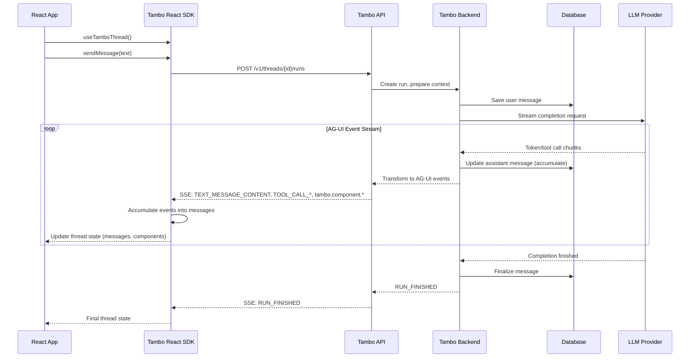
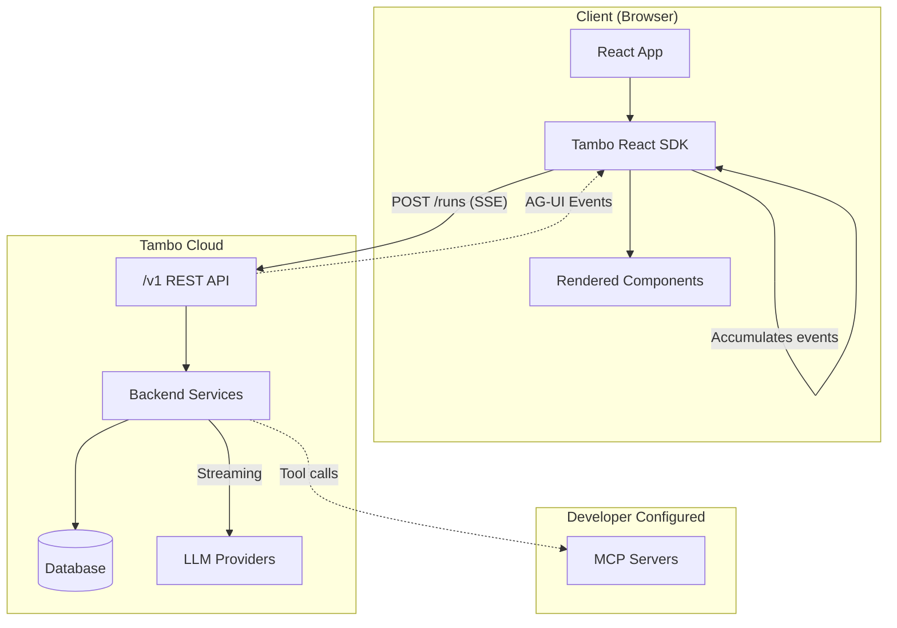

# Tambo API v1 Proposal

## Executive Summary

This proposal defines the Tambo API v1, a streaming-first API that uses AG-UI events as the wire protocol. The design aligns with industry standards (OpenAI, Anthropic, MCP) while extending them to support Tambo's unique capability: returning streamable UI components with props and state.

### Key Design Decisions

1. **Streaming-only**: No synchronous endpoints - all responses stream via Server-Sent Events (SSE)
2. **AG-UI Protocol**: Uses the AG-UI event system for all streaming communication
3. **Industry-aligned Types**: Messages, Content, and Tools follow OpenAI/Anthropic conventions
4. **First-class Components**: UI components are treated as special tool calls with streaming props/state
5. **Multi-component Support**: A single response can return multiple components
6. **Server & Client Tools**: Server-side tools (MCP, pre-registered) execute inline; client-side tools (per-request) pause the stream
7. **Bidirectional State**: Clients can push state updates to components via dedicated endpoint
8. **Pause & Resume**: Disconnected clients can reconnect to running/paused runs

---

## Architecture Overview





**Data Flow:**

1. **Client → API**: SDK sends `CreateRun` request with message, available components, and tools
2. **API → Backend**: Backend prepares context (thread history, MCP resources) and calls LLM
3. **LLM → Backend**: LLM streams tokens and tool calls back to backend
4. **Backend → API**: Backend transforms LLM output into AG-UI events
5. **API → SDK**: SSE stream delivers events (`TEXT_MESSAGE_*`, `TOOL_CALL_*`, `tambo.component.*`)
6. **SDK accumulation**: SDK accumulates events into complete message structures
7. **SDK → App**: React hooks expose accumulated state (messages, components, loading status)

---

## Part 1: Core Type Definitions

### 1.1 Roles

**References:**

- [OpenAI Chat Completions - role](https://platform.openai.com/docs/api-reference/chat/create#chat-create-messages) - defines `system`, `user`, `assistant`, `tool`
- [Anthropic Messages - role](https://docs.anthropic.com/en/api/messages) - uses only `user`, `assistant` (system is separate param)
- [MCP Sampling - Role](https://modelcontextprotocol.io/specification/2025-11-25/server/sampling#role) - defines `user`, `assistant`

```typescript
/**
 * Message roles following OpenAI conventions (superset of Anthropic/MCP).
 *
 * OpenAI uses all four roles. Anthropic puts system in a separate parameter
 * and uses tool_result content blocks instead of a "tool" role. We follow
 * OpenAI's approach for flexibility.
 */
type MessageRole = "user" | "assistant" | "system" | "tool";
```

### 1.2 Content Types

**References:**

- [OpenAI Content Parts](https://platform.openai.com/docs/api-reference/chat/create#chat-create-messages-content) - `text`, `image_url`, `input_audio`, `file`
- [Anthropic Content Blocks](https://docs.anthropic.com/en/api/messages#body-messages-content) - `text`, `image`, `tool_use`, `tool_result`
- [MCP Content Types](https://modelcontextprotocol.io/specification/2025-11-25/server/sampling#content-types) - `text`, `image`, `audio`, `resource`

Content follows a discriminated union pattern with a `type` field. This aligns with both OpenAI and Anthropic.

**Design Note: Why separate image/audio/file vs resource?**

We include both specific modality types AND the generic resource type:

1. **image, audio, file** - From OpenAI/Anthropic. These have modality-specific fields:
   - Images have `detail` level (auto/low/high) for vision processing cost control
   - Audio has `format` (wav/mp3) for codec specification
   - Files have `filename` for display and MIME type inference

2. **resource** - From MCP. A generic URI-based reference that can point to anything:
   - Useful for MCP server resources (`file://`, `git://`, custom schemes)
   - Supports both inline content (text/blob) and URI references
   - Has MCP-specific annotations (audience, priority)

The specific types are used when the client knows the modality and wants fine-grained control.
The resource type is used for MCP integration and generic content references.

```typescript
/**
 * Content block discriminator values.
 *
 * Sources:
 * - text, image, audio, file: OpenAI/Anthropic multimodal content
 * - resource: MCP resource references
 * - component: Tambo extension for UI components
 *
 * Note: Tool calls use the OpenAI pattern (separate tool_calls array on messages)
 * rather than the Anthropic pattern (tool_use/tool_result content blocks).
 * See "Open Questions" section (8.1) for discussion of this design decision.
 *
 * Note: The explicit image/audio/file types vs unified binary type is discussed
 * in "Open Questions" section (8.2). Components inline vs separate is in (8.3).
 */
type ContentType =
  | "text"
  | "image"
  | "audio"
  | "file"
  | "resource" // MCP resource reference
  | "component"; // UI component (response only, Tambo extension)

/**
 * Base content block interface
 */
interface BaseContent {
  type: ContentType;
}

/**
 * Text content - the most common type
 * @see https://platform.openai.com/docs/api-reference/chat/create - "text" type
 * @see https://docs.anthropic.com/en/api/messages - TextBlock
 * @see https://modelcontextprotocol.io/specification/2025-11-25/server/sampling - TextContent
 */
interface TextContent extends BaseContent {
  type: "text";
  text: string;
}

/**
 * Image content - for vision inputs
 * @see https://platform.openai.com/docs/api-reference/chat/create - "image_url" type
 * @see https://docs.anthropic.com/en/api/messages - ImageBlockParam
 * @see https://modelcontextprotocol.io/specification/2025-11-25/server/sampling - ImageContent
 *
 * Note: OpenAI uses "image_url" with nested image_url.url. Anthropic uses "image"
 * with source.data (base64). We follow Anthropic's structure but support both
 * base64 and URL sources. The "detail" field is from OpenAI for controlling
 * vision processing cost.
 */
interface ImageContent extends BaseContent {
  type: "image";
  source: {
    type: "base64" | "url";
    mediaType?: "image/jpeg" | "image/png" | "image/gif" | "image/webp";
    data?: string; // base64 data when type="base64"
    url?: string; // URL when type="url"
  };
  detail?: "auto" | "low" | "high"; // From OpenAI - controls vision processing
}

/**
 * Audio content - for speech inputs
 * @see https://platform.openai.com/docs/api-reference/chat/create - "input_audio" type
 * @see https://modelcontextprotocol.io/specification/2025-11-25/server/sampling - AudioContent
 *
 * Note: Anthropic doesn't have native audio input. This follows OpenAI/MCP patterns.
 */
interface AudioContent extends BaseContent {
  type: "audio";
  source: {
    type: "base64";
    mediaType: "audio/wav" | "audio/mp3" | "audio/aac";
    data: string;
  };
}

/**
 * File content - for document inputs (PDFs, etc.)
 * @see https://platform.openai.com/docs/api-reference/chat/create - "file" content part
 *
 * Note: This is primarily from OpenAI's file content type which supports
 * uploaded files via file_id or inline base64. Useful for PDFs and documents.
 */
interface FileContent extends BaseContent {
  type: "file";
  source: {
    type: "base64" | "url" | "file_id";
    mediaType?: string;
    data?: string; // base64 when type="base64"
    url?: string; // URL when type="url"
    fileId?: string; // Reference when type="file_id"
    filename?: string;
  };
}

/**
 * Resource content - MCP-style resource reference
 * @see https://modelcontextprotocol.io/specification/2025-11-25/server/resources - Resource
 * @see https://modelcontextprotocol.io/specification/2025-11-25/server/sampling - EmbeddedResource
 *
 * This is the MCP approach: a generic resource identified by URI that can
 * contain any content type. Supports both references (uri) and embedded
 * content (text/blob). Unlike specific image/audio/file types, this is
 * URI-centric and includes MCP-specific annotations.
 */
interface ResourceContent extends BaseContent {
  type: "resource";
  resource: {
    uri?: string; // Resource identifier (file://, https://, git://, etc.)
    name?: string; // Programmatic name
    title?: string; // Display name (MCP dual naming pattern)
    description?: string;
    mimeType?: string;
    text?: string; // Inline text content (MCP TextResourceContents)
    blob?: string; // Base64-encoded binary (MCP BlobResourceContents)
    annotations?: {
      audience?: MessageRole[]; // MCP annotation: intended audience
      priority?: number; // MCP annotation: 0-1, higher = more important
    };
  };
}

/**
 * Component content - UI component to render (Tambo extension)
 * Only appears in assistant messages
 */
interface ComponentContent extends BaseContent {
  type: "component";
  id: string; // Unique component instance ID
  name: string; // React component name (e.g., "StockChart")
  props: Record<string, unknown>;
  state?: Record<string, unknown>;
}

/**
 * Union type for all content blocks
 */
type Content =
  | TextContent
  | ImageContent
  | AudioContent
  | FileContent
  | ResourceContent
  | ComponentContent;

/**
 * Input content - subset allowed in request messages
 */
type InputContent =
  | TextContent
  | ImageContent
  | AudioContent
  | FileContent
  | ResourceContent;

/**
 * Output content - subset that appears in response messages
 */
type OutputContent = TextContent | ComponentContent;
```

### 1.3 Messages

**References:**

- [OpenAI Messages](https://platform.openai.com/docs/api-reference/chat/create#chat-create-messages) - array with role, content, tool_calls
- [Anthropic Messages](https://docs.anthropic.com/en/api/messages#body-messages) - array with role, content blocks
- [MCP SamplingMessage](https://modelcontextprotocol.io/specification/2025-11-25/server/sampling#samplingmessage) - role + content
- [AG-UI Messages](https://docs.ag-ui.com/concepts/messages) - id, role, content

```typescript
/**
 * Tool call on an assistant message (OpenAI pattern)
 * @see https://platform.openai.com/docs/api-reference/chat/create - tool_calls
 * @see https://modelcontextprotocol.io/specification/2025-11-25/server/tools - tools/call
 */
interface ToolCall {
  id: string; // Unique identifier for this tool call
  name: string; // Tool name
  arguments: Record<string, unknown>; // Parsed JSON arguments
}

/**
 * Message in a conversation thread
 *
 * Uses the OpenAI pattern for tool calls:
 * - Assistant messages have optional `tool_calls` array
 * - Tool results are messages with `role: "tool"` and `toolCallId`
 *
 * Content is still an array of blocks for multimodal support
 * (text, images, components).
 */
interface Message {
  id: string;
  role: MessageRole;
  content: Content[];

  // Tool calls on assistant messages (OpenAI pattern)
  toolCalls?: ToolCall[];

  // For role="tool" messages, links to the tool call being answered
  toolCallId?: string;

  // Metadata
  createdAt?: string; // ISO 8601 timestamp
  metadata?: Record<string, unknown>;
}

/**
 * Input message for requests
 */
interface InputMessage {
  role: MessageRole;
  content: InputContent[];

  // For role="tool" messages, the ID of the tool call being answered
  toolCallId?: string;

  // For role="tool" messages, the result (or error) content
  // Note: This is the tool output, typically text or structured data
  isError?: boolean;

  metadata?: Record<string, unknown>;
}
```

### 1.4 Tools

**References:**

- [OpenAI Function Calling](https://platform.openai.com/docs/guides/function-calling) - `{type:"function", function:{name, description, parameters}}`
- [Anthropic Tool Use](https://docs.anthropic.com/en/docs/build-with-claude/tool-use) - `{name, description, input_schema}`
- [MCP Tools](https://modelcontextprotocol.io/specification/2025-11-25/server/tools) - `{name, description, inputSchema}`

```typescript
/**
 * Tool definition
 * @see https://docs.anthropic.com/en/docs/build-with-claude/tool-use#defining-tools - Anthropic's tool schema
 * @see https://modelcontextprotocol.io/specification/2025-11-25/server/tools#tool-definition - MCP's Tool type
 *
 * We use "inputSchema" (MCP/Anthropic naming) rather than "parameters" (OpenAI naming).
 *
 * Note on server vs client execution:
 * - Tools submitted via API requests are always client-side (executed by the frontend)
 * - Server-side tools (MCP tools) are pre-registered at the project level
 * - The server determines execution location by tool origin, not a field
 */
interface Tool {
  name: string; // Unique identifier (a-z, A-Z, 0-9, _, -)
  description: string; // What the tool does
  inputSchema: JSONSchema; // JSON Schema for parameters (Anthropic/MCP naming)
  outputSchema?: JSONSchema; // Optional schema for structured output (MCP)
  strict?: boolean; // Enable strict schema validation (OpenAI)
}

/**
 * JSON Schema subset for tool parameters
 */
interface JSONSchema {
  type: "object";
  properties: Record<string, JSONSchemaProperty>;
  required?: string[];
  additionalProperties?: boolean;
}

interface JSONSchemaProperty {
  type:
    | "string"
    | "number"
    | "integer"
    | "boolean"
    | "array"
    | "object"
    | "null";
  description?: string;
  enum?: unknown[];
  items?: JSONSchemaProperty;
  properties?: Record<string, JSONSchemaProperty>;
  required?: string[];
  default?: unknown;
}

/**
 * Tool choice - how the model should use tools
 * @see https://platform.openai.com/docs/api-reference/chat/create#chat-create-tool_choice - OpenAI tool_choice
 * @see https://docs.anthropic.com/en/docs/build-with-claude/tool-use#controlling-claudes-output - Anthropic tool_choice
 * @see https://modelcontextprotocol.io/specification/2025-11-25/server/sampling#toolchoice - MCP ToolChoice
 *
 * All three APIs support similar patterns. We use OpenAI's string values
 * ("auto", "required", "none") plus named tool forcing.
 */
type ToolChoice =
  | "auto" // Model decides (default)
  | "required" // Must use at least one tool (OpenAI: "required", Anthropic: "any")
  | "none" // Cannot use tools
  | { name: string }; // Must use specific tool (all APIs support this)
```

### 1.5 Components (Tambo Extension)

```typescript
/**
 * Available component definition - describes a UI component the model can render
 */
interface AvailableComponent {
  name: string; // Component name (e.g., "StockChart")
  description: string; // What this component displays
  propsSchema: JSONSchema; // JSON Schema for props
  stateSchema?: JSONSchema; // Optional schema for state
  contextTools?: ComponentTool[]; // Tools available when this component is active
}

/**
 * Tool that becomes available in context of a specific component
 */
interface ComponentTool extends Tool {
  maxCalls?: number; // Limit calls to this tool
}
```

### 1.6 Threads

```typescript
/**
 * Thread represents a conversation
 */
interface Thread {
  id: string;
  projectId: string;
  contextKey?: string; // User/session identifier
  metadata?: Record<string, unknown>;
  createdAt: string;
  updatedAt: string;
}
```

---

## Part 2: AG-UI Events (Wire Protocol)

All streaming responses use the [AG-UI Protocol](https://docs.ag-ui.com), an open standard for
agent-user interaction. We use the `@ag-ui/core` SDK for event types.

**AG-UI SDK Documentation:**

- [SDK Overview](https://docs.ag-ui.com/sdk/js/core/overview) - Installation and usage
- [Core Types](https://docs.ag-ui.com/sdk/js/core/types) - All type definitions
- [Events Concepts](https://docs.ag-ui.com/concepts/events) - Event type documentation
- [State Management](https://docs.ag-ui.com/concepts/state) - STATE_SNAPSHOT and STATE_DELTA patterns

### 2.1 How We Use AG-UI Events

AG-UI provides standard events for text streaming, tool calls, and state management. For example:

```typescript
// Text streaming uses three events
{ type: "TEXT_MESSAGE_START", messageId: "msg_001", role: "assistant" }
{ type: "TEXT_MESSAGE_CONTENT", messageId: "msg_001", delta: "Hello " }
{ type: "TEXT_MESSAGE_CONTENT", messageId: "msg_001", delta: "world!" }
{ type: "TEXT_MESSAGE_END", messageId: "msg_001" }

// Tool calls stream arguments incrementally
{ type: "TOOL_CALL_START", toolCallId: "tc_001", toolName: "get_weather" }
{ type: "TOOL_CALL_ARGS", toolCallId: "tc_001", delta: "{\"city\":" }
{ type: "TOOL_CALL_ARGS", toolCallId: "tc_001", delta: "\"Paris\"}" }
{ type: "TOOL_CALL_END", toolCallId: "tc_001" }

// Run lifecycle
{ type: "RUN_STARTED", threadId: "thr_xxx", runId: "run_xxx" }
{ type: "RUN_FINISHED", threadId: "thr_xxx", runId: "run_xxx" }
{ type: "RUN_ERROR", message: "Something went wrong", code: "INTERNAL_ERROR" }
```

### 2.2 Tambo CUSTOM Events

AG-UI provides a `CUSTOM` event type for application-specific extensions. We use this with a
`tambo.*` namespace for Tambo-specific functionality that AG-UI doesn't cover natively:

1. **Pausing for client-side tool results** - AG-UI doesn't have a "waiting for input" state
2. **Streaming UI component props/state** - Components are a Tambo-specific concept
3. **Rich run completion data** - We include full message objects on completion

```typescript
/**
 * Base interface for Tambo CUSTOM events
 */
interface TamboCustomEvent {
  type: "CUSTOM";
  name: string; // Namespaced: "tambo.*"
  value: unknown;
  timestamp?: number;
}

// ============================================================================
// TAMBO CUSTOM EVENTS
// ============================================================================

/**
 * Emitted when the run is paused waiting for client-side tool results.
 * Client should execute the pending tool calls and POST results to continue.
 */
interface TamboAwaitingInputEvent extends TamboCustomEvent {
  name: "tambo.run.awaiting_input";
  value: {
    threadId: string;
    runId: string;
    pendingToolCalls: Array<{
      toolCallId: string;
      toolName: string;
      input: Record<string, unknown>;
    }>;
  };
}

/**
 * Emitted when component streaming begins.
 */
interface TamboComponentStartEvent extends TamboCustomEvent {
  name: "tambo.component.start";
  value: {
    componentId: string;
    componentName: string;
    messageId: string;
  };
}

/**
 * Emitted during component prop streaming (partial JSON).
 */
interface TamboComponentPropsDeltaEvent extends TamboCustomEvent {
  name: "tambo.component.props_delta";
  value: {
    componentId: string;
    delta: string; // Partial JSON
  };
}

/**
 * Emitted for component state updates (JSON Patch).
 */
interface TamboComponentStateDeltaEvent extends TamboCustomEvent {
  name: "tambo.component.state_delta";
  value: {
    componentId: string;
    delta: JsonPatchOperation[];
  };
}

/**
 * Emitted when component streaming ends with final data.
 */
interface TamboComponentEndEvent extends TamboCustomEvent {
  name: "tambo.component.end";
  value: {
    componentId: string;
    props: Record<string, unknown>;
    state?: Record<string, unknown>;
  };
}

/**
 * JSON Patch operation (RFC 6902)
 * @see https://datatracker.ietf.org/doc/html/rfc6902
 */
interface JsonPatchOperation {
  op: "add" | "remove" | "replace" | "move" | "copy";
  path: string;
  value?: unknown;
  from?: string;
}

/**
 * Union of all Tambo CUSTOM events
 */
type TamboExtensionEvent =
  | TamboAwaitingInputEvent
  | TamboComponentStartEvent
  | TamboComponentPropsDeltaEvent
  | TamboComponentStateDeltaEvent
  | TamboComponentEndEvent;
```

---

## Part 3: API Endpoints

### 3.1 Run Endpoint (Primary)

**Endpoint:** `POST /v1/threads/{threadId}/runs`

This is the main endpoint for interacting with the AI. It streams AG-UI events.

#### Request

```typescript
interface CreateRunRequest {
  // Required
  message: InputMessage; // The user's message

  // Optional - Context
  availableComponents?: AvailableComponent[];
  tools?: Tool[]; // Client-side tools (executed by frontend)
  toolChoice?: ToolChoice;
  forceComponent?: string; // Force a specific component

  // Optional - Thread management
  createThread?: boolean; // Create thread if doesn't exist
  contextKey?: string; // User/session identifier

  // Optional - Model configuration
  model?: string; // Override default model
  maxTokens?: number;
  temperature?: number;

  // Optional - Resource handling
  embedResources?: boolean; // Fetch and embed MCP resources (default: false)

  // Optional - Metadata
  metadata?: Record<string, unknown>;
}
```

**Note on Tools:**

- Tools submitted in the `tools` array are client-side tools, executed by the frontend
- When a client-side tool is called, `tambo.run.awaiting_input` is emitted and the stream pauses
- Server-side tools (MCP tools) are pre-registered at the project level, not per-request
- When a server-side tool is called, it executes inline and `TOOL_CALL_RESULT` is emitted

#### Response Headers

```
Content-Type: text/event-stream
Cache-Control: no-cache
Connection: keep-alive
X-Thread-Id: thr_xxxxx
X-Run-Id: run_xxxxx
```

#### Response Body

Server-Sent Events stream. Each line:

```
data: {"type":"RUN_STARTED","threadId":"thr_xxx","runId":"run_xxx","timestamp":1234567890}

data: {"type":"TEXT_MESSAGE_START","messageId":"msg_xxx","role":"assistant"}

data: {"type":"TEXT_MESSAGE_CONTENT","messageId":"msg_xxx","delta":"Hello"}

...

data: {"type":"RUN_FINISHED","threadId":"thr_xxx","runId":"run_xxx","message":{...}}
```

### 3.2 Threads Endpoint

**List Threads:** `GET /v1/threads`

```typescript
interface ListThreadsRequest {
  contextKey?: string;
  limit?: number;
  cursor?: string;
}

interface ListThreadsResponse {
  threads: Thread[];
  nextCursor?: string;
}
```

**Get Thread:** `GET /v1/threads/{threadId}`

```typescript
interface GetThreadResponse {
  thread: Thread;
  messages: Message[];
}
```

**Create Thread:** `POST /v1/threads`

```typescript
interface CreateThreadRequest {
  contextKey?: string;
  metadata?: Record<string, unknown>;
  initialMessages?: InputMessage[];
}

interface CreateThreadResponse {
  thread: Thread;
}
```

**Delete Thread:** `DELETE /v1/threads/{threadId}`

### 3.3 Run Management

**Reconnect to Run:** `GET /v1/threads/{threadId}/runs/{runId}`

Reconnect to a running or paused run. Returns an SSE stream continuing from where the client left off.

```typescript
// Response: SSE stream of events
// If run is finished, returns single RUN_FINISHED event
// If run is awaiting input, returns RUN_AWAITING_INPUT event
// If run is in progress, streams remaining events
```

**Cancel Run:** `DELETE /v1/threads/{threadId}/runs/{runId}`

Cancel a running or paused run. Also triggered by closing the SSE connection.

```typescript
interface CancelRunResponse {
  runId: string;
  status: "cancelled";
}
```

### 3.4 Component State

**Update Component State:** `POST /v1/threads/{threadId}/components/{componentId}/state`

Push state updates from client to a component. Supports both full replacement and JSON Patch.

```typescript
interface UpdateComponentStateRequest {
  // Option 1: Full replacement
  state?: Record<string, unknown>;

  // Option 2: JSON Patch operations
  patch?: JsonPatchOperation[];
}

interface UpdateComponentStateResponse {
  componentId: string;
  state: Record<string, unknown>; // New complete state
}
```

### 3.5 Messages Endpoint

**List Messages:** `GET /v1/threads/{threadId}/messages`

```typescript
interface ListMessagesRequest {
  limit?: number;
  cursor?: string;
  order?: "asc" | "desc";
}

interface ListMessagesResponse {
  messages: Message[];
  nextCursor?: string;
}
```

**Get Message:** `GET /v1/threads/{threadId}/messages/{messageId}`

```typescript
interface GetMessageResponse {
  message: Message;
}
```

---

## Part 4: NestJS DTOs

### 4.1 Content DTOs

```typescript
// content.dto.ts
import { ApiSchema } from "@nestjs/swagger";

@ApiSchema({ name: "TextContent" })
export class TextContentDto {
  type: "text";
  text: string;
}

@ApiSchema({ name: "ImageSource" })
export class ImageSourceDto {
  type: "base64" | "url";
  mediaType?: string;
  data?: string;
  url?: string;
}

@ApiSchema({ name: "ImageContent" })
export class ImageContentDto {
  type: "image";
  source: ImageSourceDto;
  detail?: "auto" | "low" | "high";
}

@ApiSchema({ name: "ResourceAnnotations" })
export class ResourceAnnotationsDto {
  audience?: string[];
  priority?: number;
}

@ApiSchema({ name: "ResourceData" })
export class ResourceDataDto {
  uri?: string;
  name?: string;
  title?: string;
  description?: string;
  mimeType?: string;
  text?: string;
  blob?: string;
  annotations?: ResourceAnnotationsDto;
}

@ApiSchema({ name: "ResourceContent" })
export class ResourceContentDto {
  type: "resource";
  resource: ResourceDataDto;
}

@ApiSchema({ name: "ComponentContent" })
export class ComponentContentDto {
  type: "component";
  id: string;
  name: string;
  props: Record<string, unknown>;
  state?: Record<string, unknown>;
}

// Union type handled via class-transformer discriminator
export type ContentDto =
  | TextContentDto
  | ImageContentDto
  | ResourceContentDto
  | ComponentContentDto;
```

### 4.2 Message DTOs

```typescript
// message.dto.ts
import { ApiPropertyOptional, ApiSchema } from "@nestjs/swagger";

export enum MessageRoleDto {
  User = "user",
  Assistant = "assistant",
  System = "system",
  Tool = "tool",
}

/**
 * Tool call on an assistant message (OpenAI pattern)
 */
@ApiSchema({ name: "ToolCall" })
export class ToolCallDto {
  id: string;
  name: string;
  arguments: Record<string, unknown>;
}

@ApiSchema({ name: "Message" })
export class MessageDto {
  id: string;
  role: MessageRoleDto;
  content: ContentDto[];
  toolCalls?: ToolCallDto[];
  toolCallId?: string;
  createdAt?: string;
  metadata?: Record<string, unknown>;
}

@ApiSchema({ name: "InputMessage" })
export class InputMessageDto {
  role: MessageRoleDto;
  content: ContentDto[];

  @ApiPropertyOptional({
    description: "For role='tool', the ID of the tool call being answered",
  })
  toolCallId?: string;

  @ApiPropertyOptional({
    description: "For role='tool', indicates an error result",
  })
  isError?: boolean;

  metadata?: Record<string, unknown>;
}
```

### 4.3 Tool DTOs

```typescript
// tool.dto.ts
import { ApiSchema } from "@nestjs/swagger";

@ApiSchema({ name: "Tool" })
export class ToolDto {
  name: string;
  description: string;
  inputSchema: JsonSchemaDto;
  outputSchema?: JsonSchemaDto;
  strict?: boolean;
}

@ApiSchema({ name: "ComponentTool" })
export class ComponentToolDto extends ToolDto {
  maxCalls?: number;
}

@ApiSchema({ name: "AvailableComponent" })
export class AvailableComponentDto {
  name: string;
  description: string;
  propsSchema: JsonSchemaDto;
  stateSchema?: JsonSchemaDto;
  contextTools?: ComponentToolDto[];
}
```

### 4.4 Run DTOs

```typescript
// run.dto.ts
import { ApiSchema } from "@nestjs/swagger";

@ApiSchema({ name: "ToolChoiceNamed" })
export class ToolChoiceNamedDto {
  name: string;
}

@ApiSchema({ name: "CreateRun" })
export class CreateRunDto {
  message: InputMessageDto;
  availableComponents?: AvailableComponentDto[];
  tools?: ToolDto[];
  toolChoice?: "auto" | "required" | "none" | ToolChoiceNamedDto;
  forceComponent?: string;
  createThread?: boolean;
  contextKey?: string;
  model?: string;
  maxTokens?: number;
  temperature?: number;
  metadata?: Record<string, unknown>;
}
```

### 4.5 Thread DTOs

```typescript
// thread.dto.ts
import { ApiSchema } from "@nestjs/swagger";

@ApiSchema({ name: "Thread" })
export class ThreadDto {
  id: string;
  projectId: string;
  contextKey?: string;
  metadata?: Record<string, unknown>;
  createdAt: string;
  updatedAt: string;
}

@ApiSchema({ name: "CreateThread" })
export class CreateThreadDto {
  contextKey?: string;
  metadata?: Record<string, unknown>;
  initialMessages?: InputMessageDto[];
}

@ApiSchema({ name: "ListThreadsQuery" })
export class ListThreadsQueryDto {
  contextKey?: string;
  limit?: number;
  cursor?: string;
}
```

### 4.6 JSON Schema DTOs

```typescript
// json-schema.dto.ts
import { ApiSchema } from "@nestjs/swagger";

@ApiSchema({ name: "JsonSchemaProperty" })
export class JsonSchemaPropertyDto {
  type: string;
  description?: string;
  enum?: unknown[];
  items?: JsonSchemaPropertyDto;
  properties?: Record<string, JsonSchemaPropertyDto>;
  required?: string[];
}

@ApiSchema({ name: "JsonSchema" })
export class JsonSchemaDto {
  type: "object";
  properties: Record<string, JsonSchemaPropertyDto>;
  required?: string[];
  additionalProperties?: boolean;
}
```

---

## Part 5: Streaming Behavior Examples

### 5.1 Pure Text Interaction (No Components)

**Request:**

```json
{
  "message": {
    "role": "user",
    "content": "What is the capital of France?"
  }
}
```

**Event Stream:**

```
data: {"type":"RUN_STARTED","threadId":"thr_abc123","runId":"run_xyz789","timestamp":1704067200000}

data: {"type":"TEXT_MESSAGE_START","messageId":"msg_001","role":"assistant","timestamp":1704067200050}

data: {"type":"TEXT_MESSAGE_CONTENT","messageId":"msg_001","delta":"The","timestamp":1704067200100}

data: {"type":"TEXT_MESSAGE_CONTENT","messageId":"msg_001","delta":" capital","timestamp":1704067200150}

data: {"type":"TEXT_MESSAGE_CONTENT","messageId":"msg_001","delta":" of","timestamp":1704067200200}

data: {"type":"TEXT_MESSAGE_CONTENT","messageId":"msg_001","delta":" France","timestamp":1704067200250}

data: {"type":"TEXT_MESSAGE_CONTENT","messageId":"msg_001","delta":" is","timestamp":1704067200300}

data: {"type":"TEXT_MESSAGE_CONTENT","messageId":"msg_001","delta":" Paris.","timestamp":1704067200350}

data: {"type":"TEXT_MESSAGE_END","messageId":"msg_001","timestamp":1704067200400}

data: {"type":"RUN_FINISHED","threadId":"thr_abc123","runId":"run_xyz789","timestamp":1704067200450}
```

_Note: Clients should accumulate deltas during streaming to build the final message state. After `RUN_FINISHED`, clients can optionally call `GET /v1/threads/{threadId}/messages` to sync and verify the accumulated state._

### 5.2 Text Interaction with Single Component

**Request:**

```json
{
  "message": {
    "role": "user",
    "content": "Show me the stock price of AAPL"
  },
  "availableComponents": [
    {
      "name": "StockChart",
      "description": "Displays a stock price chart",
      "propsSchema": {
        "type": "object",
        "properties": {
          "ticker": { "type": "string", "description": "Stock ticker symbol" },
          "timeRange": { "type": "string", "enum": ["1D", "1W", "1M", "1Y"] }
        },
        "required": ["ticker"]
      }
    }
  ]
}
```

**Event Stream:**

```
data: {"type":"RUN_STARTED","threadId":"thr_abc123","runId":"run_xyz789","timestamp":1704067200000}

data: {"type":"TEXT_MESSAGE_START","messageId":"msg_001","role":"assistant","timestamp":1704067200050}

data: {"type":"TEXT_MESSAGE_CONTENT","messageId":"msg_001","delta":"Here's the stock chart for Apple (AAPL):","timestamp":1704067200100}

data: {"type":"TEXT_MESSAGE_END","messageId":"msg_001","timestamp":1704067200150}

data: {"type":"CUSTOM","name":"tambo.component.start","value":{"componentId":"comp_001","componentName":"StockChart","messageId":"msg_001"},"timestamp":1704067200200}

data: {"type":"CUSTOM","name":"tambo.component.props_delta","value":{"componentId":"comp_001","delta":"{\"ticker\":"},"timestamp":1704067200250}

data: {"type":"CUSTOM","name":"tambo.component.props_delta","value":{"componentId":"comp_001","delta":"\"AAPL\","},"timestamp":1704067200300}

data: {"type":"CUSTOM","name":"tambo.component.props_delta","value":{"componentId":"comp_001","delta":"\"timeRange\":\"1M\"}"},"timestamp":1704067200350}

data: {"type":"CUSTOM","name":"tambo.component.end","value":{"componentId":"comp_001","props":{"ticker":"AAPL","timeRange":"1M"}},"timestamp":1704067200400}

data: {"type":"RUN_FINISHED","threadId":"thr_abc123","runId":"run_xyz789","timestamp":1704067200450}
```

### 5.3 Multiple Components in One Response

**Request:**

```json
{
  "message": {
    "role": "user",
    "content": "Compare AAPL and MSFT stocks side by side"
  },
  "availableComponents": [
    {
      "name": "StockChart",
      "description": "Displays a stock price chart",
      "propsSchema": {
        "type": "object",
        "properties": {
          "ticker": { "type": "string" },
          "timeRange": { "type": "string" }
        },
        "required": ["ticker"]
      }
    }
  ]
}
```

**Event Stream:**

```
data: {"type":"RUN_STARTED","threadId":"thr_abc123","runId":"run_xyz789","timestamp":1704067200000}

data: {"type":"TEXT_MESSAGE_START","messageId":"msg_001","role":"assistant","timestamp":1704067200050}

data: {"type":"TEXT_MESSAGE_CONTENT","messageId":"msg_001","delta":"Here's a side-by-side comparison of Apple and Microsoft:","timestamp":1704067200100}

data: {"type":"TEXT_MESSAGE_END","messageId":"msg_001","timestamp":1704067200150}

data: {"type":"CUSTOM","name":"tambo.component.start","value":{"componentId":"comp_001","componentName":"StockChart","messageId":"msg_001"},"timestamp":1704067200200}

data: {"type":"CUSTOM","name":"tambo.component.props_delta","value":{"componentId":"comp_001","delta":"{\"ticker\":\"AAPL\",\"timeRange\":\"1M\"}"},"timestamp":1704067200250}

data: {"type":"CUSTOM","name":"tambo.component.end","value":{"componentId":"comp_001","props":{"ticker":"AAPL","timeRange":"1M"}},"timestamp":1704067200300}

data: {"type":"CUSTOM","name":"tambo.component.start","value":{"componentId":"comp_002","componentName":"StockChart","messageId":"msg_001"},"timestamp":1704067200350}

data: {"type":"CUSTOM","name":"tambo.component.props_delta","value":{"componentId":"comp_002","delta":"{\"ticker\":\"MSFT\",\"timeRange\":\"1M\"}"},"timestamp":1704067200400}

data: {"type":"CUSTOM","name":"tambo.component.end","value":{"componentId":"comp_002","props":{"ticker":"MSFT","timeRange":"1M"}},"timestamp":1704067200450}

data: {"type":"RUN_FINISHED","threadId":"thr_abc123","runId":"run_xyz789","timestamp":1704067200500}
```

### 5.4 Server-Side Tool Calls (MCP Tools)

Server-side tools execute within the stream and produce results inline.

**Request:**

```json
{
  "message": {
    "role": "user",
    "content": "What's the weather in New York and San Francisco?"
  }
}
```

_Note: Server-side tools (like MCP weather tools) are configured at project level, not per-request._

**Event Stream:**

```
data: {"type":"RUN_STARTED","threadId":"thr_abc123","runId":"run_xyz789","timestamp":1704067200000}

data: {"type":"TOOL_CALL_START","toolCallId":"tc_001","toolName":"mcp_weather/get_weather","parentMessageId":"msg_001","timestamp":1704067200050}

data: {"type":"TOOL_CALL_ARGS","toolCallId":"tc_001","delta":"{\"city\":\"New York\"}","timestamp":1704067200100}

data: {"type":"TOOL_CALL_END","toolCallId":"tc_001","timestamp":1704067200150}

data: {"type":"TOOL_CALL_START","toolCallId":"tc_002","toolName":"mcp_weather/get_weather","parentMessageId":"msg_001","timestamp":1704067200200}

data: {"type":"TOOL_CALL_ARGS","toolCallId":"tc_002","delta":"{\"city\":\"San Francisco\"}","timestamp":1704067200250}

data: {"type":"TOOL_CALL_END","toolCallId":"tc_002","timestamp":1704067200300}

data: {"type":"TOOL_CALL_RESULT","toolCallId":"tc_001","result":"72°F, Sunny","timestamp":1704067200350}

data: {"type":"TOOL_CALL_RESULT","toolCallId":"tc_002","result":"65°F, Foggy","timestamp":1704067200400}

data: {"type":"TEXT_MESSAGE_START","messageId":"msg_002","role":"assistant","timestamp":1704067200450}

data: {"type":"TEXT_MESSAGE_CONTENT","messageId":"msg_002","delta":"The weather in New York is 72°F and sunny. In San Francisco, it's 65°F and foggy.","timestamp":1704067200500}

data: {"type":"TEXT_MESSAGE_END","messageId":"msg_002","timestamp":1704067200550}

data: {"type":"RUN_FINISHED","threadId":"thr_abc123","runId":"run_xyz789","timestamp":1704067200600}
```

### 5.5 Client-Side Tool Calls (Browser Tools)

Client-side tools pause the stream with `tambo.run.awaiting_input`. The client executes the tools and continues with a new request.

**Initial Request:**

```json
{
  "message": {
    "role": "user",
    "content": "Add this item to my cart"
  },
  "tools": [
    {
      "name": "add_to_cart",
      "description": "Add an item to the shopping cart",
      "inputSchema": {
        "type": "object",
        "properties": {
          "productId": { "type": "string" },
          "quantity": { "type": "integer" }
        },
        "required": ["productId", "quantity"]
      }
    }
  ]
}
```

**Event Stream (pauses for client):**

```
data: {"type":"RUN_STARTED","threadId":"thr_abc123","runId":"run_xyz789","timestamp":1704067200000}

data: {"type":"TOOL_CALL_START","toolCallId":"tc_001","toolName":"add_to_cart","parentMessageId":"msg_001","timestamp":1704067200050}

data: {"type":"TOOL_CALL_ARGS","toolCallId":"tc_001","delta":"{\"productId\":\"SKU-123\",\"quantity\":2}","timestamp":1704067200100}

data: {"type":"TOOL_CALL_END","toolCallId":"tc_001","timestamp":1704067200150}

data: {"type":"CUSTOM","name":"tambo.run.awaiting_input","value":{"threadId":"thr_abc123","runId":"run_xyz789","pendingToolCalls":[{"toolCallId":"tc_001","toolName":"add_to_cart","input":{"productId":"SKU-123","quantity":2}}]},"timestamp":1704067200200}
```

_Stream closes here. Client executes `add_to_cart` in the browser._

**Continuation Request (with tool results):**

```json
{
  "message": {
    "role": "tool",
    "toolCallId": "tc_001",
    "content": "Added 2x SKU-123 to cart. Cart total: $49.98"
  }
}
```

**Continuation Event Stream:**

```
data: {"type":"RUN_STARTED","threadId":"thr_abc123","runId":"run_abc456","timestamp":1704067201000}

data: {"type":"TEXT_MESSAGE_START","messageId":"msg_002","role":"assistant","timestamp":1704067201050}

data: {"type":"TEXT_MESSAGE_CONTENT","messageId":"msg_002","delta":"Done! I've added 2 of that item to your cart. Your cart total is now $49.98.","timestamp":1704067201100}

data: {"type":"TEXT_MESSAGE_END","messageId":"msg_002","timestamp":1704067201150}

data: {"type":"RUN_FINISHED","threadId":"thr_abc123","runId":"run_abc456","timestamp":1704067201200}
```

### 5.6 Component with Streaming State Updates

This example shows a component that receives state updates as they become available (e.g., from a long-running data fetch).

**Event Stream:**

```
data: {"type":"RUN_STARTED","threadId":"thr_abc123","runId":"run_xyz789","timestamp":1704067200000}

data: {"type":"CUSTOM","name":"tambo.component.start","value":{"componentId":"comp_001","componentName":"DataTable","messageId":"msg_001"},"timestamp":1704067200050}

data: {"type":"CUSTOM","name":"tambo.component.props_delta","value":{"componentId":"comp_001","delta":"{\"title\":\"User Analytics\"}"},"timestamp":1704067200100}

data: {"type":"STATE_SNAPSHOT","snapshot":{"components":{"comp_001":{"loading":true,"rows":[],"totalCount":0}}},"timestamp":1704067200150}

data: {"type":"STATE_DELTA","delta":[{"op":"replace","path":"/components/comp_001/totalCount","value":150}],"timestamp":1704067200200}

data: {"type":"STATE_DELTA","delta":[{"op":"add","path":"/components/comp_001/rows/0","value":{"id":1,"name":"Alice","visits":42}}],"timestamp":1704067200250}

data: {"type":"STATE_DELTA","delta":[{"op":"add","path":"/components/comp_001/rows/1","value":{"id":2,"name":"Bob","visits":38}}],"timestamp":1704067200300}

data: {"type":"STATE_DELTA","delta":[{"op":"replace","path":"/components/comp_001/loading","value":false}],"timestamp":1704067200350}

data: {"type":"CUSTOM","name":"tambo.component.end","value":{"componentId":"comp_001","props":{"title":"User Analytics"},"state":{"loading":false,"rows":[{"id":1,"name":"Alice","visits":42},{"id":2,"name":"Bob","visits":38}],"totalCount":150}},"timestamp":1704067200400}

data: {"type":"RUN_FINISHED","threadId":"thr_abc123","runId":"run_xyz789","timestamp":1704067200450}
```

_Note: This example shows using the standard AG-UI `STATE_SNAPSHOT` and `STATE_DELTA` events for component state,
namespaced under `/components/{componentId}/`. Alternatively, you could use `tambo.component.state_delta`
CUSTOM events for component-scoped updates._

### 5.7 Error Handling

**Event Stream (Error during tool execution):**

```
data: {"type":"RUN_STARTED","threadId":"thr_abc123","runId":"run_xyz789","timestamp":1704067200000}

data: {"type":"TOOL_CALL_START","toolCallId":"tc_001","toolName":"get_weather","parentMessageId":"msg_001","timestamp":1704067200050}

data: {"type":"TOOL_CALL_ARGS","toolCallId":"tc_001","delta":"{\"city\":\"InvalidCity\"}","timestamp":1704067200100}

data: {"type":"TOOL_CALL_END","toolCallId":"tc_001","timestamp":1704067200150}

data: {"type":"TOOL_CALL_RESULT","toolCallId":"tc_001","result":"City not found","isError":true,"timestamp":1704067200200}

data: {"type":"TEXT_MESSAGE_START","messageId":"msg_002","role":"assistant","timestamp":1704067200250}

data: {"type":"TEXT_MESSAGE_CONTENT","messageId":"msg_002","delta":"I couldn't find weather data for that location. Could you please provide a valid city name?","timestamp":1704067200300}

data: {"type":"TEXT_MESSAGE_END","messageId":"msg_002","timestamp":1704067200350}

data: {"type":"RUN_FINISHED","threadId":"thr_abc123","runId":"run_xyz789","timestamp":1704067200400}
```

**Event Stream (Fatal error):**

```
data: {"type":"RUN_STARTED","threadId":"thr_abc123","runId":"run_xyz789","timestamp":1704067200000}

data: {"type":"RUN_ERROR","message":"Too many requests. Please try again later.","code":"RATE_LIMIT_EXCEEDED","timestamp":1704067200050}
```

_Note: `RUN_ERROR` is a standard AG-UI event. The `code` field is optional in AG-UI but recommended for programmatic handling._

---

## Part 6: Migration Considerations

### 6.1 Breaking Changes from Current API

1. **AG-UI event format**: Uses AG-UI events instead of current chunked `AdvanceThreadResponseDto` responses.
2. **Component as content**: Components become `type: "component"` content blocks instead of a separate `component` field on messages.

### 6.2 Backwards Compatibility

The React SDK will maintain the same interface it has today (`useTamboThread`, `useTamboComponentState`, etc.) and handle the API changes internally:

- Accumulates AG-UI events into the same message structures the SDK already exposes
- Translates component content blocks back to the component interface hooks expect
- Versioned endpoints (`/v1/` prefix) allow gradual migration

---

## Part 7: Design Decisions Summary

The following design decisions were made during proposal development:

| Question                      | Decision                                                                                             |
| ----------------------------- | ---------------------------------------------------------------------------------------------------- |
| **AG-UI extensions**          | Use `CUSTOM` events with `tambo.*` namespace for Tambo-specific functionality                        |
| **Component state ownership** | Bidirectional - server can push state, clients can also update via POST endpoint                     |
| **Client-side tool flow**     | Stream emits `tambo.run.awaiting_input` (CUSTOM), client POSTs tool results to same `/runs` endpoint |
| **Server-side tool flow**     | Inline execution within stream, `TOOL_CALL_RESULT` emitted automatically                             |
| **Context tools**             | Client sends all available tools/components each request (no server tracking)                        |
| **State update granularity**  | Both full replacement and JSON Patch supported                                                       |
| **Messages per run**          | Multiple messages allowed when server-side tools loop                                                |
| **Disconnection handling**    | Pause and resume - client can reconnect via GET `/runs/{runId}`                                      |
| **Cancellation**              | Both connection close and explicit DELETE work                                                       |
| **Thread endpoints**          | Standard REST (not streaming)                                                                        |
| **MCP resources**             | Configurable via `embedResources` flag                                                               |

---

## Part 8: Open Questions

### 8.1 Tool Call Representation

**Status:** Proposal defaults to OpenAI pattern; open for discussion.

There are two competing patterns for representing tool calls in messages:

#### Option A: Separate Fields (OpenAI pattern) — CURRENT PROPOSAL

Tool calls are a separate `tool_calls` array on assistant messages. Tool results are messages with `role: "tool"`.

```typescript
// Assistant message with tool calls
{
  id: "msg_001",
  role: "assistant",
  content: [{ type: "text", text: "Let me check the weather..." }],
  toolCalls: [
    { id: "tc_001", name: "get_weather", arguments: { city: "Paris" } }
  ]
}

// Tool result message
{
  id: "msg_002",
  role: "tool",
  toolCallId: "tc_001",
  content: [{ type: "text", text: "72°F, Sunny" }]
}
```

**Used by:**

- [OpenAI Chat API](https://platform.openai.com/docs/api-reference/chat/create) - `tool_calls` array
- [MCP Tools](https://modelcontextprotocol.io/specification/2025-11-25/server/tools) - JSON-RPC `tools/call` method

**Pros:**

- Clearer separation of concerns - tool calls are structurally distinct from content
- Consistent with `MessageRole` including "tool"
- Aligns with AG-UI which uses separate events (`TOOL_CALL_START`, `TOOL_CALL_END`)
- MCP Tools uses separate JSON-RPC methods, not content blocks

**Cons:**

- Less composable - can't interleave tool calls with text in content array
- Two different structures to handle (content blocks vs tool calls)

---

#### Option B: Content Blocks (Anthropic pattern)

Tool calls are `type: "tool_use"` content blocks. Tool results are `type: "tool_result"` content blocks.

```typescript
// Assistant message with tool calls as content blocks
{
  id: "msg_001",
  role: "assistant",
  content: [
    { type: "text", text: "Let me check the weather..." },
    { type: "tool_use", id: "tc_001", name: "get_weather", input: { city: "Paris" } }
  ]
}

// User message with tool results as content blocks
{
  id: "msg_002",
  role: "user",
  content: [
    { type: "tool_result", toolUseId: "tc_001", content: [{ type: "text", text: "72°F, Sunny" }] }
  ]
}
```

**Used by:**

- [Anthropic Messages API](https://docs.anthropic.com/en/api/messages) - `ToolUseBlock`, `ToolResultBlock`
- [MCP Sampling](https://modelcontextprotocol.io/specification/2025-11-25/client/sampling) - `SamplingMessage`

**Pros:**

- More composable - text + tool calls + components in one content array
- Consistent content block pattern for all message content
- Better for streaming - content blocks can be interleaved naturally

**Cons:**

- `role: "tool"` in `MessageRole` becomes unused/inconsistent
- MCP Sampling is for client-initiated sampling, not server-side tools
- Mixes structural concerns (tool orchestration) with content

---

#### AG-UI Consideration

The AG-UI wire protocol uses separate events for tool calls:

- `TOOL_CALL_START` - begins a tool call
- `TOOL_CALL_ARGS` - streams arguments
- `TOOL_CALL_END` - completes the tool call

These events are separate from `TEXT_MESSAGE_*` events, suggesting a structural separation similar to the OpenAI pattern. However, these events describe the _wire protocol_, not how messages should be stored or returned from the API.

**Decision needed:** Should stored/returned messages follow the wire protocol's separation (OpenAI pattern) or use a unified content block approach (Anthropic pattern)?

---

### 8.2 Multimodal Content Types

**Status:** Proposal uses explicit types; open for discussion.

The proposal currently defines separate content types for different media: `ImageContent`, `AudioContent`, `FileContent`, plus `ResourceContent` for MCP resources. An alternative is to unify all binary content into a single type with MIME-type differentiation.

#### Option A: Explicit Content Types — CURRENT PROPOSAL

Separate interfaces for each media type with type-specific fields:

```typescript
interface ImageContent {
  type: "image";
  source: {
    type: "base64" | "url";
    mediaType?: "image/jpeg" | "image/png" | "image/gif" | "image/webp";
    data?: string;
    url?: string;
  };
  detail?: "auto" | "low" | "high"; // OpenAI vision control
}

interface AudioContent {
  type: "audio";
  source: {
    type: "base64";
    mediaType: "audio/wav" | "audio/mp3" | "audio/aac";
    data: string;
  };
}

interface FileContent {
  type: "file";
  source: {
    type: "base64" | "url" | "file_id";
    mediaType?: string;
    data?: string;
    url?: string;
    fileId?: string;
    filename?: string;
  };
}
```

**Used by:**

- [OpenAI Chat API](https://platform.openai.com/docs/api-reference/chat/create) - `image_url`, `input_audio`, `file` types
- [Anthropic Messages API](https://docs.anthropic.com/en/api/messages) - `ImageBlockParam`, etc.
- [MCP Sampling](https://modelcontextprotocol.io/specification/2025-11-25/server/sampling) - `ImageContent`, `AudioContent`

**Pros:**

- Type-specific validation and constraints (e.g., `detail` only applies to images)
- Clear discrimination - code can switch on `type` directly
- Explicit supported formats per media type
- Aligns with OpenAI, Anthropic, and MCP patterns

**Cons:**

- More types to maintain
- Adding new media types requires new interfaces
- Some redundancy in source structure across types

---

#### Option B: Unified Binary Type (AG-UI Pattern)

Single `BinaryContent` type with MIME-type differentiation:

```typescript
interface TextContent {
  type: "text";
  text: string;
}

interface BinaryContent {
  type: "binary";
  mimeType: string; // "image/jpeg", "audio/wav", "application/pdf", etc.
  id?: string; // Pre-uploaded content reference
  url?: string; // External URL
  data?: string; // Inline base64 data
  filename?: string;
}

type InputContent = TextContent | BinaryContent;
```

**Used by:**

- [AG-UI Multimodal Messages](https://docs.ag-ui.com/drafts/multimodal-messages) (draft, but claims implementation)

**Pros:**

- Simpler type system - only two content types for inputs
- Easily extensible to new media types via MIME type
- Flexible delivery: URL, base64, or pre-uploaded reference
- Less code to maintain

**Cons:**

- Loses type-specific fields (e.g., image `detail` would need conditional logic)
- MIME type validation must happen at runtime
- Less explicit about what media types are supported
- AG-UI spec is still in draft status

---

#### Hybrid Consideration

We could use explicit types for common media (image, audio) while treating everything else as `ResourceContent`:

```typescript
type InputContent =
  | TextContent
  | ImageContent // Keep for vision-specific fields like detail
  | AudioContent // Keep for audio-specific needs
  | ResourceContent; // Everything else via URI + mimeType
```

This keeps type safety for common cases while remaining extensible.

**Decision needed:** Should we consolidate to a unified binary type (simpler, more flexible) or keep explicit types (more type safety, aligns with major APIs)?

---

### 8.3 Component Content Representation

**Status:** Proposal uses inline content blocks; open for discussion.

Components are currently represented as content blocks in the `content[]` array, similar to text. An alternative is to represent them as a separate field, similar to how tool calls are handled.

#### Option A: Inline Content Blocks — CURRENT PROPOSAL

Components appear in the `content[]` array alongside text:

```typescript
interface AssistantMessage {
  id: string;
  role: "assistant";
  content: Content[]; // Text and components interleaved
  toolCalls?: ToolCall[];
}

// Example message
{
  id: "msg_001",
  role: "assistant",
  content: [
    { type: "text", text: "Here's the stock chart:" },
    { type: "component", id: "comp_001", name: "StockChart", props: { ticker: "AAPL" } },
    { type: "text", text: "The price has been trending upward." }
  ]
}
```

**Pros:**

- Natural content ordering - components appear in reading order with text
- Composable - text before, between, and after components
- Simpler mental model - everything that renders is "content"
- Streaming aligns naturally with content order

**Cons:**

- Components are structurally different from text (have props, state, lifecycle)
- Mixed concerns - rendering content vs interactive elements
- Inconsistent with tool calls (which are separate)

---

#### Option B: Separate Field (Like Tool Calls)

Components as a separate `components[]` array, parallel to `toolCalls[]`:

```typescript
interface AssistantMessage {
  id: string;
  role: "assistant";
  content: Content[]; // Only text/image/etc
  toolCalls?: ToolCall[];
  components?: ComponentInstance[]; // Separate from content
}

interface ComponentInstance {
  id: string;
  name: string;
  props: Record<string, unknown>;
  state?: Record<string, unknown>;
}

// Example message
{
  id: "msg_001",
  role: "assistant",
  content: [
    { type: "text", text: "Here's the stock chart. The price has been trending upward." }
  ],
  components: [
    { id: "comp_001", name: "StockChart", props: { ticker: "AAPL" } }
  ]
}
```

**Pros:**

- Consistent with tool call pattern (separate structural concerns)
- Cleaner separation - content is static, components are interactive
- Easier to query/filter (e.g., "get all components from message")
- Component-specific streaming events (`tambo.component.*`) already separate

**Cons:**

- Loses positional information - where should components render relative to text?
- Need separate mechanism to indicate component placement (markers? indices?)
- More complex for simple cases where component follows text naturally
- Two rendering concerns to coordinate

---

#### Option C: Hybrid with Placement Markers

Keep components in a separate field but use markers in content for placement:

```typescript
interface AssistantMessage {
  id: string;
  role: "assistant";
  content: Content[]; // Includes ComponentMarker for placement
  components?: ComponentInstance[];
}

interface ComponentMarker {
  type: "component_ref";
  componentId: string; // References entry in components[]
}

// Example
{
  content: [
    { type: "text", text: "Here's the chart:" },
    { type: "component_ref", componentId: "comp_001" },
    { type: "text", text: "Looks bullish!" }
  ],
  components: [
    { id: "comp_001", name: "StockChart", props: { ticker: "AAPL" } }
  ]
}
```

**Pros:**

- Clear separation of component data from placement
- Maintains positional information
- Component data easy to access/update independently

**Cons:**

- Most complex option - two places to look
- Indirection adds cognitive overhead
- Markers and components must stay in sync

---

**Decision needed:** Should components be inline content blocks (simpler, ordered), a separate field (consistent with tools), or a hybrid approach?

---

## Appendix A: Type Alignment Summary

**Key Design Choice: Tool Calls as Separate Fields (OpenAI Pattern)**

One of the most significant differences between APIs is how tool calls are represented:

- **OpenAI**: Tool calls are a _separate field_ (`tool_calls: []`) on assistant messages, not in the content array. Tool results use a separate `role: "tool"` message.
- **Anthropic/MCP Sampling**: Tool calls are _content blocks_ (`type: "tool_use"`) inside the content array. Tool results are also content blocks (`type: "tool_result"`) in user messages.

**We chose the OpenAI approach** because:

1. Clearer separation of concerns - tool calls are structurally distinct from content
2. Aligns with MCP Tools which uses JSON-RPC `tools/call` method (separate from message content)
3. Aligns with AG-UI which uses separate events for tool calls (not content blocks)
4. Having `role: "tool"` is consistent with the `MessageRole` type including "tool"

See the Open Questions section for full discussion of both approaches.

| Concept         | OpenAI                                           | Anthropic                                  | MCP Tools                        | Tambo v1                           |
| --------------- | ------------------------------------------------ | ------------------------------------------ | -------------------------------- | ---------------------------------- |
| Roles           | user, assistant, system, tool                    | user, assistant                            | user, assistant                  | user, assistant, system, tool      |
| Text content    | `{type:"text",text:"..."}`                       | `{type:"text",text:"..."}`                 | `{type:"text",text:"..."}`       | `{type:"text",text:"..."}`         |
| Image content   | `{type:"image_url",...}`                         | `{type:"image",...}`                       | `{type:"image",...}`             | `{type:"image",...}`               |
| Tool definition | `{name,description,parameters}`                  | `{name,description,input_schema}`          | `{name,description,inputSchema}` | `{name,description,inputSchema}`   |
| Tool call       | `{id,type:"function",function:{name,arguments}}` | `{type:"tool_use",id,name,input}`          | JSON-RPC `tools/call`            | `toolCalls: [{id,name,arguments}]` |
| Tool result     | `{role:"tool",tool_call_id,content}`             | `{type:"tool_result",tool_use_id,content}` | JSON-RPC response                | `{role:"tool",toolCallId,content}` |
| Streaming       | SSE with delta                                   | SSE with delta                             | N/A (JSON-RPC)                   | AG-UI events                       |

## Appendix B: Event Quick Reference

### Standard AG-UI Events

See the [AG-UI SDK Types](https://docs.ag-ui.com/sdk/js/core/types) for complete event definitions.
Key events we use: `RUN_STARTED`, `RUN_FINISHED`, `RUN_ERROR`, `TEXT_MESSAGE_*`, `TOOL_CALL_START`,
`TOOL_CALL_ARGS`, `TOOL_CALL_END`, `TOOL_CALL_RESULT`, `STATE_SNAPSHOT`, `STATE_DELTA`.

### Tambo CUSTOM Events (type: "CUSTOM", name: "tambo.\*")

| Event Name                  | When Emitted                   | Key Value Fields                      |
| --------------------------- | ------------------------------ | ------------------------------------- |
| tambo.run.awaiting_input    | Paused for client tool results | threadId, runId, pendingToolCalls[]   |
| tambo.component.start       | Begin component streaming      | componentId, componentName, messageId |
| tambo.component.props_delta | Props JSON chunk               | componentId, delta                    |
| tambo.component.state_delta | State JSON Patch               | componentId, delta[]                  |
| tambo.component.end         | Component complete             | componentId, props, state?            |
