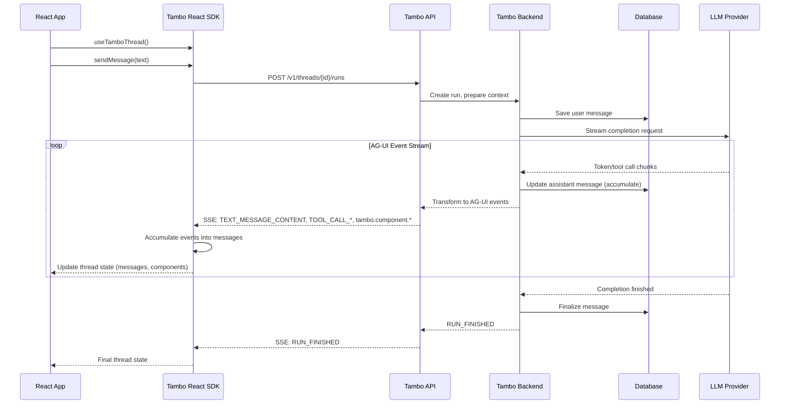
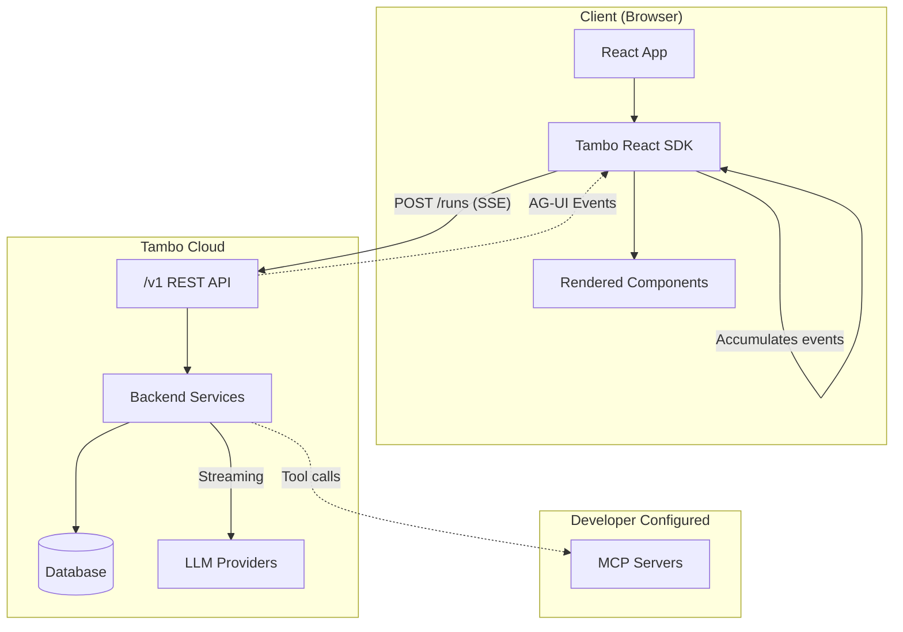

# Tambo API v1 Proposal

## Executive Summary

### Motivation

As we prepare for the Tambo 1.0 release, the current API has accumulated inconsistencies, redundant fields, and ad-hoc patterns that make it difficult to maintain and document. This proposal defines a clean v1 API that consolidates these patterns, aligns with industry standards, and provides a solid foundation for future development.

### Overview

This proposal defines the Tambo API v1, a streaming-first API that uses AG-UI events as the wire protocol. The design aligns with industry standards (OpenAI, Anthropic, MCP) while extending them to support Tambo's unique capability: returning streamable UI components with props and state.

### Key Design Decisions

1. **Streaming-only**: No synchronous endpoints - all responses stream via Server-Sent Events (SSE)
2. **AG-UI Protocol**: Uses the AG-UI event system for all streaming communication
3. **Industry-aligned Types**: Messages, Content, and Tools follow OpenAI/Anthropic conventions
4. **First-class Components**: Components appear as content blocks (like tool calls) and stream via dedicated `tambo.component.*` events
5. **Multi-component Support**: A single response can return multiple components
6. **Server & Client Tools**: Server-side tools (MCP, pre-registered) execute inline; client-side tools (per-request) pause the stream
7. **Bidirectional State**: Clients can push state updates to components via dedicated endpoint (when not streaming)
8. **Ephemeral Runs**: Runs exist only for the duration of a request; connection drops cancel the run

---

## Architecture Overview





**Data Flow:**

1. **Client → API**: SDK sends `CreateRun` request with message, available components, and tools
2. **API → Backend**: Backend prepares context (thread history, MCP resources) and calls LLM
3. **LLM → Backend**: LLM streams tokens and tool calls back to backend
4. **Backend → API**: Backend transforms LLM output into AG-UI events
5. **API → SDK**: SSE stream delivers events (`TEXT_MESSAGE_*`, `TOOL_CALL_*`, `tambo.component.*`)
6. **SDK accumulation**: SDK accumulates events into complete message structures
7. **SDK → App**: React hooks expose accumulated state (messages, components, loading status)

---

## Part 1: Core Type Definitions

**Timestamp Conventions:**

- **Stored objects** (Message, Thread): Use ISO 8601 strings for `createdAt` (e.g., `"2024-01-01T12:00:00Z"`)
- **Streaming events**: Use numeric Unix milliseconds for `timestamp` (e.g., `1704067200000`) per AG-UI convention

### 1.1 Roles

**References:**

- [OpenAI Chat Completions - role](https://platform.openai.com/docs/api-reference/chat/create#chat-create-messages) - defines `system`, `user`, `assistant`, `tool`
- [Anthropic Messages - role](https://docs.anthropic.com/en/api/messages) - uses only `user`, `assistant` (system is separate param)
- [MCP Sampling - Role](https://modelcontextprotocol.io/specification/2025-11-25/server/sampling#role) - defines `user`, `assistant`

```typescript
/**
 * Message roles following Anthropic/MCP conventions.
 *
 * We use three roles. Tool calls and results are represented as content blocks
 * (tool_use, tool_result) rather than a separate "tool" role, following Anthropic's
 * pattern. System messages use the "system" role for simplicity (vs Anthropic's
 * separate system parameter).
 */
type MessageRole = "user" | "assistant" | "system";
```

### 1.2 Content Types

**References:**

- [OpenAI Content Parts](https://platform.openai.com/docs/api-reference/chat/create#chat-create-messages-content) - `text`, `image_url`, `input_audio`, `file`
- [Anthropic Content Blocks](https://docs.anthropic.com/en/api/messages#body-messages-content) - `text`, `image`, `tool_use`, `tool_result`
- [MCP Content Types](https://modelcontextprotocol.io/specification/2025-11-25/server/sampling#content-types) - `text`, `image`, `audio`, `resource`

Content follows a discriminated union pattern with a `type` field. This aligns with both OpenAI and Anthropic.

**Design Note: Unified Resource Type**

We use a single `resource` type for all binary/multimodal content (images, audio, files, documents) rather than separate types. This:

- Simplifies the type system - one content type handles all media
- Uses MIME types (`mimeType` field) for format discrimination
- Aligns with MCP's resource model
- Includes optional fields like `detail` for vision processing when needed

```typescript
/**
 * Content block discriminator values.
 *
 * Sources:
 * - text: Standard text content (all APIs)
 * - resource: Unified binary/multimodal content (MCP-inspired)
 * - tool_use: Tool call from assistant (Anthropic pattern)
 * - tool_result: Tool result from user (Anthropic pattern)
 * - component: UI component (Tambo extension)
 */
type ContentType =
  | "text"
  | "resource" // Unified binary/multimodal content
  | "tool_use" // Tool call (assistant only)
  | "tool_result" // Tool result (user only)
  | "component"; // UI component (assistant only, Tambo extension)

/**
 * Base content block interface
 */
interface BaseContent {
  type: ContentType;
}

/**
 * Text content - the most common type
 * @see https://platform.openai.com/docs/api-reference/chat/create - "text" type
 * @see https://docs.anthropic.com/en/api/messages - TextBlock
 * @see https://modelcontextprotocol.io/specification/2025-11-25/server/sampling - TextContent
 */
interface TextContent extends BaseContent {
  type: "text";
  text: string;
}

/**
 * Resource content - unified type for all binary/multimodal content
 * @see https://modelcontextprotocol.io/specification/2025-11-25/server/resources - Resource
 * @see https://modelcontextprotocol.io/specification/2025-11-25/server/sampling - EmbeddedResource
 *
 * Handles images, audio, files, and any other binary content through a single
 * interface. Use mimeType to indicate the content type (image/png, audio/wav,
 * application/pdf, etc.). Supports URI references, inline base64, or text content.
 */
interface ResourceContent extends BaseContent {
  type: "resource";
  resource: {
    // Identification
    uri?: string; // Resource identifier (file://, https://, data:, etc.)
    name?: string; // Programmatic name
    title?: string; // Display name

    // Content - at least one should be present
    mimeType?: string; // Content type (image/png, audio/wav, application/pdf, etc.)
    text?: string; // Inline text content
    blob?: string; // Base64-encoded binary data

    // Optional metadata
    description?: string;
    filename?: string; // Original filename for downloads/display
    detail?: "auto" | "low" | "high"; // Vision processing level (for images)
    annotations?: {
      audience?: MessageRole[]; // MCP annotation: intended audience
      priority?: number; // MCP annotation: 0-1, higher = more important
    };
  };
}

/**
 * Tool use content - represents a tool call from the assistant
 * @see https://docs.anthropic.com/en/api/messages - ToolUseBlock
 *
 * Appears in assistant messages when the model wants to call a tool.
 */
interface ToolUseContent extends BaseContent {
  type: "tool_use";
  id: string; // Unique identifier for this tool call
  name: string; // Tool name
  input: Record<string, unknown>; // Tool arguments (Anthropic uses "input")
}

/**
 * Tool result content - represents the result of a tool call
 * @see https://docs.anthropic.com/en/api/messages - ToolResultBlock
 *
 * Appears in user messages following an assistant message with tool_use.
 * Note: We use camelCase `toolUseId` (Anthropic uses snake_case `tool_use_id`).
 */
interface ToolResultContent extends BaseContent {
  type: "tool_result";
  toolUseId: string; // Links to the tool_use content block's id
  content: (TextContent | ResourceContent)[]; // Result content
  isError?: boolean; // Indicates the tool call failed
}

/**
 * Component content - UI component to render (Tambo extension)
 * Only appears in assistant messages
 */
interface ComponentContent extends BaseContent {
  type: "component";
  id: string; // Unique component instance ID
  name: string; // React component name (e.g., "StockChart")
  props: Record<string, unknown>;
  state?: Record<string, unknown>;
}

/**
 * Union type for all content blocks
 */
type Content =
  | TextContent
  | ResourceContent
  | ToolUseContent
  | ToolResultContent
  | ComponentContent;

/**
 * Input content - subset allowed in request messages
 */
type InputContent = TextContent | ResourceContent | ToolResultContent;

/**
 * Output content - subset that appears in response messages
 */
type OutputContent =
  | TextContent
  | ResourceContent
  | ToolUseContent
  | ComponentContent;
```

### 1.3 Messages

**References:**

- [OpenAI Messages](https://platform.openai.com/docs/api-reference/chat/create#chat-create-messages) - array with role, content, tool_calls
- [Anthropic Messages](https://docs.anthropic.com/en/api/messages#body-messages) - array with role, content blocks
- [MCP SamplingMessage](https://modelcontextprotocol.io/specification/2025-11-25/server/sampling#samplingmessage) - role + content
- [AG-UI Messages](https://docs.ag-ui.com/concepts/messages) - id, role, content

```typescript
/**
 * Message in a conversation thread
 *
 * Uses the Anthropic pattern for tool calls:
 * - Tool calls are `tool_use` content blocks in assistant messages
 * - Tool results are `tool_result` content blocks in user messages
 *
 * Content is an array of blocks for multimodal support
 * (text, resources, tool_use, tool_result, components).
 *
 * IDs are always server-generated (format: msg_xxx). Clients cannot set message IDs.
 */
interface Message {
  id: string; // Server-generated, format: msg_xxx
  role: MessageRole;
  content: Content[];

  // Metadata
  createdAt?: string; // ISO 8601 timestamp
  metadata?: Record<string, unknown>;
}

/**
 * Input message for requests.
 * Role is always "user" - assistant/system messages are only emitted by the server.
 */
interface InputMessage {
  role: "user";
  content: InputContent[];
  metadata?: Record<string, unknown>;
}
```

### 1.4 Tools

**References:**

- [OpenAI Function Calling](https://platform.openai.com/docs/guides/function-calling) - `{type:"function", function:{name, description, parameters}}`
- [Anthropic Tool Use](https://docs.anthropic.com/en/docs/build-with-claude/tool-use) - `{name, description, input_schema}`
- [MCP Tools](https://modelcontextprotocol.io/specification/2025-11-25/server/tools) - `{name, description, inputSchema}`

```typescript
/**
 * Tool definition
 * @see https://docs.anthropic.com/en/docs/build-with-claude/tool-use#defining-tools - Anthropic's tool schema
 * @see https://modelcontextprotocol.io/specification/2025-11-25/server/tools#tool-definition - MCP's Tool type
 *
 * We use "inputSchema" (MCP/Anthropic naming) rather than "parameters" (OpenAI naming).
 *
 * Note on server vs client execution:
 * - Tools submitted via API requests are always client-side (executed by the frontend)
 * - Server-side tools (MCP tools) are pre-registered at the project level
 * - The server determines execution location by tool origin, not a field
 */
interface Tool {
  name: string; // Unique identifier (a-z, A-Z, 0-9, _, -)
  description: string; // What the tool does
  inputSchema: object; // JSON Schema object (see json-schema.org)
  outputSchema?: object; // Optional JSON Schema for structured output
  strict?: boolean; // Enable strict schema validation (OpenAI)
}

/**
 * Tool choice - how the model should use tools
 * @see https://platform.openai.com/docs/api-reference/chat/create#chat-create-tool_choice - OpenAI tool_choice
 * @see https://docs.anthropic.com/en/docs/build-with-claude/tool-use#controlling-claudes-output - Anthropic tool_choice
 * @see https://modelcontextprotocol.io/specification/2025-11-25/server/sampling#toolchoice - MCP ToolChoice
 *
 * All three APIs support similar patterns. We use OpenAI's string values
 * ("auto", "required", "none") plus named tool forcing.
 */
type ToolChoice =
  | "auto" // Model decides (default)
  | "required" // Must use at least one tool (OpenAI: "required", Anthropic: "any")
  | "none" // Cannot use tools
  | { name: string }; // Must use specific tool (all APIs support this)
```

### 1.5 Components (Tambo Extension)

```typescript
/**
 * Available component definition - describes a UI component the model can render
 */
interface AvailableComponent {
  name: string; // Component name (e.g., "StockChart")
  description: string; // What this component displays
  propsSchema: object; // JSON Schema object (see json-schema.org)
  stateSchema?: object; // Optional JSON Schema for state
}
```

### 1.6 Run Status

```typescript
/**
 * Streaming status of the current run.
 *
 * This is a simple lifecycle aligned with AG-UI's run model:
 * - idle: No active SSE stream
 * - waiting: RUN_STARTED emitted, waiting for first content (TTFB phase)
 * - streaming: Actively receiving content
 *
 * Edge cases like cancellation, errors, and pending tool calls are tracked
 * via separate fields on Thread, not as status values.
 */
type RunStatus = "idle" | "waiting" | "streaming";

/**
 * Error information from the last run
 */
interface RunError {
  code?: string;
  message: string;
}
```

### 1.7 Threads

```typescript
/**
 * Thread represents a conversation.
 *
 * Thread state is divided into three concerns:
 * 1. Current run lifecycle (runStatus) - is a run active right now?
 * 2. Last run outcome (lastRunCancelled, lastRunError) - how did it end?
 * 3. Next run requirements (pendingToolCallIds) - what must the next run provide?
 */
interface Thread {
  id: string;
  projectId: string;
  contextKey?: string; // User/session identifier

  // 1. Current run lifecycle
  // Only relevant while a run is active (runStatus !== "idle")
  runStatus: RunStatus;
  currentRunId?: string; // ID of active run (when not idle)
  statusMessage?: string; // Human-readable detail (e.g., "Fetching weather data...")

  // 2. Last run outcome (cleared when next run starts)
  lastRunCancelled?: boolean;
  lastRunError?: RunError;

  // 3. Next run requirements
  // If pendingToolCallIds is non-empty, the next run's message MUST contain
  // a tool_result for at least one of these IDs (with previousRunId set).
  // Sending a regular user message while tool calls are pending is an error.
  pendingToolCallIds?: string[];
  lastCompletedRunId?: string; // Required as previousRunId when continuing

  metadata?: Record<string, unknown>;
  createdAt: string;
  updatedAt: string;
}
```

---

## Part 2: AG-UI Events (Wire Protocol)

All streaming responses use the [AG-UI Protocol](https://docs.ag-ui.com), an open standard for
agent-user interaction. We use the `@ag-ui/core` SDK for event types.

**AG-UI SDK Documentation:**

- [SDK Overview](https://docs.ag-ui.com/sdk/js/core/overview) - Installation and usage
- [Core Types](https://docs.ag-ui.com/sdk/js/core/types) - All type definitions
- [Events Concepts](https://docs.ag-ui.com/concepts/events) - Event type documentation
- [State Management](https://docs.ag-ui.com/concepts/state) - STATE_SNAPSHOT and STATE_DELTA patterns

### 2.1 How We Use AG-UI Events

AG-UI provides standard events for text streaming, tool calls, and state management. For example:

```typescript
// Text streaming uses three events
{ type: "TEXT_MESSAGE_START", messageId: "msg_001", role: "assistant" }
{ type: "TEXT_MESSAGE_CONTENT", messageId: "msg_001", delta: "Hello " }
{ type: "TEXT_MESSAGE_CONTENT", messageId: "msg_001", delta: "world!" }
{ type: "TEXT_MESSAGE_END", messageId: "msg_001" }

// Tool calls stream arguments incrementally
{ type: "TOOL_CALL_START", toolCallId: "tc_001", toolName: "get_weather" }
{ type: "TOOL_CALL_ARGS", toolCallId: "tc_001", delta: "{\"city\":" }
{ type: "TOOL_CALL_ARGS", toolCallId: "tc_001", delta: "\"Paris\"}" }
{ type: "TOOL_CALL_END", toolCallId: "tc_001" }
// Server-side tool results
{ type: "TOOL_CALL_RESULT", toolCallId: "tc_001", result: "72°F and sunny" }

// Run lifecycle
{ type: "RUN_STARTED", threadId: "thr_xxx", runId: "run_xxx" }
{ type: "RUN_FINISHED", threadId: "thr_xxx", runId: "run_xxx" }
{ type: "RUN_ERROR", message: "Something went wrong", code: "INTERNAL_ERROR" }
```

**Event-to-Content Mapping:** These streaming events accumulate into content blocks in the current
message. `TOOL_CALL_START` creates a `tool_use` content block, `TOOL_CALL_ARGS` appends to its
`input`, and `TOOL_CALL_RESULT` creates a corresponding `tool_result` block.

**Wire format note:** `TOOL_CALL_ARGS.delta` is a string chunk on the wire (e.g., `"{\"city\":"`).
The SDK concatenates these chunks and parses the final JSON string into the `ToolUseContent.input`
field, which is typed as `Record<string, unknown>`.

### 2.2 Tambo CUSTOM Events

AG-UI provides a `CUSTOM` event type for application-specific extensions. We use this with a
`tambo.*` namespace for Tambo-specific functionality that AG-UI doesn't cover natively:

1. **Pausing for client-side tool results** - AG-UI doesn't have a "waiting for input" state
2. **Streaming UI component props/state** - Components are a Tambo-specific concept
3. **Rich run completion data** - We include full message objects on completion

```typescript
/**
 * Base interface for Tambo CUSTOM events
 */
interface TamboCustomEvent {
  type: "CUSTOM";
  name: string; // Namespaced: "tambo.*"
  value: unknown;
  timestamp?: number;
}

// ============================================================================
// TAMBO CUSTOM EVENTS
// ============================================================================

/**
 * Emitted when the run is paused waiting for client-side tool results.
 * Client should execute the pending tool calls and POST results to continue.
 *
 * Only includes tool call IDs - the tool name and input were already
 * streamed via TOOL_CALL_START/TOOL_CALL_ARGS/TOOL_CALL_END events.
 */
interface TamboAwaitingInputEvent extends TamboCustomEvent {
  name: "tambo.run.awaiting_input";
  value: {
    threadId: string;
    runId: string;
    pendingToolCallIds: string[];
  };
}

/**
 * Emitted when component streaming begins.
 *
 * The component is added to the current assistant message's content array
 * (identified by messageId). Components accumulate alongside text and tool
 * calls in the order they're streamed, allowing mixed content rendering.
 */
interface TamboComponentStartEvent extends TamboCustomEvent {
  name: "tambo.component.start";
  value: {
    componentId: string;
    componentName: string;
    messageId: string; // The message this component belongs to
  };
}

/**
 * Streaming status for a prop path.
 */
type PropStreamingStatus = "started" | "streaming" | "done";

/**
 * Emitted during component prop streaming (JSON Patch).
 *
 * Props are streamed as JSON Patch operations. The server buffers partial JSON
 * from the LLM and emits patch operations when complete values are recognized.
 *
 * The `streaming` map tracks the status of each top-level prop:
 * - "started": Prop streaming has begun but no complete value yet
 * - "streaming": Prop is actively receiving data (partial value may exist)
 * - "done": Prop value is complete
 *
 * Uses `delta` field name for alignment with AG-UI STATE_DELTA event format.
 */
interface TamboComponentPropsDeltaEvent extends TamboCustomEvent {
  name: "tambo.component.props_delta";
  value: {
    componentId: string;
    delta: JsonPatchOperation[];
    streaming?: Record<string, PropStreamingStatus>;
  };
}

/**
 * Emitted for component state updates (JSON Patch).
 * Uses `delta` field name for alignment with AG-UI STATE_DELTA event format.
 */
interface TamboComponentStateDeltaEvent extends TamboCustomEvent {
  name: "tambo.component.state_delta";
  value: {
    componentId: string;
    delta: JsonPatchOperation[];
  };
}

/**
 * Emitted when component streaming ends with final data.
 */
interface TamboComponentEndEvent extends TamboCustomEvent {
  name: "tambo.component.end";
  value: {
    componentId: string;
    props: Record<string, unknown>;
    state?: Record<string, unknown>;
  };
}

/**
 * JSON Patch operation (RFC 6902)
 * @see https://datatracker.ietf.org/doc/html/rfc6902
 */
interface JsonPatchOperation {
  op: "add" | "remove" | "replace" | "move" | "copy" | "test";
  path: string;
  value?: unknown; // Required for add, replace, test
  from?: string; // Required for move, copy
}

/**
 * Union of all Tambo CUSTOM events
 */
type TamboExtensionEvent =
  | TamboAwaitingInputEvent
  | TamboComponentStartEvent
  | TamboComponentPropsDeltaEvent
  | TamboComponentStateDeltaEvent
  | TamboComponentEndEvent;
```

---

## Part 3: API Endpoints

### 3.1 Run Endpoints

#### Create Thread with Run

**Endpoint:** `POST /v1/threads/runs`

Creates a new thread and immediately starts a run. Use this when starting a new conversation.

```typescript
interface CreateThreadWithRunRequest {
  // Required
  message: InputMessage; // The user's message

  // Optional - Thread configuration
  contextKey?: string; // User/session identifier for the new thread

  // Optional - Run context
  availableComponents?: AvailableComponent[];
  tools?: Tool[]; // Client-side tools (executed by frontend)
  toolChoice?: ToolChoice;

  // Optional - Model configuration
  model?: string; // Override default model
  maxTokens?: number;
  temperature?: number;

  // Optional - Metadata
  threadMetadata?: Record<string, unknown>; // Metadata for the thread
  runMetadata?: Record<string, unknown>; // Metadata for the run
}
```

Response is an SSE stream (same format as Create Run below).

#### Create Run

**Endpoint:** `POST /v1/threads/{threadId}/runs`

Starts a new run on an existing thread. Use this for continuing conversations.

```typescript
interface CreateRunRequest {
  // Required
  message: InputMessage; // The user's message

  // Optional - Context
  availableComponents?: AvailableComponent[];
  tools?: Tool[]; // Client-side tools (executed by frontend)
  toolChoice?: ToolChoice;

  // Optional - Continuation (for tool result submissions)
  // Required when message contains tool_result content.
  // Prevents duplicate continuations from the same run.
  previousRunId?: string;

  // Optional - Model configuration
  model?: string; // Override default model
  maxTokens?: number;
  temperature?: number;

  // Optional - Metadata (consistent with CreateThreadWithRunRequest)
  runMetadata?: Record<string, unknown>;
}
```

**Note on Tools:**

- Tools submitted in the `tools` array are client-side tools, executed by the frontend
- When a client-side tool is called:
  1. `tambo.run.awaiting_input` is emitted with the pending tool call IDs
  2. `RUN_FINISHED` is emitted (run ends cleanly)
  3. Client executes the tool and POSTs results with `previousRunId` to start a new run
- Server-side tools (MCP tools) are pre-registered at the project level, not per-request
- When a server-side tool is called, it executes inline and `TOOL_CALL_RESULT` is emitted

#### Response Headers

```
Content-Type: text/event-stream
Cache-Control: no-cache
Connection: keep-alive
X-Thread-Id: thr_xxxxx
X-Run-Id: run_xxxxx
```

#### Response Body

Server-Sent Events stream. Each line:

```
data: {"type":"RUN_STARTED","threadId":"thr_xxx","runId":"run_xxx","timestamp":1234567890}

data: {"type":"TEXT_MESSAGE_START","messageId":"msg_xxx","role":"assistant"}

data: {"type":"TEXT_MESSAGE_CONTENT","messageId":"msg_xxx","delta":"Hello"}

...

data: {"type":"RUN_FINISHED","threadId":"thr_xxx","runId":"run_xxx","message":{...}}
```

### 3.2 Threads Endpoint

**List Threads:** `GET /v1/threads`

```typescript
interface ListThreadsRequest {
  contextKey?: string;
  limit?: number;
  cursor?: string;
}

interface ListThreadsResponse {
  threads: Thread[];
  nextCursor?: string;
}
```

**Get Thread:** `GET /v1/threads/{threadId}`

```typescript
interface GetThreadResponse {
  thread: Thread;
  messages: Message[];
}
```

**Create Thread:** `POST /v1/threads`

```typescript
interface CreateThreadRequest {
  contextKey?: string;
  metadata?: Record<string, unknown>;
  initialMessages?: InputMessage[];
}

interface CreateThreadResponse {
  thread: Thread;
}
```

**Delete Thread:** `DELETE /v1/threads/{threadId}`

### 3.3 Run Lifecycle

**Runs are ephemeral.** A run exists only for the duration of a single HTTP request:

- Run starts when client POSTs to `/runs` endpoint
- Run ends when the SSE stream closes (success, error, or cancellation)
- There is no reconnection - if the connection drops, the run is cancelled
- The thread is left in the state reflected by its fields (`pendingToolCallIds`, `lastRunError`, etc.)

**Cancel Run:** `DELETE /v1/threads/{threadId}/runs/{runId}`

Explicitly cancel a running run. Note: closing the SSE connection also cancels the run.

```typescript
interface CancelRunResponse {
  runId: string;
  status: "cancelled";
}
```

### 3.4 Component State

**Update Component State:** `POST /v1/threads/{threadId}/components/{componentId}/state`

Push state updates from client to a component. Supports both full replacement and JSON Patch.

**Constraint:** This endpoint returns an error if the thread has an active run (`runStatus !== "idle"`).
Client-side state updates are only allowed between runs to avoid conflicts with server-side streaming.

```typescript
interface UpdateComponentStateRequest {
  // Option 1: Full replacement
  state?: Record<string, unknown>;

  // Option 2: JSON Patch operations
  patch?: JsonPatchOperation[];
}

interface UpdateComponentStateResponse {
  componentId: string;
  state: Record<string, unknown>; // New complete state
}
```

### 3.5 Messages Endpoint

**List Messages:** `GET /v1/threads/{threadId}/messages`

```typescript
interface ListMessagesRequest {
  limit?: number;
  cursor?: string;
  order?: "asc" | "desc";
}

interface ListMessagesResponse {
  messages: Message[];
  nextCursor?: string;
}
```

**Get Message:** `GET /v1/threads/{threadId}/messages/{messageId}`

```typescript
interface GetMessageResponse {
  message: Message;
}
```

---

## Part 4: Streaming Behavior Examples

### 4.1 Pure Text Interaction (No Components)

**Request:** `POST /v1/threads/{threadId}/runs`

```json
{ "message": { "role": "user", "content": "What is the capital of France?" } }
```

**Event Stream:** _(timestamps omitted for brevity)_

```
data: {"type":"RUN_STARTED","threadId":"thr_abc123","runId":"run_xyz789"}
data: {"type":"TEXT_MESSAGE_START","messageId":"msg_001","role":"assistant"}
data: {"type":"TEXT_MESSAGE_CONTENT","messageId":"msg_001","delta":"The capital of France is "}
data: {"type":"TEXT_MESSAGE_CONTENT","messageId":"msg_001","delta":"Paris."}
data: {"type":"TEXT_MESSAGE_END","messageId":"msg_001"}
data: {"type":"RUN_FINISHED","threadId":"thr_abc123","runId":"run_xyz789"}
```

_Note: Clients accumulate deltas to build final message state._

### 4.2 Text Interaction with Single Component

**Request:**

```json
{
  "message": { "role": "user", "content": "Show me the stock price of AAPL" },
  "availableComponents": [
    {
      "name": "StockChart",
      "description": "Displays a stock price chart",
      "propsSchema": {
        "type": "object",
        "properties": {
          "ticker": { "type": "string", "description": "Stock ticker symbol" },
          "timeRange": { "type": "string", "enum": ["1D", "1W", "1M", "1Y"] }
        },
        "required": ["ticker"]
      }
    }
  ]
}
```

**Event Stream:** _(timestamps omitted)_

```
data: {"type":"RUN_STARTED","threadId":"thr_abc123","runId":"run_xyz789"}
data: {"type":"TEXT_MESSAGE_START","messageId":"msg_001","role":"assistant"}
data: {"type":"TEXT_MESSAGE_CONTENT","messageId":"msg_001","delta":"Here's the stock chart for Apple (AAPL):"}
data: {"type":"TEXT_MESSAGE_END","messageId":"msg_001"}
data: {"type":"CUSTOM","name":"tambo.component.start","value":{"componentId":"comp_001","componentName":"StockChart","messageId":"msg_001"}}
data: {"type":"CUSTOM","name":"tambo.component.props_delta","value":{"componentId":"comp_001","delta":[],"streaming":{"ticker":"started","timeRange":"started"}}}
data: {"type":"CUSTOM","name":"tambo.component.props_delta","value":{"componentId":"comp_001","delta":[{"op":"add","path":"/ticker","value":"AAPL"}],"streaming":{"ticker":"done","timeRange":"streaming"}}}
data: {"type":"CUSTOM","name":"tambo.component.props_delta","value":{"componentId":"comp_001","delta":[{"op":"add","path":"/timeRange","value":"1M"}],"streaming":{"ticker":"done","timeRange":"done"}}}
data: {"type":"CUSTOM","name":"tambo.component.end","value":{"componentId":"comp_001","props":{"ticker":"AAPL","timeRange":"1M"}}}
data: {"type":"RUN_FINISHED","threadId":"thr_abc123","runId":"run_xyz789"}
```

_Component events show progressive streaming: `streaming` field indicates which props are still being populated._

### 4.3 Multiple Components in One Response

Same request format as 4.2, but the LLM renders multiple component instances:

**Request:** `"Compare AAPL and MSFT side by side"` with same `availableComponents` as 4.2.

**Event Stream:** _(showing only component events after text message)_

```
data: {"type":"RUN_STARTED",...}
data: {"type":"TEXT_MESSAGE_START",...}
data: {"type":"TEXT_MESSAGE_CONTENT","messageId":"msg_001","delta":"Here's a side-by-side comparison:"}
data: {"type":"TEXT_MESSAGE_END",...}
data: {"type":"CUSTOM","name":"tambo.component.start","value":{"componentId":"comp_001","componentName":"StockChart","messageId":"msg_001"}}
data: {"type":"CUSTOM","name":"tambo.component.props_delta","value":{"componentId":"comp_001","delta":[{"op":"add","path":"/ticker","value":"AAPL"}],...}}
data: {"type":"CUSTOM","name":"tambo.component.end","value":{"componentId":"comp_001","props":{"ticker":"AAPL","timeRange":"1M"}}}
data: {"type":"CUSTOM","name":"tambo.component.start","value":{"componentId":"comp_002","componentName":"StockChart","messageId":"msg_001"}}
data: {"type":"CUSTOM","name":"tambo.component.props_delta","value":{"componentId":"comp_002","delta":[{"op":"add","path":"/ticker","value":"MSFT"}],...}}
data: {"type":"CUSTOM","name":"tambo.component.end","value":{"componentId":"comp_002","props":{"ticker":"MSFT","timeRange":"1M"}}}
data: {"type":"RUN_FINISHED",...}
```

_Multiple components share the same `messageId` and stream sequentially._

### 4.4 Server-Side Tool Calls (MCP Tools)

Server-side tools execute within the stream and produce results inline.

**Request:**

```json
{
  "message": {
    "role": "user",
    "content": "What's the weather in New York and San Francisco?"
  }
}
```

_Note: Server-side tools (like MCP weather tools) are configured at project level, not per-request._

**Event Stream:**

```
data: {"type":"RUN_STARTED","threadId":"thr_abc123","runId":"run_xyz789","timestamp":1704067200000}

data: {"type":"TOOL_CALL_START","toolCallId":"tc_001","toolName":"mcp_weather/get_weather","parentMessageId":"msg_001","timestamp":1704067200050}

data: {"type":"TOOL_CALL_ARGS","toolCallId":"tc_001","delta":"{\"city\":\"New York\"}","timestamp":1704067200100}

data: {"type":"TOOL_CALL_END","toolCallId":"tc_001","timestamp":1704067200150}

data: {"type":"TOOL_CALL_START","toolCallId":"tc_002","toolName":"mcp_weather/get_weather","parentMessageId":"msg_001","timestamp":1704067200200}

data: {"type":"TOOL_CALL_ARGS","toolCallId":"tc_002","delta":"{\"city\":\"San Francisco\"}","timestamp":1704067200250}

data: {"type":"TOOL_CALL_END","toolCallId":"tc_002","timestamp":1704067200300}

data: {"type":"TOOL_CALL_RESULT","toolCallId":"tc_001","result":"72°F, Sunny","timestamp":1704067200350}

data: {"type":"TOOL_CALL_RESULT","toolCallId":"tc_002","result":"65°F, Foggy","timestamp":1704067200400}

data: {"type":"TEXT_MESSAGE_START","messageId":"msg_002","role":"assistant","timestamp":1704067200450}

data: {"type":"TEXT_MESSAGE_CONTENT","messageId":"msg_002","delta":"The weather in New York is 72°F and sunny. In San Francisco, it's 65°F and foggy.","timestamp":1704067200500}

data: {"type":"TEXT_MESSAGE_END","messageId":"msg_002","timestamp":1704067200550}

data: {"type":"RUN_FINISHED","threadId":"thr_abc123","runId":"run_xyz789","timestamp":1704067200600}
```

### 4.5 Client-Side Tool Calls (Browser Tools)

Client-side tools pause the stream with `tambo.run.awaiting_input`. The client executes the tools and continues with a new request.

**Initial Request:**

```json
{
  "message": {
    "role": "user",
    "content": "Add this item to my cart"
  },
  "tools": [
    {
      "name": "add_to_cart",
      "description": "Add an item to the shopping cart",
      "inputSchema": {
        "type": "object",
        "properties": {
          "productId": { "type": "string" },
          "quantity": { "type": "integer" }
        },
        "required": ["productId", "quantity"]
      }
    }
  ]
}
```

**Event Stream (pauses for client):**

```
data: {"type":"RUN_STARTED","threadId":"thr_abc123","runId":"run_xyz789","timestamp":1704067200000}

data: {"type":"TOOL_CALL_START","toolCallId":"tc_001","toolName":"add_to_cart","parentMessageId":"msg_001","timestamp":1704067200050}

data: {"type":"TOOL_CALL_ARGS","toolCallId":"tc_001","delta":"{\"productId\":\"SKU-123\",\"quantity\":2}","timestamp":1704067200100}

data: {"type":"TOOL_CALL_END","toolCallId":"tc_001","timestamp":1704067200150}

data: {"type":"CUSTOM","name":"tambo.run.awaiting_input","value":{"threadId":"thr_abc123","runId":"run_xyz789","pendingToolCallIds":["tc_001"]},"timestamp":1704067200200}

data: {"type":"RUN_FINISHED","threadId":"thr_abc123","runId":"run_xyz789","timestamp":1704067200250}
```

_Run ends here. Stream closes. Client executes `add_to_cart` in the browser._

**Continuation Request (with tool results):**

```json
{
  "previousRunId": "run_xyz789",
  "message": {
    "role": "user",
    "content": [
      {
        "type": "tool_result",
        "toolUseId": "tc_001",
        "content": [
          {
            "type": "text",
            "text": "Added 2x SKU-123 to cart. Cart total: $49.98"
          }
        ]
      }
    ]
  }
}
```

_Note: `previousRunId` is required when submitting tool results. The server rejects
duplicate continuations from the same run (idempotency check)._

**Multi-tool result example:** When the LLM requests multiple tools, return all results in one message:

```json
{
  "previousRunId": "run_xyz789",
  "message": {
    "role": "user",
    "content": [
      {
        "type": "tool_result",
        "toolUseId": "tc_001",
        "content": [{ "type": "text", "text": "Result 1" }]
      },
      {
        "type": "tool_result",
        "toolUseId": "tc_002",
        "content": [{ "type": "text", "text": "Result 2" }]
      }
    ]
  }
}
```

**Continuation Event Stream:**

```
data: {"type":"RUN_STARTED","threadId":"thr_abc123","runId":"run_abc456","timestamp":1704067201000}

data: {"type":"TEXT_MESSAGE_START","messageId":"msg_002","role":"assistant","timestamp":1704067201050}

data: {"type":"TEXT_MESSAGE_CONTENT","messageId":"msg_002","delta":"Done! I've added 2 of that item to your cart. Your cart total is now $49.98.","timestamp":1704067201100}

data: {"type":"TEXT_MESSAGE_END","messageId":"msg_002","timestamp":1704067201150}

data: {"type":"RUN_FINISHED","threadId":"thr_abc123","runId":"run_abc456","timestamp":1704067201200}
```

### 4.6 Component with Streaming State Updates

This example shows a component that receives state updates as data becomes available (e.g., rows loading from a database).

**Event Stream:** _(timestamps omitted)_

```
data: {"type":"RUN_STARTED","threadId":"thr_abc123","runId":"run_xyz789"}
data: {"type":"CUSTOM","name":"tambo.component.start","value":{"componentId":"comp_001","componentName":"DataTable","messageId":"msg_001"}}
data: {"type":"CUSTOM","name":"tambo.component.props_delta","value":{"componentId":"comp_001","delta":[{"op":"add","path":"/title","value":"User Analytics"}]}}
data: {"type":"CUSTOM","name":"tambo.component.state_delta","value":{"componentId":"comp_001","delta":[{"op":"add","path":"/loading","value":true},{"op":"add","path":"/rows","value":[]},{"op":"add","path":"/totalCount","value":0}]}}
data: {"type":"CUSTOM","name":"tambo.component.state_delta","value":{"componentId":"comp_001","delta":[{"op":"replace","path":"/totalCount","value":150}]}}
data: {"type":"CUSTOM","name":"tambo.component.state_delta","value":{"componentId":"comp_001","delta":[{"op":"add","path":"/rows/-","value":{"id":1,"name":"Alice","visits":42}}]}}
data: {"type":"CUSTOM","name":"tambo.component.state_delta","value":{"componentId":"comp_001","delta":[{"op":"add","path":"/rows/-","value":{"id":2,"name":"Bob","visits":38}}]}}
data: {"type":"CUSTOM","name":"tambo.component.state_delta","value":{"componentId":"comp_001","delta":[{"op":"replace","path":"/loading","value":false}]}}
data: {"type":"CUSTOM","name":"tambo.component.end","value":{"componentId":"comp_001","props":{"title":"User Analytics"},"state":{"loading":false,"rows":[...],"totalCount":150}}}
data: {"type":"RUN_FINISHED","threadId":"thr_abc123","runId":"run_xyz789"}
```

_We use `tambo.component.state_delta` CUSTOM events for component state (not AG-UI's generic STATE_SNAPSHOT/STATE_DELTA),
keeping component state scoped to the component rather than a global state tree._

### 4.7 Error Handling

**Event Stream (Error during tool execution):**

```
data: {"type":"RUN_STARTED","threadId":"thr_abc123","runId":"run_xyz789","timestamp":1704067200000}

data: {"type":"TOOL_CALL_START","toolCallId":"tc_001","toolName":"get_weather","parentMessageId":"msg_001","timestamp":1704067200050}

data: {"type":"TOOL_CALL_ARGS","toolCallId":"tc_001","delta":"{\"city\":\"InvalidCity\"}","timestamp":1704067200100}

data: {"type":"TOOL_CALL_END","toolCallId":"tc_001","timestamp":1704067200150}

data: {"type":"TOOL_CALL_RESULT","toolCallId":"tc_001","result":"City not found","isError":true,"timestamp":1704067200200}

data: {"type":"TEXT_MESSAGE_START","messageId":"msg_002","role":"assistant","timestamp":1704067200250}

data: {"type":"TEXT_MESSAGE_CONTENT","messageId":"msg_002","delta":"I couldn't find weather data for that location. Could you please provide a valid city name?","timestamp":1704067200300}

data: {"type":"TEXT_MESSAGE_END","messageId":"msg_002","timestamp":1704067200350}

data: {"type":"RUN_FINISHED","threadId":"thr_abc123","runId":"run_xyz789","timestamp":1704067200400}
```

**Event Stream (Fatal error):**

```
data: {"type":"RUN_STARTED","threadId":"thr_abc123","runId":"run_xyz789","timestamp":1704067200000}

data: {"type":"RUN_ERROR","message":"Too many requests. Please try again later.","code":"RATE_LIMIT_EXCEEDED","timestamp":1704067200050}
```

_Note: `RUN_ERROR` is a standard AG-UI event. The `code` field is optional in AG-UI but recommended for programmatic handling._

---

## Part 5: Migration Considerations

### 5.1 Breaking Changes from Current API

1. **AG-UI event format**: Uses AG-UI events instead of current chunked `AdvanceThreadResponseDto` responses.
2. **Component as content**: Components become `type: "component"` content blocks instead of a separate `component` field on messages.

### 5.2 Backwards Compatibility

The React SDK will maintain the same interface it has today (`useTamboThread`, `useTamboComponentState`, etc.) and handle the API changes internally:

- Accumulates AG-UI events into the same message structures the SDK already exposes
- Translates component content blocks back to the component interface hooks expect
- Versioned endpoints (`/v1/` prefix) allow gradual migration

---

## Part 6: Design Decisions Summary

The following design decisions were made during proposal development:

| Question                      | Decision                                                                                                                         |
| ----------------------------- | -------------------------------------------------------------------------------------------------------------------------------- |
| **Tool call representation**  | Anthropic pattern - `tool_use`/`tool_result` content blocks (not OpenAI's separate `tool_calls` array)                           |
| **Multimodal content types**  | Unified `resource` type with MIME types (not separate image/audio/file types)                                                    |
| **Component representation**  | Inline content blocks in `content[]` array (components render in reading order with text)                                        |
| **Component delta format**    | JSON Patch (RFC 6902) for both props and state; `streaming` map with tri-state (started/streaming/done)                          |
| **AG-UI extensions**          | Use `CUSTOM` events with `tambo.*` namespace for Tambo-specific functionality                                                    |
| **Component state ownership** | Bidirectional - server can push state, clients can also update via POST endpoint                                                 |
| **Client-side tool flow**     | Run ends with `awaiting_input` then `RUN_FINISHED`; client POSTs tool results with `previousRunId` to start new run              |
| **Server-side tool flow**     | Inline execution within stream, `TOOL_CALL_RESULT` emitted automatically                                                         |
| **Context tools**             | Client sends all available tools/components each request (no server tracking)                                                    |
| **State update granularity**  | Both full replacement and JSON Patch supported                                                                                   |
| **Messages per run**          | Multiple messages allowed when server-side tools loop                                                                            |
| **Disconnection handling**    | No reconnection - runs are ephemeral. Connection drop cancels run; thread state reflects outcome.                                |
| **Cancellation**              | Both connection close and explicit DELETE work                                                                                   |
| **Thread endpoints**          | Standard REST (not streaming)                                                                                                    |
| **Run/thread status**         | Simple `RunStatus` (idle/waiting/streaming); edge cases via separate fields (pendingToolCallIds, lastRunCancelled, lastRunError) |

---

## Part 7: Out of Scope

The following operational aspects are intentionally out of scope for this API proposal. They are handled by other systems or documented elsewhere.

| Aspect                      | Assumption                                                                                          |
| --------------------------- | --------------------------------------------------------------------------------------------------- |
| **Authentication/Identity** | API is fully authenticated via OAuth 2.0 with Bearer token header. Identity management is external. |
| **Rate Limiting**           | Handled at infrastructure layer (API gateway). Not specified in endpoint contracts.                 |
| **Billing/Usage Metering**  | Usage tracking and billing handled by separate metering service. Not exposed in this API.           |
| **Logging/Auditing**        | Request logging, PII handling, and audit trails managed by observability infrastructure.            |
| **CORS Policy**             | Cross-origin request handling configured at infrastructure layer, not per-endpoint.                 |
| **API Versioning Strategy** | This document defines v1. Migration strategy for future versions documented separately.             |
| **Regional Availability**   | Data residency and multi-region deployment are infrastructure concerns, not API design.             |
| **Request/Response Limits** | Max payload sizes and timeout policies configured at infrastructure layer.                          |

---

## Part 8: SDK Migration Strategy

This section outlines how the `@tambo-ai/react` SDK will be updated to support the v1 API.

### Phase 1: Preview Release

A new `<TamboV1Provider>` will be introduced in a subpackage:

```typescript
import { TamboV1Provider } from "@tambo-ai/react/v1";

// Preview usage - interface mostly identical to current TamboProvider
<TamboV1Provider apiKey={apiKey} apiBaseUrl={apiBaseUrl}>
  <App />
</TamboV1Provider>
```

**Key characteristics:**

- Exported from `@tambo-ai/react/v1` subpath (not the main export)
- Interface largely mirrors existing `<TamboProvider>` for easy migration
- Uses updated types aligned with this proposal (content blocks, RunStatus, etc.)
- Connects to `/v1/` API endpoints
- Marked as preview/experimental in documentation

This allows early adopters to test the new API while the existing provider remains stable.

### Phase 2: Stable Release (SDK 1.0)

Once the v1 API is fully implemented and validated:

- The existing `<TamboProvider>` will be updated to use the v1 API
- `@tambo-ai/react/v1` subpath will be removed entirely
- Breaking type changes will be documented in migration guide
- SDK version bumped to 1.0 to signal stable v1 API support

**Migration path for users:**

1. (Now) Use current `<TamboProvider>` with existing API
2. (Preview) Optionally test `<TamboV1Provider>` from `/v1` subpath
3. (1.0 release) Switch back to `<TamboProvider>` (now with v1 types)

---

## Appendix A: Type Alignment Summary

Quick reference for how Tambo v1 types map to common API conventions. See Part 6 for design rationale.

| Concept          | OpenAI                                           | Anthropic                                  | MCP                              | Tambo v1                                 |
| ---------------- | ------------------------------------------------ | ------------------------------------------ | -------------------------------- | ---------------------------------------- |
| Roles            | user, assistant, system, tool                    | user, assistant                            | user, assistant                  | user, assistant, system                  |
| Text content     | `{type:"text",text:"..."}`                       | `{type:"text",text:"..."}`                 | `{type:"text",text:"..."}`       | `{type:"text",text:"..."}`               |
| Resource content | `{type:"image_url",...}`                         | `{type:"image",...}`                       | `{type:"resource",...}`          | `{type:"resource",resource:{...}}`       |
| Tool definition  | `{name,description,parameters}`                  | `{name,description,input_schema}`          | `{name,description,inputSchema}` | `{name,description,inputSchema}`         |
| Tool call        | `{id,type:"function",function:{name,arguments}}` | `{type:"tool_use",id,name,input}`          | JSON-RPC `tools/call`            | `{type:"tool_use",id,name,input}`        |
| Tool result      | `{role:"tool",tool_call_id,content}`             | `{type:"tool_result",tool_use_id,content}` | JSON-RPC response                | `{type:"tool_result",toolUseId,content}` |
| Streaming        | SSE with delta                                   | SSE with delta                             | N/A (JSON-RPC)                   | AG-UI events                             |

_Key alignment: Tool calls/results are content blocks (Anthropic pattern), not separate message fields._

## Appendix B: Event Quick Reference

### Standard AG-UI Events

See the [AG-UI SDK Types](https://docs.ag-ui.com/sdk/js/core/types) for complete event definitions.
Key events we use: `RUN_STARTED`, `RUN_FINISHED`, `RUN_ERROR`, `TEXT_MESSAGE_*`, `TOOL_CALL_START`,
`TOOL_CALL_ARGS`, `TOOL_CALL_END`, `TOOL_CALL_RESULT`, `CUSTOM`.

### Tambo CUSTOM Events (type: "CUSTOM", name: "tambo.\*")

| Event Name                  | When Emitted                   | Key Value Fields                                          |
| --------------------------- | ------------------------------ | --------------------------------------------------------- |
| tambo.run.awaiting_input    | Paused for client tool results | threadId, runId, pendingToolCallIds[]                     |
| tambo.component.start       | Begin component streaming      | componentId, componentName, messageId                     |
| tambo.component.props_delta | Props update (JSON Patch)      | componentId, delta[], streaming? (started/streaming/done) |
| tambo.component.state_delta | State update (JSON Patch)      | componentId, delta[]                                      |
| tambo.component.end         | Component complete             | componentId, props, state?                                |

## Appendix C: NestJS DTO Implementation

_Implementation guidance for the NestJS API server. The TypeScript interfaces in Part 1 are the definitive API definitions; these DTOs add NestJS/Swagger decorators and validation for the server implementation._

### C.1 Content DTOs

```typescript
// content.dto.ts
import { ApiSchema } from "@nestjs/swagger";

@ApiSchema({ name: "TextContent" })
export class TextContentDto {
  type: "text";
  text: string;
}

@ApiSchema({ name: "ResourceAnnotations" })
export class ResourceAnnotationsDto {
  audience?: string[];
  priority?: number;
}

@ApiSchema({ name: "ResourceData" })
export class ResourceDataDto {
  uri?: string;
  name?: string;
  title?: string;
  description?: string;
  filename?: string;
  mimeType?: string;
  text?: string;
  blob?: string;
  detail?: "auto" | "low" | "high"; // Vision processing level (for images)
  annotations?: ResourceAnnotationsDto;
}

@ApiSchema({ name: "ResourceContent" })
export class ResourceContentDto {
  type: "resource";
  resource: ResourceDataDto;
}

@ApiSchema({ name: "ToolUseContent" })
export class ToolUseContentDto {
  type: "tool_use";
  id: string;
  name: string;
  input: Record<string, unknown>;
}

@ApiSchema({ name: "ToolResultContent" })
export class ToolResultContentDto {
  type: "tool_result";
  toolUseId: string;
  content: (TextContentDto | ResourceContentDto)[];
  isError?: boolean;
}

@ApiSchema({ name: "ComponentContent" })
export class ComponentContentDto {
  type: "component";
  id: string;
  name: string;
  props: Record<string, unknown>;
  state?: Record<string, unknown>;
}

// Union type handled via class-transformer discriminator
export type ContentDto =
  | TextContentDto
  | ResourceContentDto
  | ToolUseContentDto
  | ToolResultContentDto
  | ComponentContentDto;
```

### C.2 Message DTOs

```typescript
// message.dto.ts
import { ApiSchema } from "@nestjs/swagger";

export enum MessageRoleDto {
  User = "user",
  Assistant = "assistant",
  System = "system",
}

@ApiSchema({ name: "Message" })
export class MessageDto {
  id: string;
  role: MessageRoleDto;
  content: ContentDto[];
  createdAt?: string;
  metadata?: Record<string, unknown>;
}

@ApiSchema({ name: "InputMessage" })
export class InputMessageDto {
  role: "user"; // Only user messages accepted as input
  content: ContentDto[];
  metadata?: Record<string, unknown>;
}
```

### C.3 Tool DTOs

```typescript
// tool.dto.ts
import { ApiSchema } from "@nestjs/swagger";

@ApiSchema({ name: "Tool" })
export class ToolDto {
  name: string;
  description: string;
  inputSchema: object; // JSON Schema
  outputSchema?: object; // JSON Schema
  strict?: boolean;
}

@ApiSchema({ name: "AvailableComponent" })
export class AvailableComponentDto {
  name: string;
  description: string;
  propsSchema: object; // JSON Schema
  stateSchema?: object; // JSON Schema
}
```

### C.4 Run DTOs

```typescript
// run.dto.ts
import { ApiSchema } from "@nestjs/swagger";

@ApiSchema({ name: "ToolChoiceNamed" })
export class ToolChoiceNamedDto {
  name: string;
}

@ApiSchema({ name: "CreateThreadWithRun" })
export class CreateThreadWithRunDto {
  message: InputMessageDto;
  contextKey?: string; // For the new thread
  availableComponents?: AvailableComponentDto[];
  tools?: ToolDto[];
  toolChoice?: "auto" | "required" | "none" | ToolChoiceNamedDto;
  model?: string;
  maxTokens?: number;
  temperature?: number;
  threadMetadata?: Record<string, unknown>;
  runMetadata?: Record<string, unknown>;
}

@ApiSchema({ name: "CreateRun" })
export class CreateRunDto {
  message: InputMessageDto;
  availableComponents?: AvailableComponentDto[];
  tools?: ToolDto[];
  toolChoice?: "auto" | "required" | "none" | ToolChoiceNamedDto;

  // Required when message contains tool_result content
  previousRunId?: string;

  model?: string;
  maxTokens?: number;
  temperature?: number;
  runMetadata?: Record<string, unknown>;
}
```

### C.5 Thread DTOs

```typescript
// thread.dto.ts
import { ApiSchema } from "@nestjs/swagger";

/**
 * Streaming status of the current run
 */
export enum RunStatusDto {
  Idle = "idle",
  Waiting = "waiting",
  Streaming = "streaming",
}

/**
 * Error information from the last run
 */
@ApiSchema({ name: "RunError" })
export class RunErrorDto {
  code?: string;
  message: string;
}

@ApiSchema({ name: "Thread" })
export class ThreadDto {
  id: string;
  projectId: string;
  contextKey?: string;

  // Current run state
  runStatus: RunStatusDto;
  currentRunId?: string;
  statusMessage?: string;

  // Pending client-side tool calls
  pendingToolCallIds?: string[];
  lastCompletedRunId?: string; // Set when run finishes with pending tool calls

  // Last run outcome (cleared on next RUN_STARTED)
  lastRunCancelled?: boolean;
  lastRunError?: RunErrorDto;

  metadata?: Record<string, unknown>;
  createdAt: string;
  updatedAt: string;
}

@ApiSchema({ name: "CreateThread" })
export class CreateThreadDto {
  contextKey?: string;
  metadata?: Record<string, unknown>;
  initialMessages?: InputMessageDto[];
}

@ApiSchema({ name: "ListThreadsQuery" })
export class ListThreadsQueryDto {
  contextKey?: string;
  limit?: number;
  cursor?: string;
}
```

### C.6 Event DTOs

```typescript
// event.dto.ts
import { ApiSchema } from "@nestjs/swagger";

/**
 * JSON Patch operation (RFC 6902)
 */
@ApiSchema({ name: "JsonPatchOperation" })
export class JsonPatchOperationDto {
  op: "add" | "remove" | "replace" | "move" | "copy" | "test";
  path: string;
  value?: unknown; // Required for add, replace, test
  from?: string; // Required for move, copy
}

/**
 * Streaming status for a prop path
 */
export enum PropStreamingStatus {
  Started = "started",
  Streaming = "streaming",
  Done = "done",
}

/**
 * Value payload for tambo.component.props_delta CUSTOM event
 */
@ApiSchema({ name: "ComponentPropsDeltaValue" })
export class ComponentPropsDeltaValueDto {
  componentId: string;
  delta: JsonPatchOperationDto[];
  streaming?: Record<string, PropStreamingStatus>;
}

/**
 * Value payload for tambo.component.state_delta CUSTOM event
 */
@ApiSchema({ name: "ComponentStateDeltaValue" })
export class ComponentStateDeltaValueDto {
  componentId: string;
  delta: JsonPatchOperationDto[];
}

/**
 * Value payload for tambo.component.start CUSTOM event
 */
@ApiSchema({ name: "ComponentStartValue" })
export class ComponentStartValueDto {
  componentId: string;
  componentName: string;
  messageId: string;
}

/**
 * Value payload for tambo.component.end CUSTOM event
 */
@ApiSchema({ name: "ComponentEndValue" })
export class ComponentEndValueDto {
  componentId: string;
  props: Record<string, unknown>;
  state?: Record<string, unknown>;
}

/**
 * Value payload for tambo.run.awaiting_input CUSTOM event
 */
@ApiSchema({ name: "AwaitingInputValue" })
export class AwaitingInputValueDto {
  threadId: string;
  runId: string;
  pendingToolCallIds: string[];
}
```
