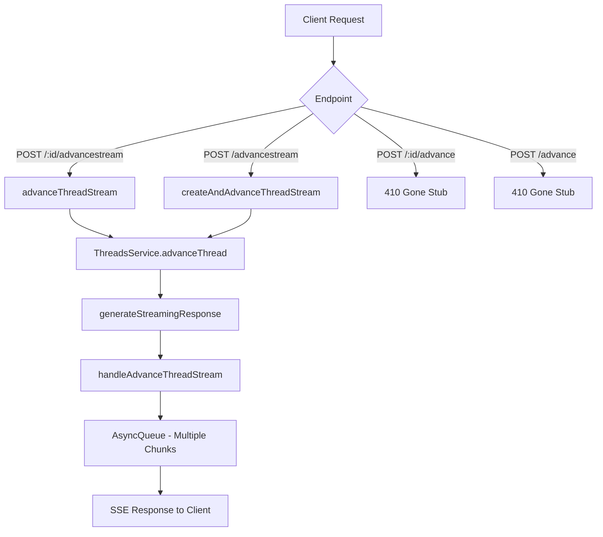

# refactor: Remove Non-Streaming Advance Thread API

## Overview

Remove the non-streaming advance thread API endpoints from the Tambo Cloud API, replacing them with deprecation stubs that return 410 Gone errors. This refactoring will simplify the codebase by eliminating the `stream` parameter branching logic throughout the threads service.

## Problem Statement / Motivation

The API currently has 4 "advance thread" endpoints:

1. `POST /:id/advance` - Non-streaming, existing thread
2. `POST /:id/advancestream` - Streaming, existing thread
3. `POST /advance` - Non-streaming, new thread
4. `POST /advancestream` - Streaming, new thread

**Why remove non-streaming?**

- Nobody uses the non-streaming endpoints
- The non-streaming endpoints may be broken
- The `stream` parameter branching adds significant complexity to the codebase
- The backend (`packages/backend`) always operates in streaming mode anyway - non-streaming is achieved by consuming the entire stream before responding, which is wasteful
- Maintaining two code paths increases the risk of bugs and makes refactoring harder

## Proposed Solution

### High-Level Approach

1. Replace non-streaming endpoints with stub APIs returning 410 Gone
2. Remove the `stream` parameter from `advanceThread` method and related code
3. Refactor internal methods to assume streaming-only behavior
4. Remove dead code paths (like `processThreadMessage` which only exists for non-streaming)
5. Update tests to reflect streaming-only behavior

## Technical Approach

### Architecture



### Files to Modify

| File                                              | Changes                                                                                    |
| ------------------------------------------------- | ------------------------------------------------------------------------------------------ |
| `apps/api/src/threads/threads.controller.ts`      | Replace 2 endpoints with deprecation stubs                                                 |
| `apps/api/src/threads/threads.service.ts`         | Remove `stream` parameter, remove non-streaming code path, simplify `handleSystemToolCall` |
| `apps/api/src/threads/util/thread-state.ts`       | Remove `processThreadMessage`, remove `getFinalDecision`                                   |
| `apps/api/src/threads/threads.controller.test.ts` | Update tests for deprecation stubs                                                         |
| `apps/api/src/threads/threads.service.test.ts`    | Remove non-streaming test cases                                                            |

### Implementation Phases

#### Phase 1: Add Deprecation Stubs

Replace the non-streaming endpoint implementations with deprecation stubs:

**threads.controller.ts - advanceThread method (lines 376-418)**:

```typescript
@UseGuards(ThreadInProjectGuard)
@Post(":id/advance")
@ApiOperation({
  summary: "DEPRECATED - Advance a thread (non-streaming)",
  description: "This endpoint has been deprecated. Use POST /:id/advancestream instead.",
  deprecated: true,
})
@ApiResponse({
  status: 410,
  description: "This endpoint is deprecated",
})
async advanceThread(): Promise<never> {
  throw new GoneException({
    error: "ENDPOINT_DEPRECATED",
    message: "The non-streaming /advance endpoint has been deprecated. Please use /advancestream instead.",
    migrateToEndpoint: "POST /:id/advancestream",
    documentation: "https://docs.tambo.ai/api/threads#advance-stream",
  });
}
```

**threads.controller.ts - createAndAdvanceThread method (lines 470-505)**:

```typescript
@Post("advance")
@ApiOperation({
  summary: "DEPRECATED - Create and advance a thread (non-streaming)",
  description: "This endpoint has been deprecated. Use POST /advancestream instead.",
  deprecated: true,
})
@ApiResponse({
  status: 410,
  description: "This endpoint is deprecated",
})
async createAndAdvanceThread(): Promise<never> {
  throw new GoneException({
    error: "ENDPOINT_DEPRECATED",
    message: "The non-streaming /advance endpoint has been deprecated. Please use /advancestream instead.",
    migrateToEndpoint: "POST /advancestream",
    documentation: "https://docs.tambo.ai/api/threads#advance-stream",
  });
}
```

**Success criteria:**

- [x] Non-streaming endpoints return 410 Gone with structured error
- [x] Swagger docs show endpoints as deprecated
- [x] Deprecation stubs have unit tests

#### Phase 2: Remove Stream Parameter from Service

**threads.service.ts - advanceThread method (lines 905-968)**:

Remove the three method overloads and simplify to a single signature:

```typescript
/**
 * Advance the thread by one step/message (streaming).
 */
async advanceThread(
  projectId: string,
  advanceRequestDto: Omit<AdvanceThreadDto, "contextKey">,
  unresolvedThreadId?: string,
  toolCallCounts: Record<string, number> = {},
  cachedSystemTools?: McpToolRegistry,
  queue?: AsyncQueue<AdvanceThreadResponseDto>,
  contextKey?: string,
): Promise<void> {
  // ... implementation
}
```

**Changes in advanceThread\_ (lines 970-1230)**:

- Remove the `stream` parameter entirely
- Remove the conditional at line 1109 (`if (stream)`)
- Always call `generateStreamingResponse` directly
- Remove lines 1128-1210 (the non-streaming code path)

**Success criteria:**

- [x] `stream` parameter removed from all `advanceThread` signatures
- [x] Non-streaming code path removed from `advanceThread_`
- [x] All callers updated to not pass `stream` parameter

#### Phase 3: Simplify handleSystemToolCall

**threads.service.ts - handleSystemToolCall (lines 1232-1361)**:

Remove the overloads and `stream` parameter:

```typescript
private async handleSystemToolCall(
  toolCallRequest: ToolCallRequest,
  toolCallId: string,
  toolCallMessageId: string,
  allTools: McpToolRegistry,
  componentDecision: LegacyComponentDecision,
  advanceRequestDto: AdvanceThreadDto,
  projectId: string,
  threadId: string,
  toolCallCounts: Record<string, number>,
  queue: AsyncQueue<AdvanceThreadResponseDto>,
): Promise<void> {
  // Always use streaming behavior - recursively calls advanceThread
}
```

**Success criteria:**

- [x] `stream` parameter removed from `handleSystemToolCall`
- [x] Method overloads consolidated into single signature
- [x] Recursive `advanceThread` calls updated

#### Phase 4: Remove Dead Code in thread-state.ts

**thread-state.ts - Functions to remove**:

1. **`getFinalDecision` (lines 44-77)**: Only used by non-streaming `processThreadMessage`
2. **`processThreadMessage` (lines 109-161)**: Only called by non-streaming code path in `advanceThread_`

These functions are ONLY used in the non-streaming path. The streaming path uses:

- `fixStreamedToolCalls` for streaming chunk processing
- `updateThreadMessageFromLegacyDecision` for updating messages from stream chunks

**Verification before removal:**

```bash
grep -r "processThreadMessage" apps/api/src/threads/ --include="*.ts"
grep -r "getFinalDecision" apps/api/src/threads/ --include="*.ts"
```

**Success criteria:**

- [x] `getFinalDecision` function removed
- [x] `processThreadMessage` function removed
- [x] No other code depends on these functions
- [x] All imports/exports updated

#### Phase 5: Update Tests

**threads.controller.test.ts**:

- Add tests for deprecation stubs (verify 410 response)
- Update any existing tests that call non-streaming endpoints

**threads.service.test.ts**:

- Remove test cases that explicitly test `stream: false` behavior
- Update test cases that test `stream` parameter handling
- Ensure streaming path has adequate coverage

**Success criteria:**

- [x] Deprecation stubs have unit tests
- [x] Non-streaming test cases removed
- [x] All remaining tests pass
- [x] Test coverage maintained or improved

### Code Removal Summary

| Location                        | What to Remove                                 | Why Safe                       |
| ------------------------------- | ---------------------------------------------- | ------------------------------ |
| `threads.controller.ts:376-418` | `advanceThread` method body                    | Replaced with deprecation stub |
| `threads.controller.ts:470-505` | `createAndAdvanceThread` method body           | Replaced with deprecation stub |
| `threads.service.ts:905-923`    | `stream?: false` overload                      | No longer needed               |
| `threads.service.ts:1128-1210`  | Non-streaming code path                        | Never reached                  |
| `threads.service.ts:1232-1257`  | `handleSystemToolCall` overloads with `stream` | Consolidated                   |
| `thread-state.ts:44-77`         | `getFinalDecision` function                    | Only used by non-streaming     |
| `thread-state.ts:109-161`       | `processThreadMessage` function                | Only used by non-streaming     |

## Acceptance Criteria

### Functional Requirements

- [x] `POST /:id/advance` returns 410 Gone with structured deprecation error
- [x] `POST /advance` returns 410 Gone with structured deprecation error
- [x] `POST /:id/advancestream` continues to work unchanged
- [x] `POST /advancestream` continues to work unchanged
- [x] Swagger docs mark deprecated endpoints as deprecated
- [x] Error response includes migration guidance

### Non-Functional Requirements

- [x] No regression in streaming endpoint performance
- [x] All tests pass
- [x] Type checking passes
- [x] Linting passes

### Quality Gates

- [x] `npm run check-types` passes
- [x] `npm run lint` passes
- [x] `npm test` passes
- [ ] Code review approved

## Success Metrics

- **Codebase simplification**: Remove ~200-300 lines of branching/non-streaming code
- **Reduced complexity**: Eliminate `stream` parameter from service methods
- **Maintainability**: Single code path is easier to understand and modify

## Dependencies & Prerequisites

- No external dependencies
- No database migrations required
- No infrastructure changes required

## Risk Analysis & Mitigation

| Risk                               | Likelihood | Impact | Mitigation                                                          |
| ---------------------------------- | ---------- | ------ | ------------------------------------------------------------------- |
| Unknown client using non-streaming | Low        | Medium | Check API logs before deployment; 410 provides clear migration path |
| Breaking streaming during refactor | Medium     | High   | Careful testing; run integration tests; deploy incrementally        |
| Test coverage gaps                 | Low        | Medium | Review coverage before and after; add tests where needed            |

## Implementation Checklist

### Pre-Implementation

- [x] Verify no API requests to non-streaming endpoints in last 30 days (check logs)
- [x] Review test coverage of streaming paths
- [x] Create feature branch from main

### Implementation

- [x] Phase 1: Add deprecation stubs
- [x] Phase 2: Remove stream parameter from service
- [x] Phase 3: Simplify handleSystemToolCall
- [x] Phase 4: Remove dead code in thread-state.ts
- [x] Phase 5: Update tests

### Post-Implementation

- [x] Run full test suite
- [x] Run type checking
- [x] Run linting
- [ ] Deploy to staging and verify streaming works
- [ ] Deploy to production

## References & Research

### Internal References

- Controller endpoints: `apps/api/src/threads/threads.controller.ts:376-544`
- Service implementation: `apps/api/src/threads/threads.service.ts:905-2063`
- Thread state utilities: `apps/api/src/threads/util/thread-state.ts:44-161`
- AsyncQueue implementation: `packages/core/src/async-queue.ts:36-150`

### External References

- HTTP 410 Gone: https://developer.mozilla.org/en-US/docs/Web/HTTP/Status/410
- OpenAPI deprecated: https://swagger.io/specification/#operation-object
- NestJS GoneException: https://docs.nestjs.com/exception-filters#built-in-http-exceptions

### Related Work

- The backend (`packages/backend`) already operates in streaming-only mode
- This refactor aligns the API layer with the backend's streaming-first architecture
